 # UNO主板_C_教程

## 1. Keyes Plus主板：

---

### 1. 简介：

在我们开始学习keyes 模拟智能家居综合套件之前，首先介绍Keyes Plus主板，它是所有项目的核心。

Keyes Plus主板完全兼容Arduino IDE开发环境的控制板，包含Arduino UNO R3的所有功能，并且在UNO R3主板的基础上，我们做了一些改进，使它的功能更加强大。它是学习如何构建电路和设计自己的代码的最好的选择，让我们得到更详细的相关信息：


---

### 2. 规格参数：

微控制器：ATMEGA328P-AU

USB转串口芯片：CP2102

工作电压：DC 5V

外接电源: DC 6-15V（建议9V）

数字I/O引脚: 14个 (D0-D13)

PWM通道：6个 (D3，D5，D6，D9，D10，D11)

模拟输入通道（ADC）: 8个 (A0-A7)

每个I/O直流输出能力:	20 mA

3.3V端口输出能力:  50 mA

Flash Memory: 32 KB（其中引导程序使用0.5 KB）

SRAM: 2 KB (ATMEGA328P-AU)

EEPROM:	1 KB (ATMEGA328P-AU)

时钟速度: 16MHz

板载LED引脚: D13

**各个接口和主要元件说明：**


**特殊功能接口说明：**

串口通信接口：D0为RX、D1为TX

PWM接口（脉宽调制）：D3，D5，D6，D9，D10，D11

外部中断接口：D2(中断0)和D3(中断1)

SPI通信接口：D10为SS，D11为MOSI，D12为MISO，D13为SCK

IIC通信端口：A4为SDA，A5为SCL

---

## 2. Arduino IDE 的下载、安装和使用方法：

参考链接：[https://www.keyesrobot.cn/projects/Arduino/zh-cn/latest/](https://www.keyesrobot.cn/projects/Arduino/zh-cn/latest/)

<span style="color: rgb(255, 76, 65);">注意：</span><span style="background:#ff0;color:#000">UNO主板_C_教程里所有课程使用的是Arduino IDE版本：2.1.1 。</span>

---

## 3. 课程

---

### 项目01 Hello World

#### 1. 项目介绍：

对于Arduino初学者，我们将从一些简单的东西开始。在这个项目中，您只需要一个Plus主板、MicroUSB线和计算机来完成“Hello World!”项目。它不仅是Plus主板(兼容Arduino Uno)和计算机的通信测试，也是Arduino世界的初级项目。

#### 2. 项目元件：

| |  |
| :--: | :--: |
|Plus主板*1 | MicroUSB线*1 |

#### 3. 项目接线：

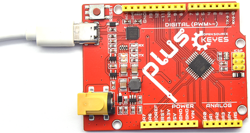

#### 4. 项目代码：

将使用一个简单的If()语句编程控制结构。Arduino IDE使用串行监视器来显示打印语句、传感器数据等信息。这是一个非常强大的工具，用于调试长代码。现在是你的第一个代码：

```C
//*************************************************************************************
/*
 * 名称   : Hello World
 * 功能   : 输入字母R，串口显示“Hello World”。
 * 作者   : http://www.keyes-robot.com/
*/
char val;//定义变量val.

void setup(){
Serial.begin(9600);// 设置波特率为9600. 
}

void loop(){
  if (Serial.available() > 0) {
    val=Serial.read();// 读取指令或字符从PC到Arduino，并赋值给val.
    if(val=='R') {  // 确定接收的指令或字符是否为“R”.    
     Serial.println("Hello World!");// 显示“Hello World !”字符串.
    }
  }
}
//*************************************************************************************
```

#### 5. 项目现象： 

按照接线图正确接好各元器件，选择正确的主板类型Arduino Uno和COM端口，点击Arduino IDE上的上传按钮上传代码。上传成功后，利用MicroUSB线连接到计算机上电，单击图标进入串行监视器，设置波特率为 **9600** ，在文本框输入字母“R”，按下回车键(Enter 键)，这样串口监视器打印“Hello World!”。

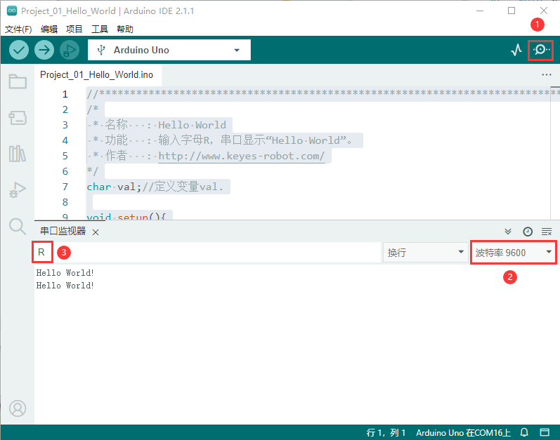

#### 6. 代码说明

| 代码                | 说明                                                         |
| ------------------- | ------------------------------------------------------------ |
| char val            | 定义一个变量val                                              |
| Serial.begin(9600)  | 设置波特率为9600                                             |
| Serial.available( ) | 获取串口上可读取的数据的字节数，该数据已经到达并存储在接收缓存（共有64字节）中。Serial.available() > 0表示串口接收到了数据，可以读取。 |
| Serial.read( )      | 读取写入的串行数据。                                         |
| if( ){ }            | 如果“（ ）”里的条件满足，则执行“{ }”里的程序。               |
| Serial.println( )   | 换行输出数据。从串行端口输出数据，跟随一个回车和一个换行符。 |

---

### 项目02 点亮LED

#### 1. 项目介绍：

在这个项目中，我们将向你展示点亮LED。我们是使用Plus主板的数字引脚来打开LED，使LED被点亮。

#### 2. 项目元件：

||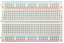||
| :--: | :--: | :--: |
|Plus主板*1|面包板*1|红色LED*1|
|| ||
|220Ω电阻*1|面包板连接线*2|MicroUSB线*1|

#### 3. 元件知识：

**（1）LED**


LED是一种被称为“发光二极管”的半导体，是一种由半导体材料(硅、硒、锗等)制成的电子器件。它有正极和负极。短腿为负极，接GND，长腿为正极，接3.3V或5V。


**（2）五色环电阻**

电阻是电路中限制或调节电流流动的电子元件。左边是电阻器的外观，右边是电阻在电路中表示的符号。电阻(R)的单位为欧姆(Ω)，1 mΩ= 1000 kΩ，1kΩ= 1000Ω。


我们可以使用电阻来保护敏感组件，如LED。电阻的强度（以Ω为单位）用小色环标记在电阻器的主体上。每种颜色代表一个数字，你可以用电阻对照卡查找。

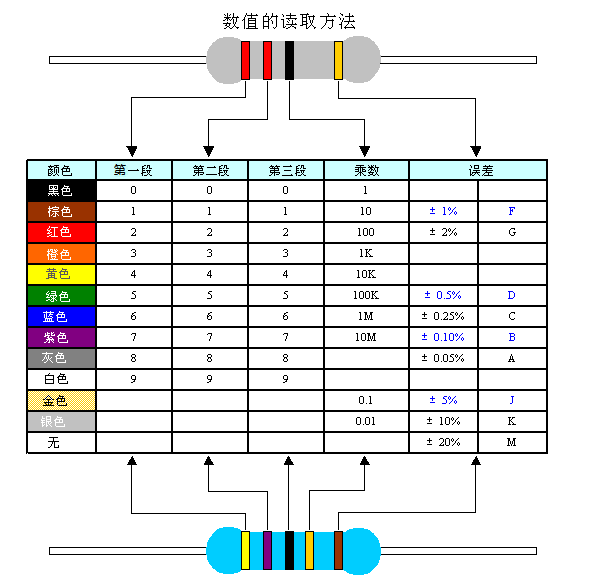

在这个套件中，我们提供了2个具有不同电阻值的五色环电阻。这里以2个五色环电阻为例：

220Ω电阻×10


1KΩ电阻×10


在相同的电压下，会有更小的电流和更大的电阻。电流、电压、电阻之间的联系可以用公式表示：I=U/R。在下图中，目前通过R1的电流: I = U / R = 3 V / 10 KΩ= 0.0003A= 0.3mA。


不要把电阻值很低的电阻直接连接在电源两极，这样会使电流过高而损坏电子元件。电阻是没有正负极之分。

**（3）面包板**

面包板是实验室中用于搭接电路的重要工具。面包板上有许多孔，可以插入集成电路和电阻等电路元件。熟练掌握面包板的使用方法是提高实验效率，减少实验故障出现几率的重要基础之一。下面就面包板的结构和使用方法做简单介绍。一个典型的面包板如下所示：


面包板的外观和内部结构如上图所示，常见的最小单元面包板分上、中、下三部分，上面和下面部分一般是由一行或两行的插孔构成的窄条，中间部分是由中间一条隔离凹槽和上下各5 行的插孔构成的条。


在面包板的两个窄条分别有两行插孔，两行之间是不连通的，一般是作为电源引入的通路。上方第一行标有“+”的一行有10组插孔（内部都是连通），均为正极；上方第二行标有“-”的一行有10组插孔，（内部都是连通），均为接地。面包板下方的第一行与第二行结构同上。如需用到整个面包板，通常将“+”与“+”用导线连接起来，“-”与“-”用导线连接起来。

中间部分宽条是由中间一条隔离凹槽和上下各5 行的插孔构成。在同一列中的5 个插孔是互相连通的，列和列之间以及凹槽上下部分则是不连通的。外观及结构如下图：


中间部分宽条的连接孔分为上下两部分，是面包板的主工作区，用来插接原件和面包板连接线。在同一列中的5个插孔（即a-b-c-d-e，f-g-h-i-j）是互相连通的；列和列之间以及凹槽上下部分是不连通的。在做实验的时候，通常是使用两窄一宽组成的小单元，在宽条部分搭接电路的主体部分，上面的窄条取一行做电源，下面的窄条取一行做接地。中间宽条用于连接电路，由于凹槽上下是不连通的，所以集成块一般跨插在凹槽上。

**(4)电源**

Plus主板需要3.3V-5V电源，在本项目中，我们通过用MicroUSB线将Plus主板和电脑连起来。


#### 4. 项目接线图：

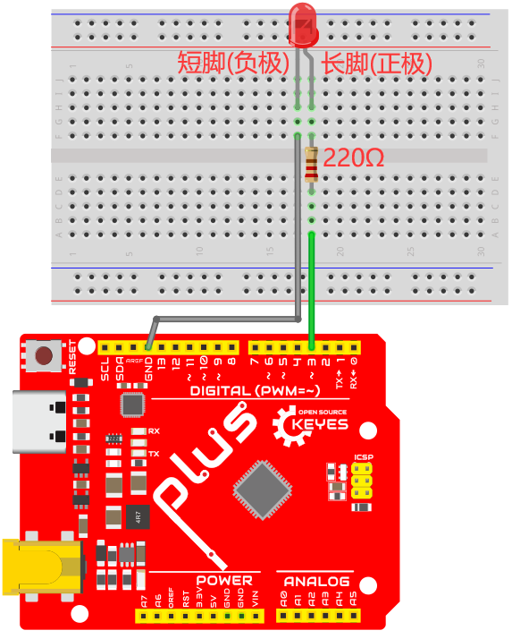

#### 5. 项目代码：

```C
//*************************************************************************************
/*
 * 名称   : Turn_On_LED
 * 功能   : 点亮 LED
 * 作者   : http://www.keyes-robot.com/
*/
int ledPin = 3;  // 定义LED的引脚为D3.

void setup() {
  pinMode(ledPin, OUTPUT);  // 设置led引脚为输出模式.
}

void loop() {
  digitalWrite(ledPin, HIGH); //  点亮LED.
}
//*************************************************************************************
```

#### 6. 项目现象：

按照接线图正确接好各元器件，选择正确的主板类型Arduino Uno和COM端口，点击Arduino IDE上的上传按钮上传代码。项目代码上传成功后，利用MicroUSB线连接到计算机上电，LED被点亮。


#### 7. 代码说明:

| 代码                       | 说明                                                       |
| -------------------------- | ---------------------------------------------------------- |
| pinMode(ledPin, OUTPUT)    | 设置引脚的模式。OUTPUT为输出模式；INPUT为输入模式          |
| digitalWrite(ledPin, HIGH) | 设置引脚的输出电压为高\低电平。HIGH为高电平，LOW为低电平。 |

---

### 项目03 LED闪烁

#### 1. 项目介绍：

在这个项目中，我们将向你展示LED闪烁效果。我们是使用Plus主板的数字引脚来打开LED，让它闪烁。

#### 2. 项目元件：

||||
| :--: | :--: | :--: |
|Plus主板*1|面包板*1|红色LED*1|
|| ||
|220Ω电阻*1|面包板连接线*2|MicroUSB线*1|

#### 3. 项目接线图：


#### 4. 项目代码：

```C
//*************************************************************************************
/*
 * 名称   : LED_Blinking
 * 功能   : LED 闪烁 1s
 * 作者   : http://www.keyes-robot.com/
*/
int ledPin = 3; // 定义LED的引脚为D3.

void setup(){
  pinMode(ledPin, OUTPUT);// 设置led引脚为输出模式.
}

void loop(){
  digitalWrite(ledPin, HIGH); // 点亮LED.
  delay(1000); // 等待1秒.
  digitalWrite(ledPin, LOW); // 熄灭LED.
  delay(1000); // 等待1秒
}
//*************************************************************************************
```

#### 5. 项目现象：

按照接线图正确接好各元器件，选择正确的主板类型Arduino Uno和COM端口，点击Arduino IDE上的上传按钮上传代码。项目代码上传成功后，利用MicroUSB线连接到计算机上电，可以看到的现象是：电路中的LED会反复闪烁。

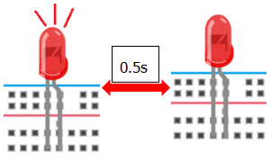

#### 6. 代码说明:

| 代码                       | 说明                                                       |
| -------------------------- | ---------------------------------------------------------- |
| pinMode(ledPin, OUTPUT)    | 设置引脚的模式。OUTPUT为输出模式；INPUT为输入模式          |
| digitalWrite(ledPin, HIGH) | 设置引脚的输出电压为高\低电平。HIGH为高电平，LOW为低电平。 |
| delay(1000)                | 将程序的执行暂停一段时间,也就是延时。单位是毫秒。          | 

---

### 项目04 交通灯

#### 1. 项目介绍：

交通灯在我们的日常生活中很普遍。根据一定的时间规律，交通灯是由红、黄、绿三种颜色组成的。每个人都应该遵守交通规则，这可以避免许多交通事故。在这个项目中，我们将使用Plus主板和一些led(红，黄，绿)来模拟交通灯。

#### 2. 项目元件：
|||||
| :--: | :--: | :--: |:--: |
|Plus主板*1|面包板*1|红色LED*1|黄色LED*1|
||| ||
|绿色LED*1|220Ω电阻*3|面包板连接线若干|MicroUSB线*1|

#### 3. 项目接线图： 

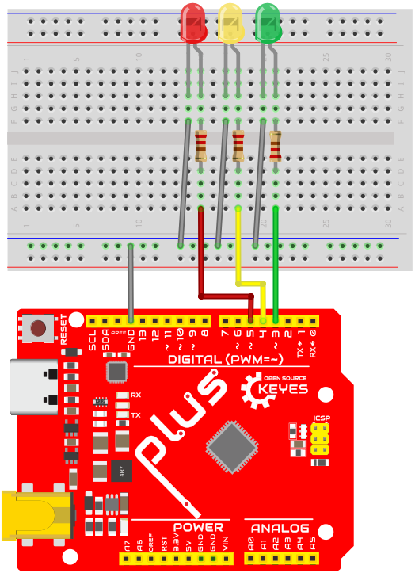

#### 4. 项目代码：

```C
//*********************************************************************************
/*
 * 名称   : Traffic_Lights
 * 功能   : 模拟交通灯
 * 作者   : http://www.keyes-robot.com/ 
*/
int redled = 5;  // 红色LED连接到数字管脚D5.
int yellowled = 4;  // 黄色LED连接到数字管脚D4.
int greenled = 3;  // 绿色LED连接数字管脚D3.

void setup() {
  pinMode(redled, OUTPUT);  // 将红色LED引脚设置为输出模式
  pinMode(yellowled, OUTPUT);  // 将黄色LED引脚设置为输出模式
  pinMode(greenled, OUTPUT);  // 将绿色LED的引脚设置为输出模式
}

void loop(){
  digitalWrite(greenled, HIGH); // 点亮绿色LED
  delay(5000); // 延时5秒
  digitalWrite(greenled, LOW); // 熄灭绿色LED
  for(int i=0;i<3;i++){// 闪烁3次
    digitalWrite(yellowled, HIGH); //点亮黄色LED
    delay(500); // 延时0.5秒
    digitalWrite(yellowled, LOW); // 熄灭黄色LED
    delay(500); // 延时0.5秒
  } 
  digitalWrite(redled, HIGH); // 点亮红色LED
  delay(5000); // 延时5秒
  digitalWrite(redled, LOW); // 熄灭红色LED
}
//*********************************************************************************
```
#### 5. 项目现象：

按照接线图正确接好各元器件，选择正确的主板类型Arduino Uno和COM端口，点击Arduino IDE上的上传按钮上传代码。项目代码上传成功后，利用MicroUSB线连接到计算机上电，你会看到的现象是：1.首先，绿灯会亮5秒，然后熄灭；2.其次，黄灯会闪烁3次，然后熄灭；3.然后，红灯会亮5秒，然后熄灭；4.继续运行上述1-3个步骤。


#### 6. 代码说明:

可以参照项目03和项目05的代码说明，这里就不多做介绍了。

---

### 项目05 呼吸灯

#### 1. 项目介绍：

在之前的研究中，我们知道LED有亮/灭状态，那么如何进入中间状态呢?如何输出一个中间状态让LED“半亮”?这就是我们将要学习的。呼吸灯，即LED由灭到亮，再由亮到灭，就像“呼吸”一样。那么，如何控制LED的亮度呢? 我们将使用Plus主板的PWM来实现这个目标。

#### 2. 项目元件：

||||
| :--: | :--: | :--: |
|Plus主板*1|面包板*1|红色LED*1|
|| ||
|220Ω电阻*1|面包板连接线*2|MicroUSB线*1|

#### 3. 元件知识：


**模拟信号 & 数字信号** 

模拟信号在时间和数值上都是连续的信号。相反，数字信号或离散时间信号是由一系列数字组成的时间序列。生活中的大多数信号都是模拟信号，一个熟悉的模拟信号的例子是：全天的温度是连续不断变化的，而不是突然从0到10的瞬间变化。然而，数字信号的值可以瞬间改变。这个变化用数字表示为1和0(二进制代码的基础)。如下图所示，我们可以更容易地看出它们的差异。


在实际应用中，我们经常使用二进制作为数字信号，即一系列的0和1。由于二进制信号只有两个值(0或1)，因此具有很大的稳定性和可靠性。最后，可以将模拟信号和数字信号相互转换。

**PWM：**

脉宽调制(PWM)是一种利用数字信号控制模拟电路的有效方法。普通处理器不能直接输出模拟信号。PWM技术使这种转换(将数字信号转换为模拟信号)非常方便。PWM技术利用数字引脚发送一定频率的方波，即高电平和低电平的输出，交替持续一段时间。每一组高电平和低电平的总时间一般是固定的，称为周期(<span style="color: rgb(255, 76, 65);">注:周期的倒数是频率</span>)。高电平输出的时间通常称为脉宽，占空比是脉宽(PW)与波形总周期(T)之比的百分比。高电平输出持续时间越长，占空比越长，模拟信号中相应的电压也就越高。下图显示了对应于脉冲宽度0%-100%的模拟信号电压在0V-3.3V(高电平为3.3V)之间的变化情况.


PWM占空比越长，输出功率越高。既然我们了解了这种关系，我们就可以用PWM来控制LED的亮度或直流电机的速度等等。从上面可以看出，PWM并不是真实的模拟信号，电压的有效值等于相应的模拟信号。因此，我们可以控制LED和其他输出模块的输出功率，以达到不同的效果。

#### 4. 项目接线图： 


#### 5. 项目代码：

```C
//**********************************************************************************
/*
 * 名称   : Breathing_LED
 * 功能   : 使用PWM让led灯像呼吸一样忽明忽暗。
 * 作者   : http://www.keyes-robot.com/
*/
int ledPin = 3;  // 定义LED的引脚为D3.

void setup() {
  pinMode(ledPin,OUTPUT); // 设置LED引脚为输出模式.
}

void loop(){
  for (int value = 0 ; value < 255; value=value+1) {  //使灯光渐亮
    analogWrite(ledPin, value);
    delay(10);
  }
  for (int value = 255; value >0; value=value-1) {  //使灯光渐暗
    analogWrite(ledPin, value);
    delay(10);
  } 
}      
//**********************************************************************************
```

#### 6. 项目现象：

按照接线图正确接好各元器件，选择正确的主板类型Arduino Uno和COM端口，点击Arduino IDE上的上传按钮上传代码。项目代码上传成功后，利用MicroUSB线连接到计算机上电，可以看到的现象是：电路中的LED从暗逐渐变亮，再从亮逐渐变暗，就像呼吸一样。


#### 7. 代码说明:

当我们需要重复执行某句话时，我们可以使用for语句。

for语句格式如下：


for循环顺序如下：

第一轮：1 → 2 → 3 → 4

第二轮：2 → 3 → 4

…

直到2不成立，for循环结束。

知道了这么个顺序之后，回到代码中：

for (int value = 0; value < 255; value=value+1){

        ...}

for (int value = 255; value >0; value=value-1){

       ...}

这两个for语句实现了value的值不断由0增加到255，随之在从255减到0，在增加到255……，无限循环下去。

再看下for里面，涉及一个新函数analogWrite()。

我们知道数字口只有0和1两个状态，那如何发送一个模拟值到一个数字引脚呢？就要用到该函数。观察一下Plus 主板，查看数字引脚，你会发现其中6个引脚旁标有“~”，这些引脚不同于其他引脚，它们可以输出PWM信号。

**函数格式如下：**

analogWrite(pin,value)

analogWrite()函数用于给PWM口写入一个0 ~ 255的模拟值。所以，value是在0 ~ 255之间的值。特别注意的是，analogWrite()函数只能写入具有PWM功能的数字引脚，也就是D3，D5，D6，D9，D10，D11引脚。

---

### 项目06 流水灯

#### 1. 项目介绍：

在日常生活中，我们可以看到许多由不同颜色的led组成的广告牌。他们不断地改变灯光(像流水一样)来吸引顾客的注意。在这个项目中，我们将使用Plus主板控制5个LED灯实现流水的效果。

#### 2. 项目元件：

||||
| :--: | :--: | :--: |
|Plus主板*1|面包板*1|红色LED*5|
|| ||
|220Ω电阻*5|面包板连接线若干|MicroUSB线*1|

#### 3. 项目接线图:

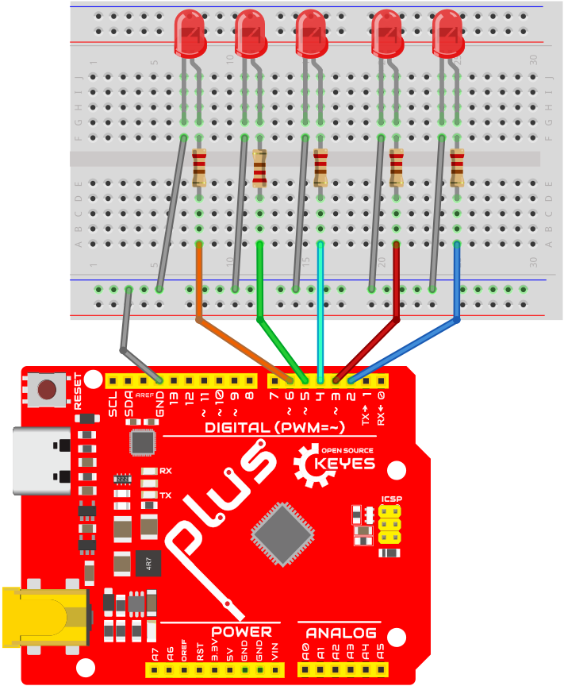

#### 4. 项目代码：

```C
//**********************************************************************************
/*
 * 名称   : Flowing_Water_Light
 * 功能   : 流水灯
 * 作者   : http://www.keyes-robot.com/ 
*/
int BASE = 2; // 第一个LED的I/O引脚
int NUM = 5; // LED 数量

void setup(){
   for (int i = BASE; i < BASE + NUM; i ++) {
     pinMode(i, OUTPUT);   // 设置I/O引脚为输出模式
   }
}
void loop(){
   for (int i = BASE; i < BASE + NUM; i ++) {
     digitalWrite(i, LOW); // 设I/O引脚为低电平，依次熄灭led灯。
     delay(100); // 延时0.1秒
   }
   for (int i = BASE; i < BASE + NUM; i ++) {
     digitalWrite(i, HIGH); // 设置I/O引脚为高，依次点亮led灯
     delay(100); // 延时0.1秒
   }  
}
//**********************************************************************************
```

#### 5. 项目现象：

按照接线图正确接好各元器件，选择正确的主板类型Arduino Uno和COM端口，点击Arduino IDE上的上传按钮上传代码。项目代码上传成功后，利用MicroUSB线连接到计算机上电，可以看到的现象是：电路中的5个LED会逐渐亮起来，然后逐渐熄灭，就像电池充电一样。

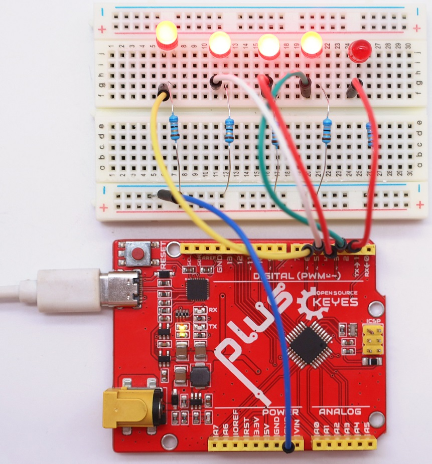

#### 6. 代码说明:

可以参照项目03和项目05的代码说明，这里就不多做介绍了。

---

### 项目07 有源蜂鸣器

#### 1. 项目介绍：

有源蜂鸣器模块上有一个发声元件----有源蜂鸣器。它被广泛用作电脑、打印机、报警器、电子玩具、电话、计时器等的发声元件。它有一个内在的振动源，需连接3.3V~5V电源，即可持续发出嗡嗡声。在这个项目中，我们将使用Plus主板控制有源蜂鸣器发出“滴滴”声。

#### 2. 项目元件：

|||||
| :--: | :--: | :--: | :--: |
|Plus主板*1|有源蜂鸣器模块*1|公对母杜邦线若干|MicroUSB线*1|

#### 3. 元件知识：

<span style="color: rgb(255, 76, 65);">注意：本教程使用的是有源蜂鸣器。</span>


有源蜂鸣器和无源蜂鸣器的“源”不是指电源，而是指震荡源。

**有源蜂鸣器**：内部自带震荡源，所以一触发就能发声，发声频率固定。有源蜂鸣器的优点是程序控制方便，声压高。有源自激型蜂鸣器工作发声原理如下：直流电源输入经过振荡系统的放大和取样电路在谐振装置作用下产生声音信号。

**模块参数：**

工作电压: DC 3.3 ~ 5V 

工作温度：-10°C ~ +50°C

控制信号：数字信号

尺寸：32 mm x 23.8 mm x 12.3 mm

定位孔大小：直径为 4.8 mm

**无源蜂鸣器**: 内部不带震荡源，如果直接通直流电信号无源蜂鸣器是没有声音的，因为磁路恒定，振动膜片一直处在吸附状态，不能振动发音。根据不同需求，一般我们通过方波去驱动，然后通过更换方波的频率来实现不同音效。

**总结：有源蜂鸣器内部带震荡源，发声频率固定。无源内部不带震荡源，通过方波去驱动，发音频率可改变。**


#### 4. 项目接线图：

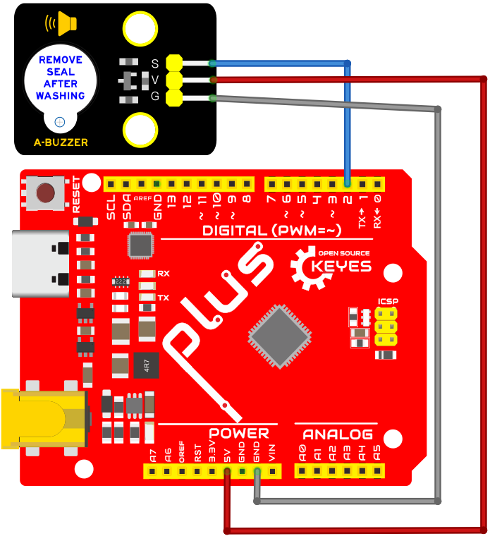

#### 5. 项目代码：

```C
//**********************************************************************************
/*
 * 名称   : Active buzzer
 * 功能   : 有源蜂鸣器产生声音
 * 作者   : http://www.keyes-robot.com/
*/
int buzzerPin = 2;  //定义蜂鸣器的引脚为D2

void setup () {
  pinMode (buzzerPin, OUTPUT);  //设置蜂鸣器引脚为输出模式
}

void loop () {
  digitalWrite (buzzerPin, HIGH); //发声
  delay (500); //延时0.5秒
  digitalWrite (buzzerPin, LOW);  //停止发声
  delay (500); //延时0.5秒
}
//**********************************************************************************
```

#### 6. 项目现象：

按照接线图正确接好模块，选择正确的主板类型Arduino Uno和COM端口，点击Arduino IDE上的上传按钮上传代码。项目代码上传成功后，利用MicroUSB线连接到计算机上电，可以看到的现象是：有源蜂鸣器发出“滴滴”声。

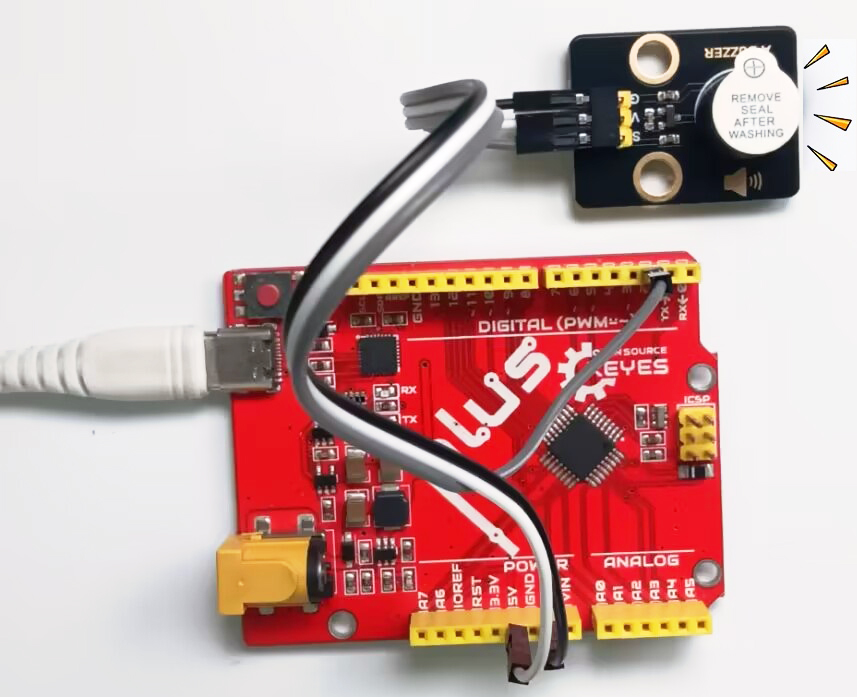

#### 7. 代码说明:

可以参照项目03的代码说明，这里就不多做介绍了。

---

### 项目08 继电器控制LED

#### 1. 项目介绍：

在日常生活中，我们一般使用交流来驱动电气设备，有时我们会用开关来控制电器。如果将开关直接连接到交流电路上，一旦发生漏电，人就有危险。从安全的角度考虑，我们特别设计了这款具有NO(常开)端和NC(常闭)端的继电器模块。在这节课我们将学习一个比较特殊、好用的开关，就是继电器模块，使用继电器模块控制LED灯亮灭。

#### 2. 项目元件：

||||||
| :--: | :--: | :--: |:--: |:--: |
|Plus主板*1|面包板*1|继电器模块*1|红色LED*1|一字螺丝刀*1|
|||| | |
|公对母杜邦线若干|MicroUSB线*1|220Ω电阻*1|面包板连接线若干| |

#### 3. 元件知识：


**继电器：** 继电器能兼容多种单片机控制板，是用小电流去控制大电流运作的一种“自动开关”。它可以让单片机控制板驱动3A以下负载，如LED灯带、直流马达、微型水泵、电磁阀可插拔式接口设计，方便使用。继电器有3个接线柱用于外接电路，分别为NO、COM和NC端（背后丝印）。


**模块参数:**

工作电压: DC 5V 

工作电流: 50 mA

最大功率: 0.25 W

控制信号: 数字信号

触电电流: 小于 3 A

工作温度：-10°C ~ +50°C

尺寸：47.6mm x 23.8mm x 19mm

定位孔大小：直径为4.8mm

**模块原理图:**


一个继电器拥有一个动触点以及两个静触点A和B。

当开关K断开时，继电器线路无电流通过，此时动触点与静触点B相接触，上半部分的电路导通。静触点B被称为常闭触点（NC）。常闭——NC（normal close）通常情况下是关合状态，即线圈未得电的情况下闭合的。

当开关K闭合时，继电器电路通过电流产生磁力，此时动触点与静触点A相接触，下半部分电路导通。静触点A被称为常开触点（NO）。常开——NO（normal open）通常情况下是断开状态，即线圈未得电的情况下断开的。

而动触点也被称为公共触点（COM）。

继电器简单来说就是一个开关，VCC表示电源正极、GND表示电源负极、IN表示信号输入脚，COM表示公共端，NC（normal close）表示常闭端，NO(normal open)表示常开端。


#### 4. 项目接线图：

<br>
<span style="color: rgb(61, 167, 66);"> **特别注意：** 接线前，需要用一字螺丝刀将继电器模块的NO端口和COM端口处的螺丝扭松，将面包板连接线的一端插入NO端口和COM端口处；接好线后，再用一字螺丝刀将NO端口和COM端口处的螺丝扭紧。</span>
<br>


#### 5. 项目代码：

```C
//**********************************************************************************
/*
 * 名称   : Relay_Control_LED
 * 功能   : 继电器控制LED亮与灭
 * 作者   : http://www.keyes-robot.com/ 
*/
int Relay = 3; //定义继电器的引脚为D3

void setup() {
  pinMode(Relay, OUTPUT); //设置继电器的引脚为输出模式
}

void loop() {
  digitalWrite(Relay, HIGH); //打开继电器
  delay(1000); //延时1秒
  digitalWrite(Relay, LOW); //关闭继电器
  delay(1000); //延时1秒
}
//**********************************************************************************
```
#### 6. 项目现象：

按照接线图正确接好模块和各元器件，选择正确的主板类型Arduino Uno和COM端口，点击Arduino IDE上的上传按钮上传代码。项目代码上传成功后，利用MicroUSB线连接到计算机上电，你会看到的现象是：继电器将循环开与关，开启1秒LED点亮1秒，关闭1秒LED熄灭1秒。同时可以听到继电器开与关的声音，还可以看到继电器上的指示灯指示状态的变化。

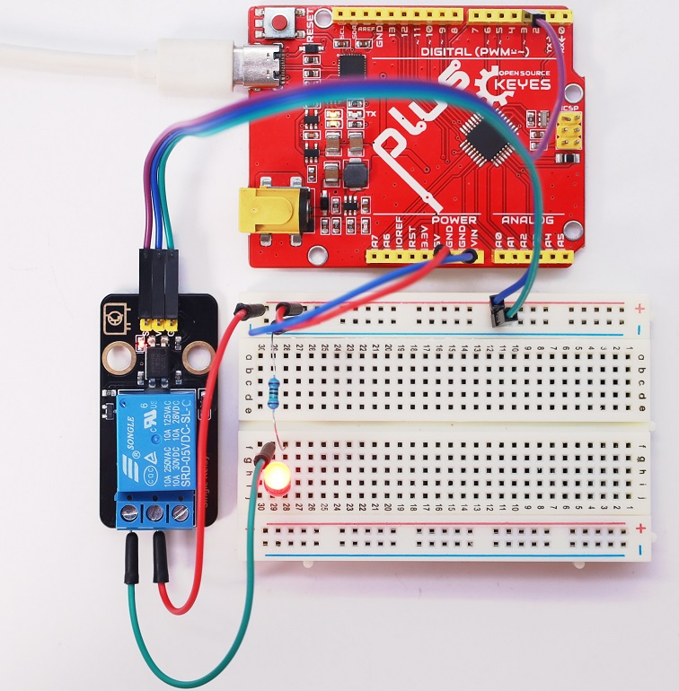

#### 7. 代码说明:

可以参照项目03的代码说明，这里就不多做介绍了。

---

### 项目09 人体红外热释传感器

#### 1. 项目介绍：

在本项目中，通过读取人体红外热释传感器模块上S端高低电平，判断附近是否有人在运动；并且在串口监视器上显示测试结果。

#### 2. 项目元件：

|||||
| :--: | :--: | :--: |:--: |
|Plus主板*1|人体红外热释传感器模块*1|公对母杜邦线若干|MicroUSB线*1|

#### 3. 元件知识：


**人体红外热释传感器:** 它主要由一个RE200B-P传感器元件组成。它是一款基于热释电效应的人体热释运动传感器，能检测到人体或动物身上发出的红外线，配合菲涅尔透镜能使传感器探测范围更远更广。

**模块参数:**

工作电压: DC 3.3V ~ 5V 

工作电流: 3.6MA

最大功率: 0.018W

输出信号: 数字信号

触发方式: L 不可重复触发/H 重复触发

探测距离: ≤5m

视野角度: Y = 90°，X = 110°（视野角度为理论数值）

工作温度：-10°C ~ +50°C

尺寸：32mm x 23.8mm x 7.4mm

定位孔大小：直径为4.8mm

**模块原理图:**


这个模块的原理图可能较前面的模块稍复杂，我们一部分一部分来看。先看电压转换部分，作用是将5V输入电压转换为3.3V输入电压。因为我们模块上用到的人体热释电红外传感器的工作电压是3.3V，不能直接用5V电压供电使用。有了这个电压转换部分，3.3V输入电压和5V输入电压都适用于此热释电红外传感器。

当红外热释传感器没有检测到红外信号时，红外热释传感器的1脚输出低电平，此时模块上的LED两端有电压差，有电流流过，LED被点亮，MOS管Q1导通（Q1是NPN MOS管，型号为2N7002。由于红外热释传感器的1脚输出低电平，所以Q1的源极Vs=0，而Q1的栅极Vg=3.3V，于是Q1的栅极G和Q1的源极S之间的电压 Vgs = 3.3V 大于Q1的阈值电压 2.5V，Q1导通。），信号端S检测到低电平。

当红外热释传感器检测到红外信号时，红外热释传感器模块的1脚输出高电平，此时模块上的LED熄灭，MOS管Q1不导通，则信号端S检测到被10K上拉电阻R5拉高的高电平。

#### 4. 项目接线图：

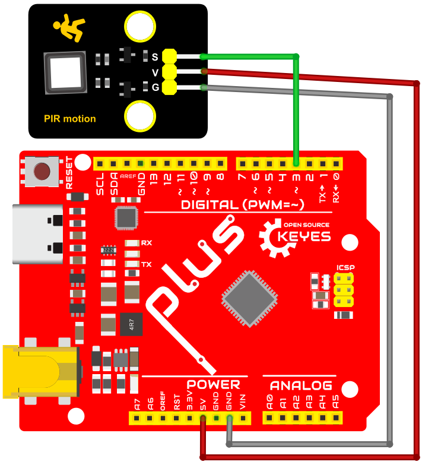

#### 5. 项目代码：

```C
//**********************************************************************************
/*
 * 名称   : PIR_Motion_sensor
 * 功能   : 读取人体红外传感器的数值
 * 作者   : http://www.keyes-robot.com/ 
*/
int val = 0;
int pirPin = 3;   //PIR运动传感器的引脚定义为D3
void setup() {
  Serial.begin(9600);   //波特率设置为9600
  pinMode(pirPin, INPUT);    //将传感器设置为输入模式
}

void loop() {
  val = digitalRead(pirPin);    //读取传感器值
  Serial.print(val);    //打印传感器值
  if (val == 1) {    //附近有人移动，输出高电平
    Serial.print("        ");
    Serial.println("Somebody is in this area!");
    delay(100);
  }
  else {    //如果附近没有人移动，输出低电平
    Serial.print("        ");
    Serial.println("No one!");
    delay(100);
  }
}
//**********************************************************************************
```

#### 6. 项目现象：

按照接线图正确接好模块，选择正确的主板类型Arduino Uno和COM端口，点击Arduino IDE上的上传按钮上传代码。项目代码上传成功后，利用MicroUSB线连接到计算机上电，单击图标进入串行监视器，设置波特率为9600，你会看到的现象是：当传感器检测到附近有人在运动时，value值为1，模块上LED熄灭，串口监视器显示“**1   Somebody is in this area!**”；没有检测到附近有人在运动时，value值为0，模块上LED点亮，串口监视器显示“**0   No one!**”。


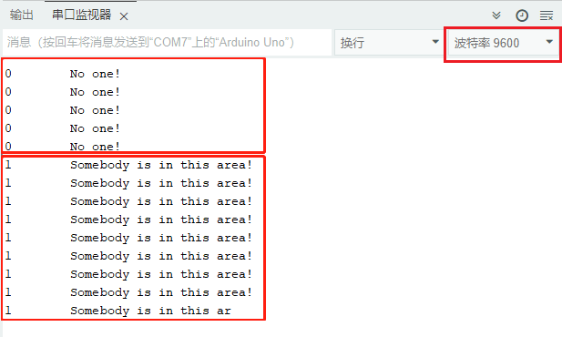

#### 7. 代码说明:

| 代码                   | 说明                                                         |
| ---------------------- | ------------------------------------------------------------ |
| pinMode(pirPin, INPUT) | 由“ int pirPin = 3; ”知道，定义人体红外热释传感器模块的管脚为D3。“INPUT”设置为输入模式。通过pinMode()配置为INPUT必须使用上拉或下拉电阻。但是，我们的模块已经使用上拉电阻R3和R5，该电阻的目的是在开关断开时将引脚拉至已知状态。通常选择一个4.7KΩ/10KΩ的电阻，因为它的阻值足够低，可以可靠地防止输入悬空。同时，该阻值也要足够高，以使开关闭合时不会消耗太多电流。如果使用下拉电阻，则当开关断开时，输入引脚将为低电平；当开关闭合时，输入引脚将为高电平。如果使用上拉电阻，则当开关断开时，输入引脚将为高电平；当开关闭合时，输入引脚将为低电平。 |
| if( ){ } else{ }       | 如果（ ）里的表达式为真，则执行 if { }块内的代码。如果（ ）里表达式为假 ，则执行 else { }块内的代码。 |
| digitalRead(pirPin)    | 读取人体红外热释传感器的数字电平，高(HIGH)或者低(LOW)。如果该引脚未连接任何东西，则digitalRead( )可以返回“高”或“低”（并且可以随机更改）。 |
| Serial.begin(9600)     | 初始化串口通信，并设置波特率为9600。                         |
| Serial.print( )   | 未换行输出数据。从串行端口输出数据，跟随一个回车和一个未换行符。 |
| Serial.println( )   | 换行输出数据。从串行端口输出数据，跟随一个回车和一个换行符。 |

---

### 项目10 避障传感器

#### 1. 项目介绍：

在本项目中，通过读取避障传感器模块上S端高低电平，判断是否存在障碍物，并且在串口监视器上显示测试结果。

#### 2. 项目元件：

||||||
| :--: | :--: | :--: |:--: |:--: |
|Plus主板*1|避障传感器模块*1|公对母杜邦线若干|MicroUSB线*1|一字螺丝刀*1|

#### 3. 元件知识：


**避障传感器:** 它主要由一对红外线发射管与接收管元件组成。当传感器感应到物体时信号端S输出0，未感应到时信号端S输出1。它可通过调节电位器用来调节感应灵敏度，它感应速度快，适合智能小车避障、防跌落，产品计数器，流水线切割，液位检测等。

**模块参数:**

工作电压: DC 3.3 ~ 5V 

工作电流: 6.8MA

最大功率: 0.034W

静态电流: <50 uA

最大检测距离: 173mm

工作温度：-10°C ~ +50°C

输出信号: 数字信号

感应距离: 2 ~ 40 cm

尺寸：32mm x 23.8mm x 11mm

定位孔大小：直径为4.8mm

**模块原理图:**


NE555时基电路提供给发射管TX发射出一定频率的红外信号，红外信号会随着传送距离的加大逐渐衰减，如果遇到障碍物，就会形成红外反射。当检测方向RX遇到反射回来的信号比较弱时，接收检测引脚输出高电平，说明障碍物比较远；当反射回来的信号比较强，接收检测引脚输出低电平，说明障碍物比较近，此时指示灯亮起。传感器上有两个电位器，一个用于调节发送功率，一个用于调节接收频率，通过调节两个电位器，我们可以调节它的有效距离。

#### 4. 项目接线图：

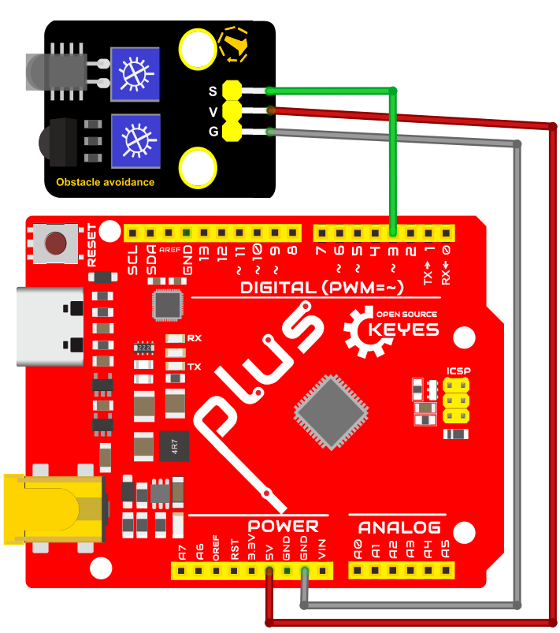

#### 5. 项目代码：

```C
//**********************************************************************************
/*
 * 名称   : Obstacle Avoidance Sensor
 * 功能   : 读取避障传感器的数值
 * 作者   : http://www.keyes-robot.com/ 
*/
int val = 0;
int AvoidPin = 3;   //避障传感器的引脚定义为D3
void setup() {
  Serial.begin(9600);   //波特率设置为9600
  pinMode(AvoidPin, INPUT);    //将传感器设置为输入模式
}

void loop() {
  val = digitalRead(AvoidPin);    //读取传感器值
  Serial.print(val);    //打印传感器值
  if (val == 0) {    //检测到障碍物，输出低电平
    Serial.print("        ");
    Serial.println("There are obstacles");
    delay(100);
  }
  else {    //未发现障碍物，输出高电平
    Serial.print("        ");
    Serial.println("All going well");
    delay(100);
  }
}
//**********************************************************************************
```

#### 6. 项目现象：

按照接线图正确接好模块和各元器件，选择正确的主板类型Arduino Uno和COM端口，点击Arduino IDE上的上传按钮上传代码。项目代码上传成功后，利用MicroUSB线连接到计算机上电，接着开始调节传感器模块上的两个电位器感应距离。避障传感器上有两个电位器，分别是接收频率调节电位器和发射功率调节电位器，如下图所示。

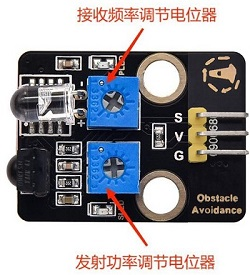

先使用一字螺丝刀调节发射功率调节电位器，先将电位器顺时针拧到尽头，然后逆时针慢慢往回调，当调节到SLED灯亮起时，微调使传感器上SLED灯介于亮与不亮之间的**不亮**状态。

接着设置接收频率调节电位器，同样将电位器顺时针拧到尽头，然后逆时针慢慢往回调，当SLED灯亮起时，微调使传感器上SLED灯介于亮与不亮之间的**不亮**状态，此时能检测障碍物的距离最长。

点击打开串口监视器，设置波特率为**9600**，你会看到的现象是：当传感器检测到障碍物时，value 值为 **0**，SLED 灯亮，串口监视器打印出 “**0    There are obstacles**” ；没有检测到障碍物时，value 值为 **1**，SLED 灯灭，串口监视器打印出 “**1    All going well**” 。

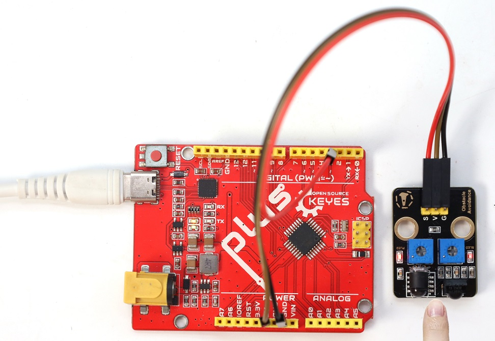

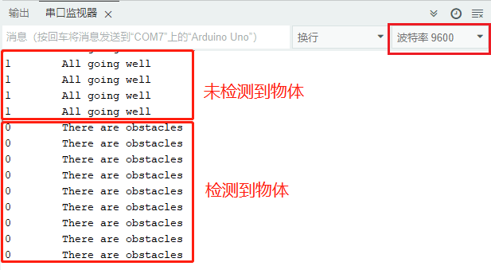

#### 7. 代码说明:

可以参照项目09的代码说明，这里就不多做介绍了。

---

### 项目11 电容触摸传感器

#### 1. 项目介绍：

在本项目中，通过读取电容触摸传感器模块上S端高低电平，判断是否触摸传感器的感应区，并且在串口监视器上显示测试结果。

#### 2. 项目元件：

||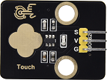|||
| :--: | :--: | :--: |:--: |
|Plus主板*1|电容触摸传感器模块*1|公对母杜邦线若干|MicroUSB线*1|

#### 3. 元件知识：


**电容触摸传感器:** 它主要由1个触摸检测芯片 TTP223-BA6 构成。模块上提供一个触摸按键，功能是用可变面积的按键取代传统按键。当我们上电之后，传感器需要约0.5秒的稳定时间，此时间段内不要触摸按键，此时所有功能都被禁止，始终进行自校准，校准周期约为4秒。

**模块参数:**

工作电压：DC 3.3 ~ 5V

工作电流：3MA

最大功率：0.015W

工作温度：-10°C ~ +50°C

输出信号：数字信号

尺寸：32 mm x 23.8 mm x 9 mm

定位孔大小：直径为 4.8 mm

**模块原理图:**


TTP223N-BA6 的输出通过 AHLB（4）引脚选择高电平或低电平有效。通过 TOG（6）引脚选择直接模式或触发模式。

| TOG  | AHLB | 引脚Q的功能           |
| ---- | ---- | --------------------- |
| 0    | 0    | 直接模式，高电平有效  |
| 0    | 1    | 直接模式，低电平有效  |
| 1    | 0    | 触发模式，上电状态为0 |
| 1    | 1    | 触发模式，上电状态为1 |

从原理图我们可以知道 TOG 脚和 AHLB 脚是悬空的，此时输出为直接模式，高电平有效。

当我们用手指触摸电容触摸传感器模块上的感应区时，信号端 S 输出高电平，板载红色LED点亮。我们通过读取模块上 S 端的高低电平，来判断电容触摸模块上的感应区是否感应到触摸。


#### 4. 项目接线图：

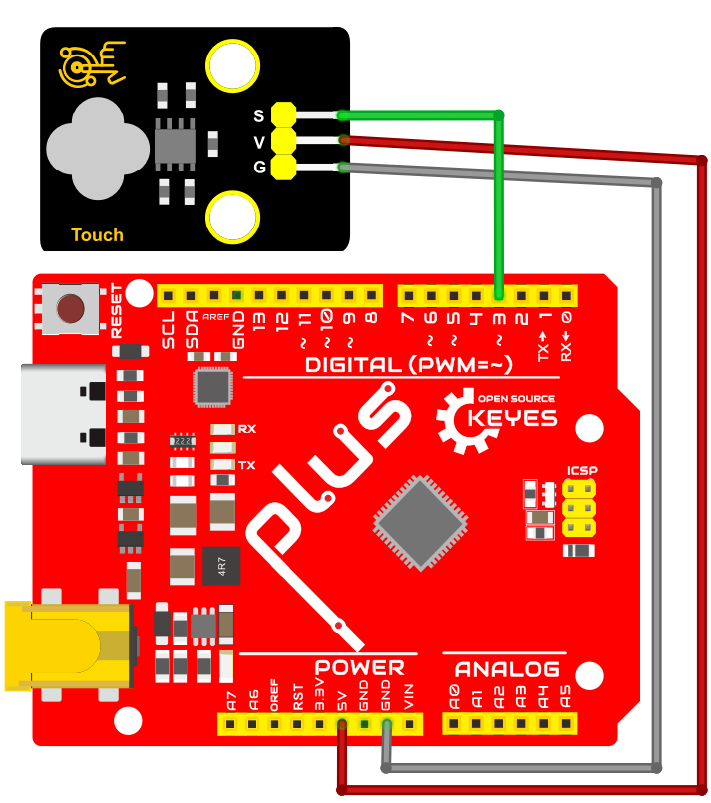

#### 5. 项目代码：

```C
//**********************************************************************************
/*
 * 名称   : Touch_Sensor
 * 功能   : 读取电容触摸传感器的数值
 * 作者   : http://www.keyes-robot.com/ 
*/
int val = 0;
int TouchPin = 3;   //电容触摸传感器的引脚定义为D3
void setup() {
  Serial.begin(9600);   //波特率设置为9600
  pinMode(TouchPin, INPUT);    //将传感器设置为输入模式
}

void loop() {
  val = digitalRead(TouchPin);    //读取传感器值
  Serial.print(val);    //打印传感器值
  if (val == 1) {    //感应区感应到触摸时，输出高电平
    Serial.print("        ");
    Serial.println("Touch the button");
    delay(100);
  }
  else {    //感应区未感应到触摸时，输出低电平
    Serial.print("        ");
    Serial.println("Loosen the button");
    delay(100);
  }
}
//**********************************************************************************
```

#### 6. 项目现象：

按照接线图正确接好模块和各元器件，选择正确的主板类型Arduino Uno和COM端口，点击Arduino IDE上的上传按钮上传代码。项目代码上传成功后，利用MicroUSB线连接到计算机上电，单击图标进入串行监视器，设置波特率为9600，当电容触摸传感器模块上的感应区感应到触摸时，板载红色LED灯点亮，value 值为 1，串口监视器打印出“**1  Touch the button**”。否则，当没有感应到触摸时，板载红色LED灯熄灭，value 值为 0，串口监视器打印出“**0  Loosen the button**”。

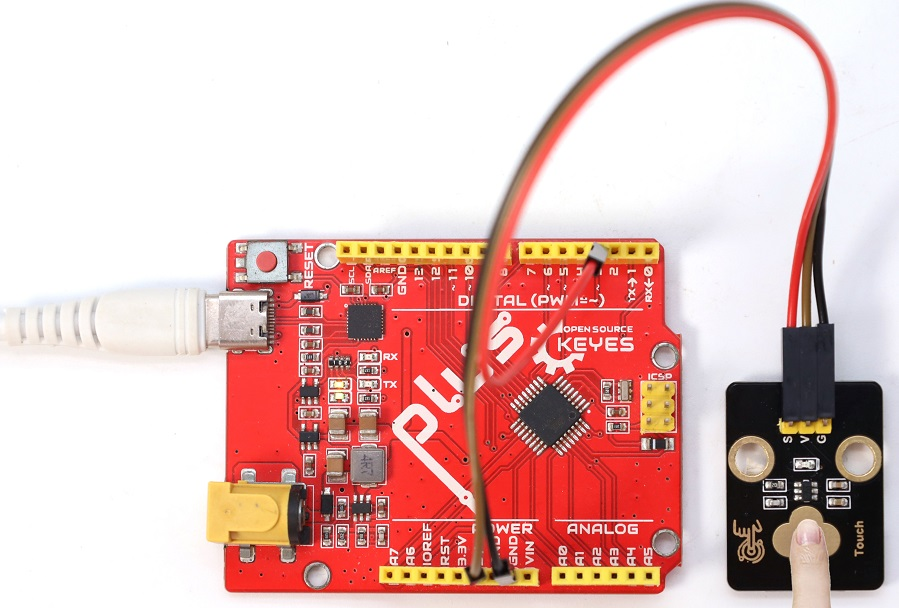

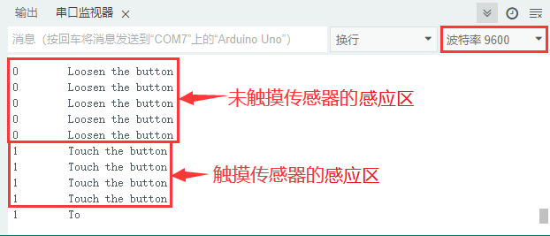

#### 7. 代码说明:

可以参照项目09的代码说明，这里就不多做介绍了。

---

### 项目12 光敏传感器

#### 1. 项目介绍：

光敏传感器模块有个信号输出端，可以输出光照强度的模拟信号。在本项目中，我们将读取传感器的模拟信号，并将测试结果在串口监视器上打印显示出来。

#### 2. 项目元件：

||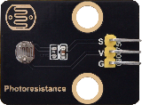|||
| :--: | :--: | :--: |:--: |
|Plus主板*1|光敏传感器模块*1|公对母杜邦线若干|MicroUSB线*1|

#### 3. 元件知识：


**光敏传感器:** 是一个常用的光敏电阻传感器，它主要由一个光敏电阻元件组成。光敏电阻元件的阻值随着光照强度的变化而变化，此传感器就是利用光敏电阻元件这一特性，设计电路将阻值变化转换为电压变化。光敏电阻传感器可以模拟人对环境光线的强度的判断，方便做出与人友好互动的应用。

**模块参数:**

工作电压: DC 3.3 ~ 5V 

工作电流: 0.2MA

最大功率: 0.001W

光谱峰值: 540nm

亮电阻: 5~10千欧

暗电阻: 0.5兆欧

工作温度：-10°C ~ +50°C

输出信号: 模拟信号

尺寸：32 mm x 23.8 mm x 7.4 mm

定位孔大小：直径为 4.8 mm

**模块原理图:**


当没有光照射时，电阻大小为0.2 MΩ，光敏电阻的信号端（2脚）检测的电压接近0。随着光照强度增大，光敏传感器的电阻值越来越小，所以信号端能检测到的电压越来越大，模拟值也越来越大。

#### 4. 项目接线图：

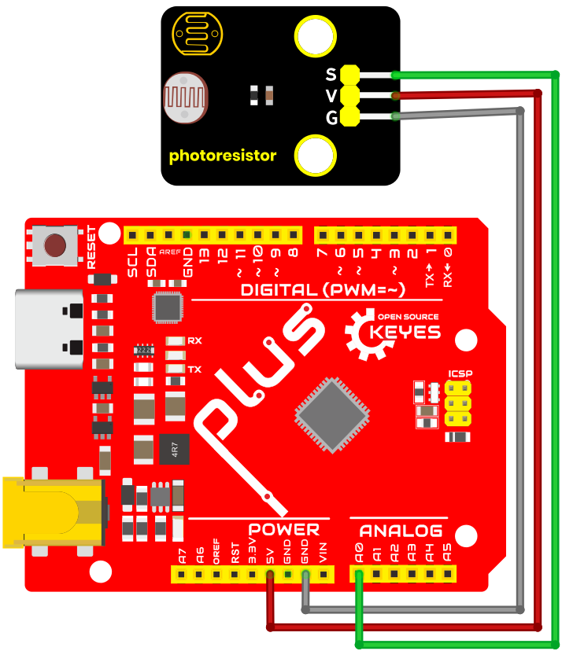

#### 5. 项目代码：

```C
//**********************************************************************************
/*
 * 名称   : Photosensor
 * 功能   : 读取光敏传感器的数值
 * 作者   : http://www.keyes-robot.com/ 
*/
int val = 0;   //设置value为0
int PIN_ANALOG_IN = A0;   //光敏传感器的引脚定义为A0

void setup() {
  Serial.begin(9600);   //波特率设置为9600
  pinMode(PIN_ANALOG_IN, INPUT);    //将传感器的引脚设置为输入模式
}

void loop() {
  val = analogRead(PIN_ANALOG_IN);    //读取传感器的模拟信号
  Serial.print("light_intensity:  ");    //打印字符串light_intensity:
  Serial.println(val);    //打印且显示光线强度的模拟信号
  delay(200);
}
//**********************************************************************************
```

#### 6. 项目现象：

按照接线图正确接好模块和各元器件，选择正确的主板类型Arduino Uno和COM端口，点击Arduino IDE上的上传按钮上传代码。项目代码上传成功后，利用MicroUSB线连接到计算机上电，点击打开串口监视器，设置波特率为**9600**，串口监视器打印出光照强度模拟值。光线越强，可以看到模拟值越大。

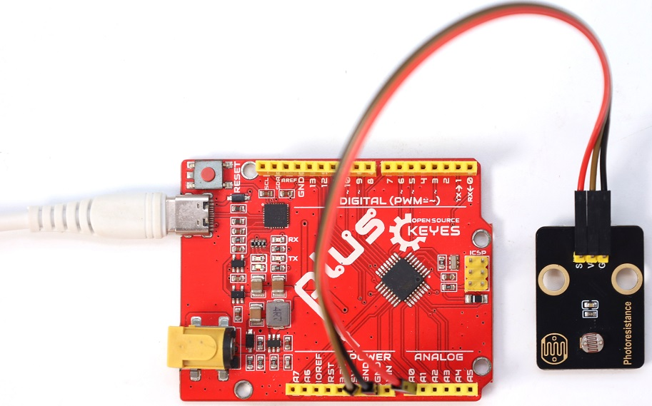


#### 7. 代码说明:

| 代码                   | 说明                                                         |
| ---------------------- | ------------------------------------------------------------ |
| pinMode(PIN_ANALOG_IN, INPUT); | 由“ int PIN_ANALOG_IN = A0; ”知道，定义光敏传感器模块的模拟管脚为A0，“INPUT”设置为输入模式。 |
| val = analogRead(PIN_ANALOG_IN)    | 为了兼容性，默认analogRead()分辨率为 10 位。详细了解请参考链接：https://vimsky.com/examples/usage/arduino-language-functions-analog-io-analogread-ar.html 。这个函数是从指定的模拟引脚PIN_ANALOG_IN读取光敏传感器检测到的光照强度模拟信号，模拟信号的范围：0~1023。并且将光照强度模拟信号赋值于变量val。 |
| Serial.begin(9600)     | 初始化串口通信，并设置波特率为9600。                         |
| Serial.print( )   | 未换行输出数据。从串行端口输出数据，跟随一个回车和一个未换行符。 |
| Serial.println( )   | 换行输出数据。从串行端口输出数据，跟随一个回车和一个换行符。 |
|int val = 0|设置变量val的初始值为0|

---

### 项目13 水滴传感器

#### 1. 项目介绍：

水滴传感器模块有个信号输出端，可以输出水量大小的模拟信号。在本项目中，我们将读取传感器的模拟信号，并将测试结果在串口监视器上打印显示出来。

#### 2. 项目元件：

||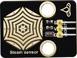|||
| :--: | :--: | :--: |:--: |
|Plus主板*1|水滴传感器模块*1|公对母杜邦线若干|MicroUSB线*1|

#### 3. 元件知识：


**水滴传感器:** 是一个模拟（数字）输入模块，也叫雨水、雨量传感器。可用于各种天气状况的监测，检测是否下雨及雨量的大小，转成模拟信号（AO）输出，并广泛应用于各种天气状况的监测，也可用于汽车自动刮水系统、智能灯光系统和智能天窗系统等。

**模块参数:**

工作电压: DC 3.3 ~ 5V 

工作电流: 1.5MA

最大功率: 0.0075W

工作温度：-10°C ~ +50°C

输出信号: 模拟信号

尺寸：32 mm x 23.8 mm x 9.3 mm

定位孔大小：直径为 4.8 mm

**模块原理图:**


水滴传感器通过电路板上裸露的印刷平行线检测水量的大小。水量越多，就会有更多的导线被联通，随着导电的接触面积增大，雨滴感应区 2 脚输出的电压就会逐步上升。信号端 S 检测到的模拟值就越大。除了可以检测水量的大小，它还可以检测空气中的水蒸气。

#### 4. 项目接线图：

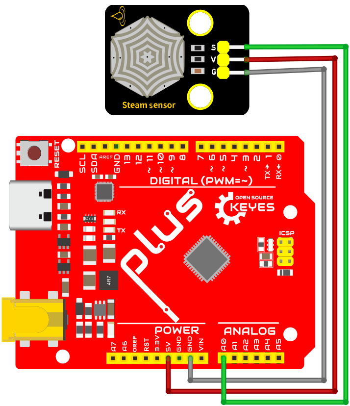

#### 5. 项目代码：

```C
//**********************************************************************************
/*
 * 名称   : Steam_Sensor
 * 功能   : 读取水滴传感器的数值
 * 作者   : http://www.keyes-robot.com/ 
*/
int val = 0;   //设置value为0
int PIN_ANALOG_IN = A0;   //水滴传感器的引脚定义为A0

void setup() {
  Serial.begin(9600);   //波特率设置为9600
  pinMode(PIN_ANALOG_IN, INPUT);    //将传感器的引脚设置为输入模式
}

void loop() {
  val = analogRead(PIN_ANALOG_IN);    //读取传感器的模拟信号
  Serial.print("water_volume:  ");    //打印字符串water_volume:
  Serial.println(val);    //打印且显示水量的模拟信号
  delay(200);
}
//**********************************************************************************
```

#### 6. 项目现象：

按照接线图正确接好模块和各元器件，选择正确的主板类型Arduino Uno和COM端口，点击Arduino IDE上的上传按钮上传代码。项目代码上传成功后，利用MicroUSB线连接到计算机上电，点击打开串口监视器，设置波特率为**9600**。


在水滴传感器的感应区滴一两滴水（**小心用水，注意不要滴到感应区以外的其他任何地方，包括Plus主板**），串口监视器打印出此时水滴传感器的模拟值。水量变化，模拟值也会发生变化。水量越多，输出的模拟值越大。

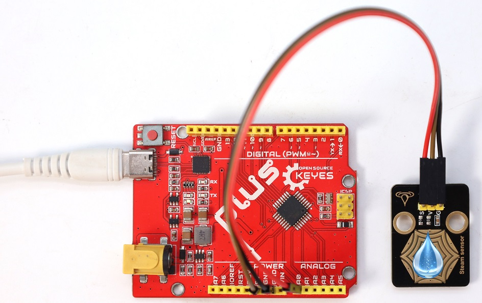

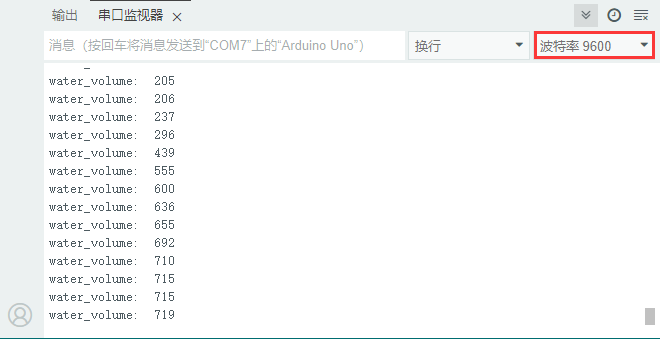

#### 7. 代码说明:

| 代码                   | 说明                                                         |
| ---------------------- | ------------------------------------------------------------ |
| pinMode(PIN_ANALOG_IN, INPUT); | 由“ int PIN_ANALOG_IN = A0; ”知道，定义水滴传感器模块的模拟管脚为A0。“INPUT”设置为输入模式。通过pinMode()配置为INPUT必须使用上拉或下拉电阻。但是，我们的模块已经使用下拉电阻R1，该电阻的目的是在开关断开时将引脚拉至已知状态。通常选择一个4.7K/10KΩ的电阻，因为它的阻值足够低，可以可靠地防止输入悬空。同时，该阻值也要足够高，以使开关闭合时不会消耗太多电流。如果使用下拉电阻，则当开关断开时，输入引脚将为低电平；当开关闭合时，输入引脚将为高电平。如果使用上拉电阻，则当开关断开时，输入引脚将为高电平；当开关闭合时，输入引脚将为低电平。 |
| val = analogRead(PIN_ANALOG_IN)    | 读取水滴传感器检测水量大小输出的模拟信号，模拟信号的范围：0~1023。并且将水量模拟信号赋值于变量val。 |
| Serial.begin(9600)     | 初始化串口通信，并设置波特率为9600。                         |
| Serial.print( )   | 未换行输出数据。从串行端口输出数据，跟随一个回车和一个未换行符。 |
| Serial.println( )   | 换行输出数据。从串行端口输出数据，跟随一个回车和一个换行符。 |
|int val = 0|设置变量val的初始值为0|

---

### 项目14 声音传感器

#### 1. 项目介绍：

声音传感器将外界声音的大小转换成对应的模拟信号，然后通过模块上的信号输出端输出。在本项目中，我们将读取传感器的模拟信号，并将测试结果在串口监视器上打印显示出来。

#### 2. 项目元件：

||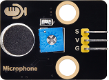||||
| :--: | :--: | :--: |:--: |:--: |
|Plus主板*1|声音传感器模块*1|公对母杜邦线若干|MicroUSB线*1|一字螺丝刀*1|

#### 3. 元件知识：


**声音传感器:** 声音传感器通常用于检测周围环境中的声音响度。微型控制板可以通过模拟输入接口采集其输出信号。S引脚是模拟输出，是麦克风电压信号的实时输出。传感器附带一个电位器，这样你就可以调整信号强度。你可以使用它来制作一些交互式作品，如语音操作的开关等。

**模块参数:**

工作电压: DC 3.3 ~ 5V 

工作电流: 1.5MA

最大功率: 0.075W

工作温度：-10°C ~ +50°C

输出信号: 模拟信号

尺寸：32 mm x 23.8 mm x 10.3 mm

定位孔大小：直径为 4.8 mm

**模块原理图:**


声音传感器主要由一个高感度麦克风元件和LM386音频功率放大器芯片组成。高感度麦克风元件用于检测外界的声音。利用LM386音频功率放大器芯片设计对高感度麦克风检测到的声音进行放大的电路，最大倍数为200倍。使用时我们可以通过旋转传感器上电位器，调节声音的放大倍数。顺时针调节电位器到尽头，放大倍数最大。

#### 4. 项目接线图：

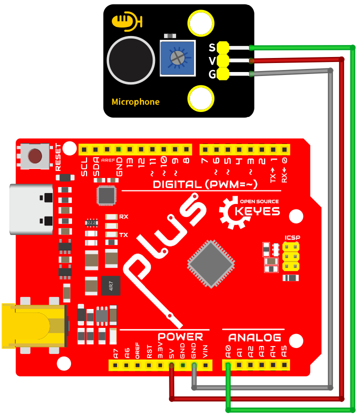

#### 5. 项目代码：

```C
//**********************************************************************************
/*
 * 名称   : Sound_Sensor
 * 功能   : 读取声音传感器的数值
 * 作者   : http://www.keyes-robot.com/ 
*/
int val = 0;   //设置value为0
int PIN_ANALOG_IN = A0;   //声音传感器的引脚定义为A0

void setup() {
  Serial.begin(9600);   //波特率设置为9600
  pinMode(PIN_ANALOG_IN, INPUT);    //将传感器的引脚设置为输入模式
}

void loop() {
  val = analogRead(PIN_ANALOG_IN);    //读取传感器的模拟信号
  Serial.print("sound_volume:  ");    //打印字符串sound_volume:
  Serial.println(val);    //打印且显示声音的模拟信号
  delay(200);
}
//**********************************************************************************
```

#### 6. 项目现象：

按照接线图正确接好模块和各元器件，选择正确的主板类型Arduino Uno和COM端口，点击Arduino IDE上的上传按钮上传代码。项目代码上传成功后，利用MicroUSB线连接到计算机上电，此时声音传感器上的电源指示灯点亮。


点击打开串口监视器，设置波特率为**9600**，串口监视器打印出声音传感器接收到的声音对应的模拟值。对准模块上的MIC头大声说话（或大呼气）时，可以看到接收到的声音对应的模拟值变大。（**注意：如果声音变化对应的模拟值没有变化并且一直都是数字0，需要用一字螺丝刀顺时针旋转电位器来调节。**）

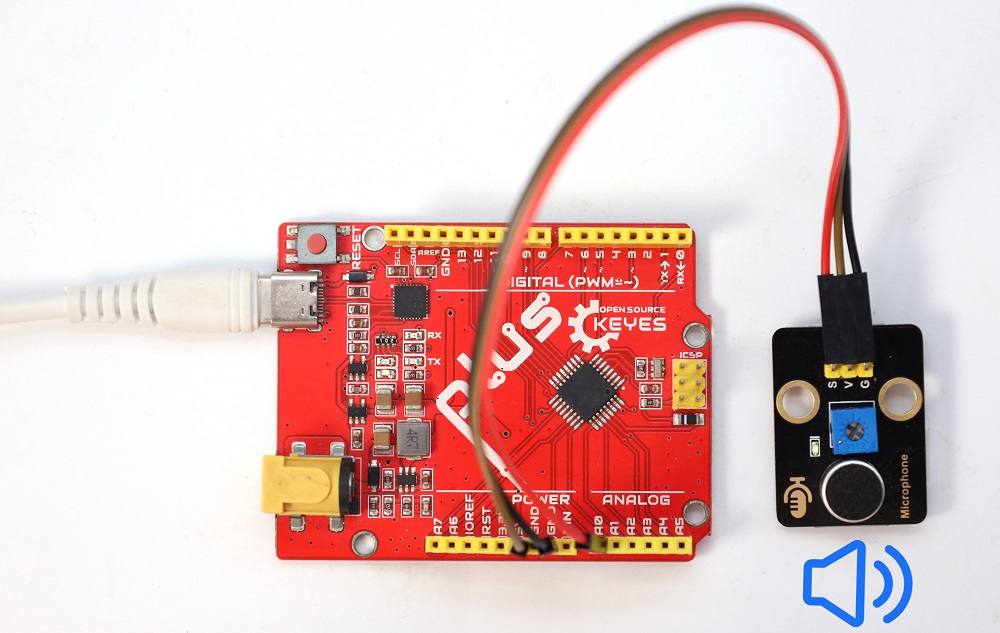

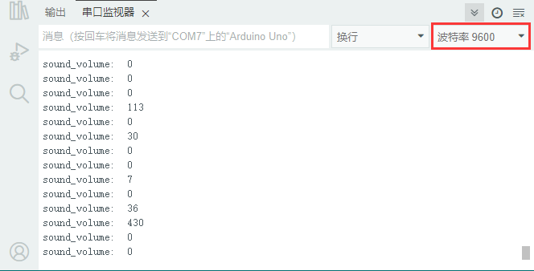

#### 7. 代码说明:

可以参照项目13的代码说明，这里就不多做介绍了。

---

### 项目15 火焰传感器

#### 1. 项目介绍：

火焰传感器模块有两个信号输出端，分别可输出数字信号与模拟信号。在本项目中，我们分别读取传感器的数字信号与模拟信号，并将测试结果在串口监视器上打印显示出来。

#### 2. 项目元件：

||||||
| :--: | :--: | :--: |:--: |:--: |
|Plus主板*1|火焰传感器模块*1|公对母杜邦线若干|MicroUSB线*1|一字螺丝刀*1|

#### 3. 元件知识：


**火焰传感器:** 它对火焰光谱特别灵敏，且灵敏度可调。性能稳定，是救火机器人的必备部件。火焰传感器上有一个远红外火焰探头，起着非常重要的作用，它可以用作机器人的眼睛来寻找火源或足球。利用它可以制作灭火机器人、足球机器人等。

**模块参数:**

工作电压: DC 3.3 ~ 5V

工作电流: 1.2MA

最大功率: 0.006W

感应距离: 0~60mm

输出信号：模拟信号和数字信号

工作温度：-10°C ~ +50°C

尺寸：32 mm x 23.8 mm x 9.2 mm

定位孔大小：直径为 4.8 mm

**模块原理图:**


红外火焰传感器能够探测到波长在700纳米～1000纳米范围内的红外光，探测角度为60，其中红外光波长在880纳米附近时，其灵敏度达到最大。从电路原理图我们可以看到，上电后红色LED2先点亮，红色LED1处于熄灭状态，检测到火焰时，数字信号端D0输出低电平，红色LED1将点亮。红外火焰探头将外界红外光的强弱变化转化为电流的变化，通过A/D转换器反映为0～255范围内数值的变化。外界红外光越强，数值越小；红外光越弱，数值越大。

#### 4. 项目接线图：

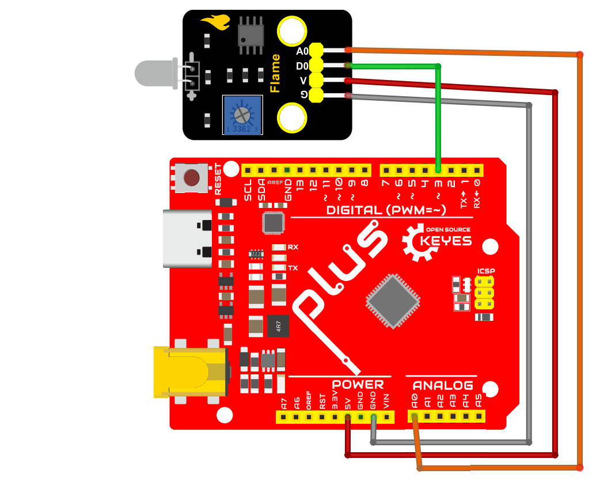

#### 5. 项目代码：

```C
//**********************************************************************************
/*
 * 名称   : Flame Sensor
 * 功能   : 读取火焰传感器的数值
 * 作者   : http://www.keyes-robot.com/ 
*/
int val1 = 0;   //设置value1为0
int val2 = 0;   //设置value2为0
int PIN_ANALOG_IN = A0;   //火焰传感器的模拟引脚定义为A0
int PIN_DIGITAL_IN = 3;   //火焰传感器的数字引脚定义为D3

void setup() {
  Serial.begin(9600);   //波特率设置为9600
  pinMode(PIN_ANALOG_IN, INPUT);    //将传感器的模拟引脚设置为输入模式
  pinMode(PIN_DIGITAL_IN, INPUT);    //将传感器的数字引脚设置为输入模式
}

void loop() {
  val1 = analogRead(PIN_ANALOG_IN);    //读取传感器的模拟信号
  val2 = digitalRead(PIN_DIGITAL_IN);    //读取传感器的数字信号
  Serial.print("D0:  ");    //打印字符串D0:
  Serial.print(val2);    //打印且显示val2数值
  if (val2 == 0) {    //检测到火焰，输出低电平
    Serial.print("  On fire!");
    Serial.print("  A0:  ");
    Serial.println(val1);
    delay(100);
  }
  else {    //未检测到火焰，输出高电平
    Serial.println("  All going well");
    delay(100);
  }
}
//**********************************************************************************
```

#### 6. 项目现象：

按照接线图正确接好模块和各元器件，选择正确的主板类型Arduino Uno和COM端口，点击Arduino IDE上的上传按钮上传代码。项目代码上传成功后，利用MicroUSB线连接到计算机上电，此时火焰传感器上的红色LED2点亮。使用一字螺丝刀旋转火焰传感器上的电位器，微调使传感器上红色LED1灯介于亮与不亮之间的**不亮**状态。如下图所示。

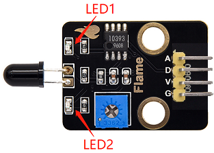

点击打开串口监视器，设置波特率为**9600**，串口监视器打印出火焰传感器的D0值“1”和字符串“All going well”。当传感器检测到火焰时，红色LED1点亮，在串口监视器中可以看到D0值由“1”变为“0”，字符串“All going well”变为“on fire!”，还打印出A0值，同时传感器检测到的火焰越大，A0值反而越小。


#### 7. 代码说明:

可以参照项目09和项目13的代码说明，这里就不多做介绍了。

---

### 项目16 模拟气体(MQ-2)传感器

#### 1. 项目介绍：

模拟气体(MQ-2)传感器模块有两个信号输出端，分别可输出数字信号与模拟信号。在本项目中，我们分别读取传感器的数字信号与模拟信号，并将测试结果在串口监视器上打印显示出来。

#### 2. 项目元件：

||||||
| :--: | :--: | :--: |:--: |:--: |
|Plus主板*1|模拟气体(MQ-2)传感器模块*1|公对母杜邦线若干|MicroUSB线*1|一字螺丝刀*1|

#### 3. 元件知识：


**模拟气体(MQ-2)传感器:** 它主要用到了MQ-2 可燃气体、烟雾传感器元件。该元件所使用的气敏材料是在清新空气中电导率较低的二氧化锡(SnO2)。当传感器所处环境中存在可燃气体时，传感器的电导率随空气中可燃气体浓度的增加而增大。该传感器对液化气、丙烷、氢气的灵敏度高，对天然气和其它可燃蒸汽的检测也很理想。它可检测多种可燃性气体，是一款适合多种应用的低成本传感器。

**模块参数:**

工作电压 : DC 3.3 ~ 5V

工作电流 : 100 mA

最大功率 : 0.5 W

输出信号 ：模拟信号和数字信号

工作温度 ：-10°C ~ +50°C

尺寸 ：47.6 mm x 23.8 mm x 17.9 mm

定位孔大小：直径为 4.8 mm

**模块原理图:**

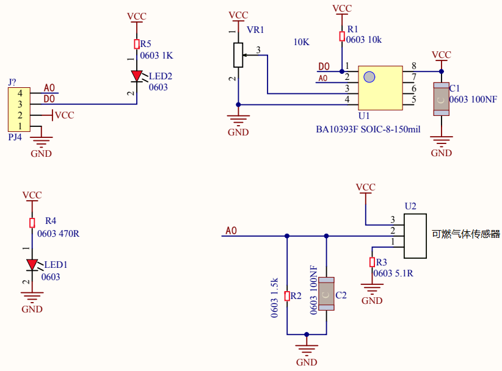

模拟气体(MQ-2)传感器与烟雾接触时，晶粒间界处的势垒受到烟雾的浓度变化而变化，就会引起表面导电率的变化。利用这一点就可以获得这种烟雾存在的信息，烟雾的浓度越大，导电率越大，输出电阻越低，则输出的模拟信号就越大。

使用时，A 端读取对应气体的模拟值；D 端连接一个LM393芯片（电压比较器），我们可以通过电位器调节测量气体报警临界点，在 D 端输出数字值。当测量气体含量超过临界点时，D 端输出低电平；测量气体含量没超过临界点时，D 端输出高电平。

#### 4. 项目接线图：

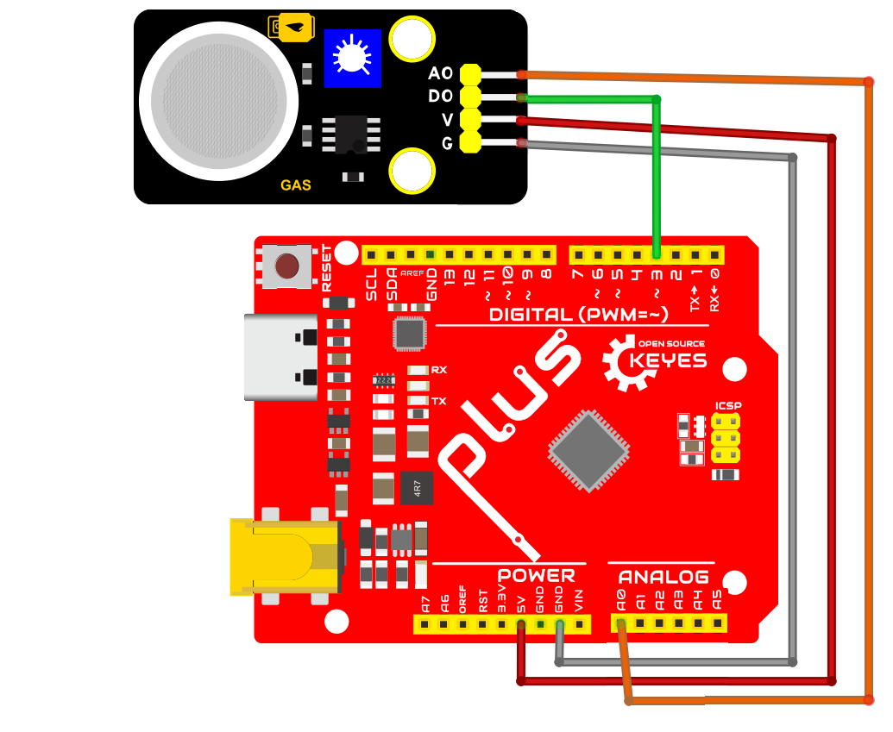

#### 5. 项目代码：

```C
//**********************************************************************************
/*
 * 名称   : MQ-2 Sensor
 * 功能   : 读取模拟气体(MQ-2)传感器的数值
 * 作者   : http://www.keyes-robot.com/ 
*/
int val1 = 0;   //设置value1为0
int val2 = 0;   //设置value2为0
int PIN_ANALOG_IN = A0;   //模拟气体(MQ-2)传感器的模拟引脚定义为A0
int PIN_DIGITAL_IN = 3;   //模拟气体(MQ-2)传感器的数字引脚定义为D3

void setup() {
  Serial.begin(9600);   //波特率设置为9600
  pinMode(PIN_ANALOG_IN, INPUT);    //将传感器的模拟引脚设置为输入模式
  pinMode(PIN_DIGITAL_IN, INPUT);    //将传感器的数字引脚设置为输入模式
}

void loop() {
  val1 = analogRead(PIN_ANALOG_IN);    //读取传感器的模拟信号
  val2 = digitalRead(PIN_DIGITAL_IN);    //读取传感器的数字信号
  Serial.print("D0: ");    //打印字符串D0:
  Serial.print(val2);    //打印且显示val2数值
  if (val2 == 0) {    //检测到烟雾或可燃性气体，输出低电平
    Serial.print("  smoke or flammable gas!");
    Serial.print("  A0:  ");
    Serial.println(val1);
    delay(100);
  }
  else {    //未检测到烟雾或可燃性气体，输出高电平
    Serial.println("  All going well");
    delay(100);
  }
}
//**********************************************************************************
```

#### 6. 项目现象：

按照接线图正确接好模块和各元器件，选择正确的主板类型Arduino Uno和COM端口，点击Arduino IDE上的上传按钮上传代码。项目代码上传成功后，利用MicroUSB线连接到计算机上电，此时模拟气体(MQ-2)传感器上的电源指示灯点亮。使用一字螺丝刀旋转模拟气体(MQ-2)传感器上的电位器，微调使传感器上红色LED灯介于亮与不亮之间的**不亮**状态。如下图所示：


点击打开串口监视器，设置波特率为**9600**，串口监视器打印出模拟气体(MQ-2)传感器的D0值“1”和字符串“All going well”。当传感器检测到烟雾或可燃性气体时，红色LED点亮，在串口监视器中可以看到D0值由“1”变为“0”，字符串“All going well”变为“smoke or flammable gas!”，还打印出A0值，同时传感器检测到的烟雾或可燃性气体浓度越大，A0值也越大。

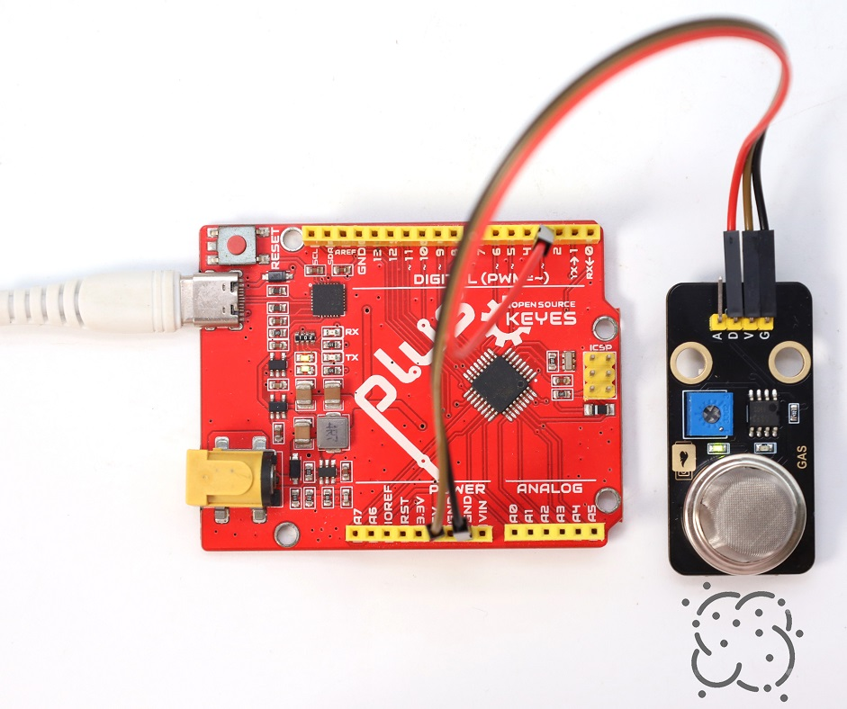

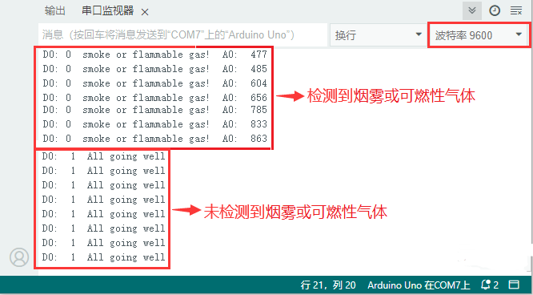

#### 7. 代码说明:

可以参照项目09和项目13的代码说明，这里就不多做介绍了。

---

### 项目17 LCD 1602 显示屏

#### 1. 项目介绍：

LCD1602液晶显示屏是广泛使用的一种字符型液晶显示模块。LCD1602液晶显示屏采用标准的14脚（无背光）或16脚（带背光）接口，通过显示屏驱动IC，实现I2C控制，节省了单片机引脚。这一项目中我们将使用LCD1602液晶显示屏显示字符串。

#### 2. 项目元件：

||||||
| :--: | :--: | :--: |:--: |:--: |
|Plus主板*1|LCD1602显示屏模块*1|公对母杜邦线若干|MicroUSB线*1|一字螺丝刀*1|

#### 3. 元件知识：

**I2C串行通信：**

I2C通信协议是Inter-Integrated Circuit（IIC）的缩写，也叫作两线制或TWI（Two-Wire Interface），是一种通用的主从式的两线总线通信协议，它是由Philips Semiconductor公司开发的（现在被美国NXP半导体公司收购）。

其最大的优点是只需要两根线就可以完成数据的传输，对于系统线路的繁琐也减少了很多，这种总线可以并行联结127个节点，并且支持多主机，从机一般不需要外接电源，因为I2C总线可以把电源传输到从机。如下图。


I2C总线的数据传输采用8位数据传输的方式，通常一个字节的数据传输是由9个时钟信号组成，8个时钟信号传输数据，最后一个时钟信号用于传输结束的标志。同时，I2C总线也支持多字节的数据传输，不断重复上述过程，即可完成多字节的数据传输。

I2C协议的基本组成部分包括以下内容：

- 起始信号：在发送数据之前，发送方必须发送起始信号，以告知接收方，要发送数据了。

- 地址码：地址码用于告知接收方，要发送的数据是给谁的。

- 数据：数据按照位传输，每次传输一个字节的数据。 

- 停止信号：发送完数据后，发送方必须发送停止信号，以告知接收方，数据发送完毕。

**串口协议时序如下：**

具体通信协议请移步官网：[https://www.nxp.com/](https://www.nxp.com/)


Arduino提供了一个名为Wire.h的I2C协议集成库，可以通过调用其函数实现I2C通信，从而实现与I2C/TWI设备的通信。

具体库介绍参考官网链接：

[https://www.arduino.cc/reference/en/language/functions/communication/wire/](https://www.arduino.cc/reference/en/language/functions/communication/wire/)


**LCD 1602显示屏：**（1602 Liquid Crystal Display）是一种常见的字符液晶显示器，它是一种专门用来显示字母、数字、符号等的点阵型液晶模块。

字符型液晶，能够同时显示16x02即32个字符。它由若干个点阵字符位组成，每个点阵字符位都可以显示一个字符，每两个点阵字符位之间有一个点距的间隔，每行之间也有间隔，起到了字符间距和行间距的作用，正因为如此所以它不能很好地显示图形。

LCD1602显示屏模块，简化了LCD1602接线 ，使用IIC/I2C接口，不仅方便接线，还更加节省GPIO口。它能兼容Arduino的库文件，方便快速开发。

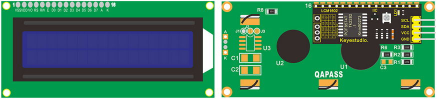

可以通过IIC扩展板上的电位器，调节对比度，使用一字螺丝刀旋转电位器。


**模块参数：**

工作电压 : DC 5V 

工作电流 :  < 130 mA

工作温度 : -10°C ~ +50°C

温度范围 : 0 ~ 50°C (± 2℃) 

IIC地址 : 0x27

尺寸 ：80 mm x 36 mm x 17.2 mm

定位孔大小：直径为 3 mm

**模块原理图：**


LCD1602 显示屏采用标准的16脚接口，其中：

| 引脚   | 符号     | 引脚说明                                                     |
| ------ | -------- | ------------------------------------------------------------ |
| 1      | VSS      | GND负电源。       |
| 2      | VDD      | 5V正电源。           |
| 3      | V0       | V0为液晶显示器对比度调整端，接正电源时对比度最弱，接地电源时对比度最高。<br>（对比度过高时会 产生“鬼影”，使用时可以通过一个10K的电位器调整对比度。） |
| 4      | RS       | RS为寄存器选择，高电平1时选择数据寄存器、低电平0时选择指令寄存器。 |
| 5      | RW       | RW为读写信号线，高电平(1)时进行读操作，低电平(0)时进行写操作。 |
| 6      | E        | E(或EN)端为使能(enable)端,高电平（1）时读取信息，负跳变时执行指令。 |
| 7 ~ 14 | D0 ~ D14 | D0～D7为8位双向数据端。第15～16脚：空脚或背灯电源。          |
| 15     | BLA      | 背光正极。                                                   |
| 16     | BLK      | 背光负极。                                                   |

LCD1602 显示屏使用时需要至少7个IO口才能驱动起来，占用的IO口太多了，其他传感器就不够用了。IIC LCD1602显示屏模块使用了I2C接口的转接板，使用IIC接口，简化了LCD1602接线 。不仅方便接线，还更加节省IO口。

#### 4. 项目接线图：

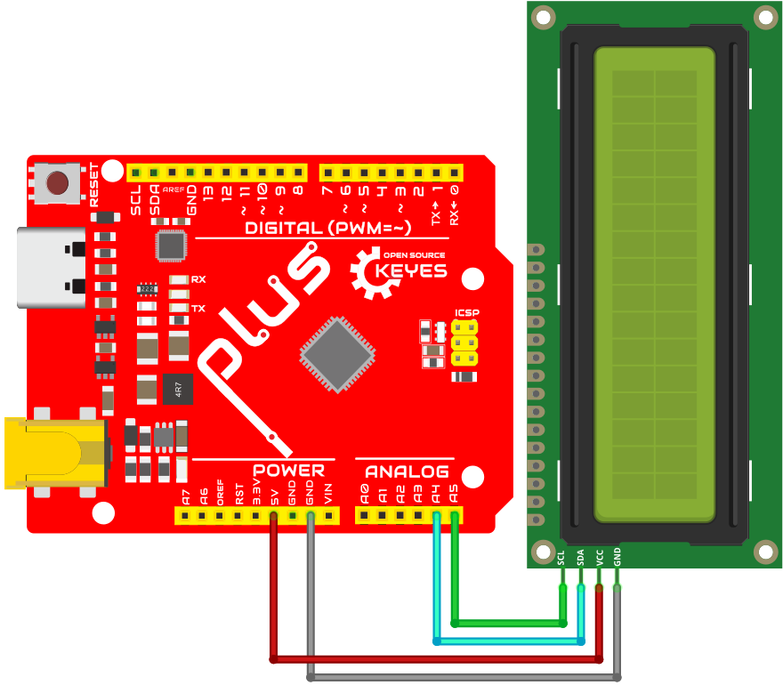

#### 5. 添加LiquidCrystal_I2C库文件：

先点击“**项目**”，选择“**导入库**”，最后选择“**添加 .ZIP库...**”。根据库文件的路径打开库文件夹，选中”**LiquidCrystal_I2C.zip**“库压缩包，然后单击“**打开**”。这样，库文件成功加入。

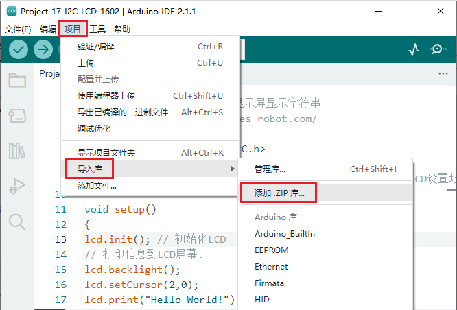

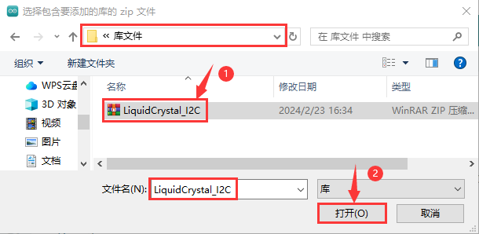

#### 6. 项目代码：

```C
//**********************************************************************************
/*  
 * 名称   : I2C_LCD_1602
 * 功能   : I2C LCD 1602 显示屏显示字符串
 * 作者   : http://www.keyes-robot.com/ 
*/
#include <LiquidCrystal_I2C.h>

LiquidCrystal_I2C lcd(0x27,16,2); // 将显示16字符,2行的LCD设置地址为0x27

void setup()
{
lcd.init(); // 初始化LCD
lcd.init();
// 打印信息到LCD屏幕.
lcd.backlight();
lcd.setCursor(2,0);
lcd.print("Hello World!");
lcd.setCursor(2,1);
lcd.print("Hello Keyes!");
}
void loop()
{
}
//********************************************************************************
```

#### 7. 项目现象：

按照接线图正确接好模块和各元器件，选择正确的主板类型Arduino Uno和COM端口，点击Arduino IDE上的上传按钮上传代码。项目代码上传成功后，利用MicroUSB线连接到计算机上电，你会看到的现象是：LCD1602显示屏第一行居中打印出“ **Hello World!** ” ，第二行居中打印出 “ **Hello Keyes!** ” 。

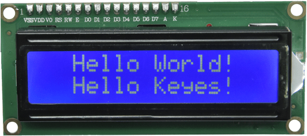

<span style="color: rgb(255, 76, 65);">注意:</span> 如果你看不见屏幕上的任何东西或显示不清楚，请尝试缓慢旋转LCD1602背面的白色旋钮，以调节对比度，直到屏幕可以清晰显示。


#### 8. 代码说明：

| 代码                              | 说明                                               |
| --------------------------------- | -------------------------------------------------- |
| LiquidCrystal_I2C lcd(0x27,16,2); | 初始化对象名 lcd，地址是0x27，16列，2行。          |
| lcd.init();                       | LCD初始化。                                        |
| lcd.backlight();                  | 背光。                                             |
| lcd.clear();                      | 清空显示屏。                                       |
| lcd.setCursor(2,0);               | 在显示屏上设置起始坐标，第三列，第一行。           |
| lcd.print("Hello World!");        | 从显示屏设置的起始坐标开始打印 “ Hello World! ” 。 |

---

### 项目18 入侵检测报警器

#### 1. 项目介绍：

前面的项目中我们已经学习了人体红外热释传感器的工作原理，那么，在本项目中，我们将结合人体红外热释传感器、有源蜂鸣器和LED灯来模拟入侵检测报警器。实现人体红外热释传感器检测到附近有人经过时有源蜂鸣器响起，LED灯快速闪烁的效果。

#### 2. 项目元件：

||||||
| :--: | :--: | :--: |:--: |:--: |
|Plus主板*1|面包板*1|人体红外热释传感器模块*1|有源蜂鸣器模块*1|红色LED*1|
|||| | |
|公对母杜邦线若干|MicroUSB线*1|220Ω电阻*1|面包板连接线若干| |

#### 3. 项目接线图：

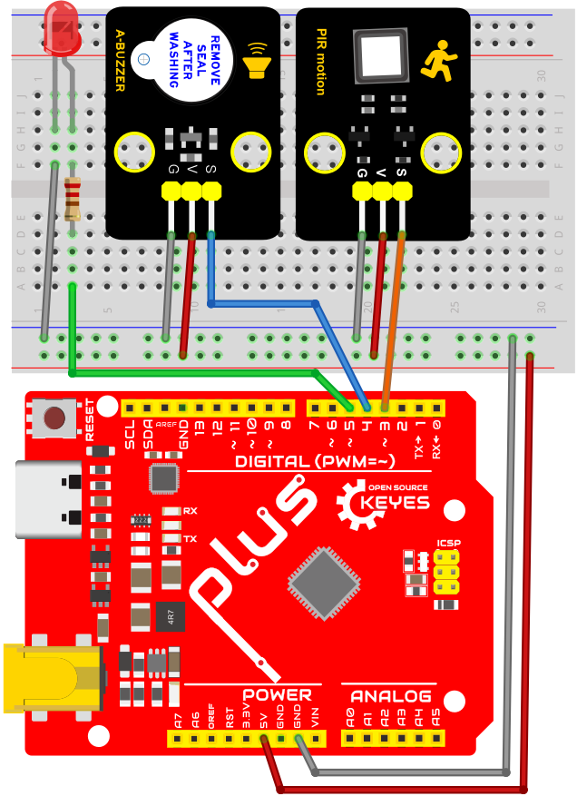

#### 4. 项目代码：

```C
//**********************************************************************************
/*  
 * 名称   : PIR_Motion_Alarm
 * 功能   : PIR控制LED和蜂鸣器
 * 作者   : http://www.keyes-robot.com/ 
*/
int item = 0;

void setup() {
  Serial.begin(9600); //设置串口波特率为9600
  pinMode(3, INPUT);  //PIR运动传感器连接D3上，并设置为输入模式
  pinMode(4, OUTPUT); //将有源蜂鸣器连接到D4上，并设置为输出模式
  pinMode(5, OUTPUT);  //将LED连接到D5上，并设置为输出模式
}

void loop() {
  item = digitalRead(3); //读取人体红外热释传感器输出的数字信号
  Serial.println(item);  //串口打印人体红外热释传感器输出的数字信号
  if (item == 1) {  //运动检测
    digitalWrite(4, HIGH); //打开蜂鸣器
    digitalWrite(5, HIGH);  //打开LED
    delay(500);  //延迟 500ms
    digitalWrite(4, LOW);  //关闭蜂鸣器
    digitalWrite(5, LOW);  //关闭LED
    delay(500);  //延迟 500ms
  } else {  //没有检测到任何信号或数据
    digitalWrite(4, LOW); //关闭蜂鸣器
    digitalWrite(5, LOW);  //关闭LED
  }
}
//**********************************************************************************
```

#### 5. 项目现象：

按照接线图正确接好模块和各元器件，选择正确的主板类型Arduino Uno和COM端口，点击Arduino IDE上的上传按钮上传代码。项目代码上传成功后，利用MicroUSB线连接到计算机上电，你会看到的现象是：当人体红外热释传感器检测到附近有人经过时，人体红外热释传感器模块上的红灯灭，有源蜂鸣器发出警报，LED灯快速闪烁，实现入侵检测报警的效果。

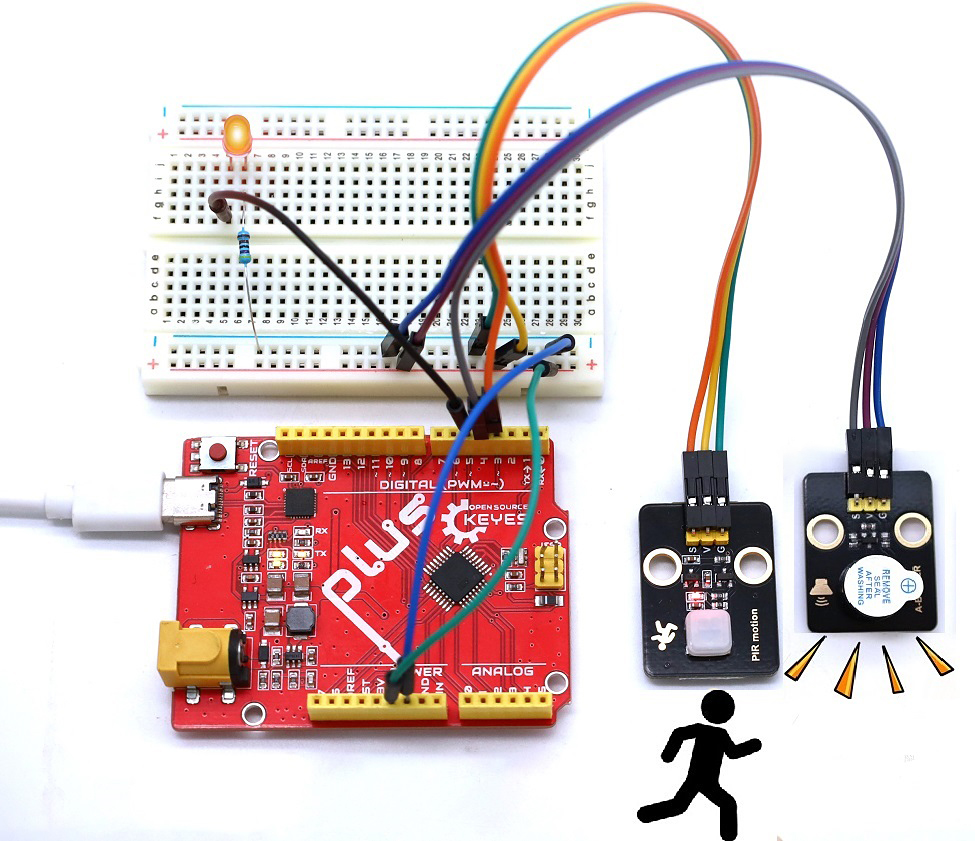

#### 6. 代码说明:

| 代码                   | 说明                                     |
| ---------------------- | ---------------------------------------- |
| item = digitalRead(3) | 人体红外热释传感器读取数字电平信号输出。 |
| item == 1              | 运动检测，检测到有人经过。               |
| digitalWrite(4, HIGH) | 有源蜂鸣器响起发出警报。                 |
| digitalWrite(5, HIGH)  | LED灯点亮。                      |


---

### 项目19 障碍物检测报警器

#### 1. 项目介绍：

上一项目中我们学习了使用人体红外热释传感器检测附近有人经过时进行报警提醒。在这一本项目中，我们将结合避障传感器、有源蜂鸣器和LED灯来模拟障碍物检测报警器。

#### 2. 项目元件：

||||||
| :--: | :--: | :--: |:--: |:--: |
|Plus主板*1|面包板*1|避障传感器模块*1|有源蜂鸣器模块*1|红色LED*1|
|||| | |
|公对母杜邦线若干|MicroUSB线*1|220Ω电阻*1|面包板连接线若干| |

#### 3. 项目接线图：

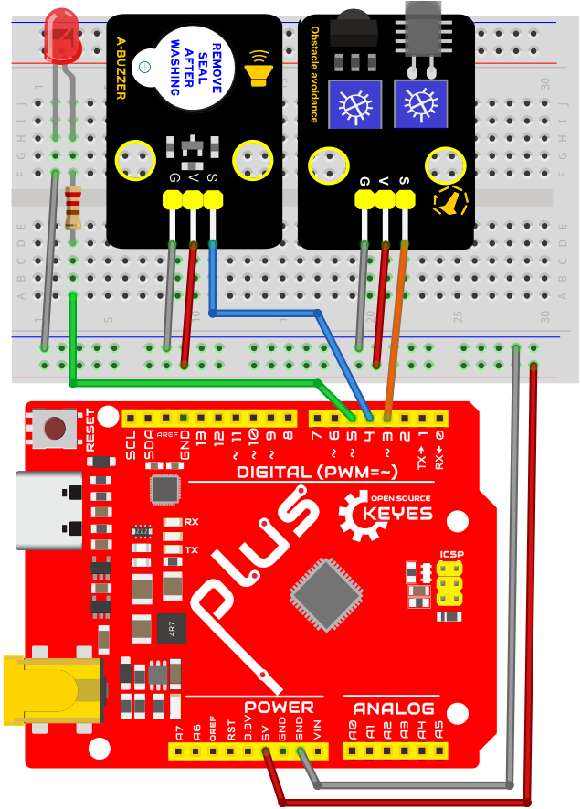

#### 4. 项目代码：

```C
//**********************************************************************************
/*  
 * 名称   : Obstacle_Detection_Alarm
 * 功能   : 避障传感器控制LED和蜂鸣器
 * 作者   : http://www.keyes-robot.com/ 
*/
int item = 0;

void setup() {
  Serial.begin(9600); //设置串口波特率为9600
  pinMode(3, INPUT);  //避障传感器连接D3上，并设置为输入模式
  pinMode(4, OUTPUT); //将有源蜂鸣器连接到D4上，并设置为输出模式
  pinMode(5, OUTPUT);  //将LED连接到D5上，并设置为输出模式
}

void loop() {
  item = digitalRead(3); //读取避障传感器输出的数字信号
  Serial.println(item);  //串口打印避障传感器输出的数字信号
  if (item == 0) {  //避障传感器检测到障碍物
    digitalWrite(4, HIGH); //打开蜂鸣器
    digitalWrite(5, HIGH);  //打开LED
    delay(500);  //延迟 500ms
    digitalWrite(4, LOW);  //关闭蜂鸣器
    digitalWrite(5, LOW);  //关闭LED
    delay(500);  //延迟 500ms
  } else {  //没有检测到任何障碍物
    digitalWrite(4, LOW); //关闭蜂鸣器
    digitalWrite(5, LOW);  //关闭LED
  }
}
//**********************************************************************************
```

#### 5. 项目现象：

按照接线图正确接好模块和各元器件，选择正确的主板类型Arduino Uno和COM端口，点击Arduino IDE上的上传按钮上传代码。项目代码上传成功后，利用MicroUSB线连接到计算机上电，你会看到的现象是：当避障传感器检测到有障碍物时，避障传感器模块上的SLED灯亮，有源蜂鸣器发出警报，外接LED灯快速闪烁，实现障碍物检测报警的效果。

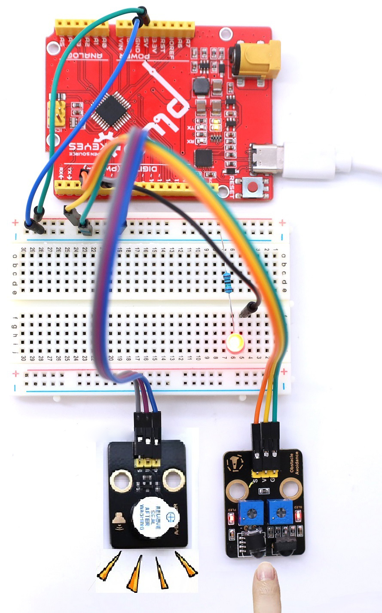

#### 6. 代码说明:

可以参照项目18的代码说明，这里就不多做介绍了。

---

### 项目20 触摸报警

#### 1. 项目介绍：

前面的项目中我们已经学习了电容触摸传感器的工作原理。那么，在本项目中，我们将结合电容触摸传感器、有源蜂鸣器和LED灯来模拟触摸报警。

#### 2. 项目元件：

||||||
| :--: | :--: | :--: |:--: |:--: |
|Plus主板*1|面包板*1|电容触摸传感器模块*1|有源蜂鸣器模块*1|红色LED*1|
|||| | |
|公对母杜邦线若干|MicroUSB线*1|220Ω电阻*1|面包板连接线若干| |

#### 3. 项目接线图：

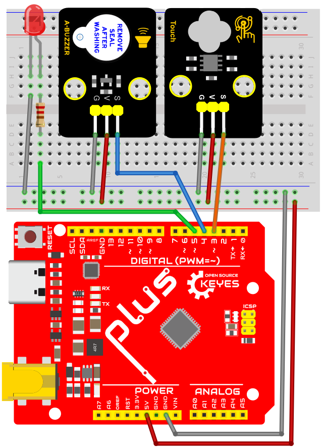

#### 4. 项目代码：

```C
//**********************************************************************************
/*  
 * 名称   : Touch_Alarm
 * 功能   : 电容触摸传感器控制LED和蜂鸣器
 * 作者   : http://www.keyes-robot.com/ 
*/
int item = 0;

void setup() {
  Serial.begin(9600); //设置串口波特率为9600
  pinMode(3, INPUT);  //电容触摸传感器连接D3上，并设置为输入模式
  pinMode(4, OUTPUT); //将有源蜂鸣器连接到D4上，并设置为输出模式
  pinMode(5, OUTPUT);  //将LED连接到D5上，并设置为输出模式
}

void loop() {
  item = digitalRead(3); //读取电容触摸传感器输出的数字信号
  Serial.println(item);  //串口打印电容触摸传感器输出的数字信号
  if (item == 1) {  //电容触摸传感器模块上的感应区感应到触摸
    digitalWrite(4, HIGH); //打开蜂鸣器
    digitalWrite(5, HIGH);  //打开LED
    delay(500);  //延迟 500ms
    digitalWrite(4, LOW);  //关闭蜂鸣器
    digitalWrite(5, LOW);  //关闭LED
    delay(500);  //延迟 500ms
  } else {  //感应区没有感应到触摸
    digitalWrite(4, LOW); //关闭蜂鸣器
    digitalWrite(5, LOW);  //关闭LED
  }
}
//**********************************************************************************
```

#### 5. 项目现象：

按照接线图正确接好模块和各元器件，选择正确的主板类型Arduino Uno和COM端口，点击Arduino IDE上的上传按钮上传代码。项目代码上传成功后，利用MicroUSB线连接到计算机上电，你会看到的现象是：用手指触摸电容触摸传感器模块上的感应区时，模块上的板载红色LED灯点亮，有源蜂鸣器发出警报，外接LED灯快速闪烁，实现触摸检测报警的效果。

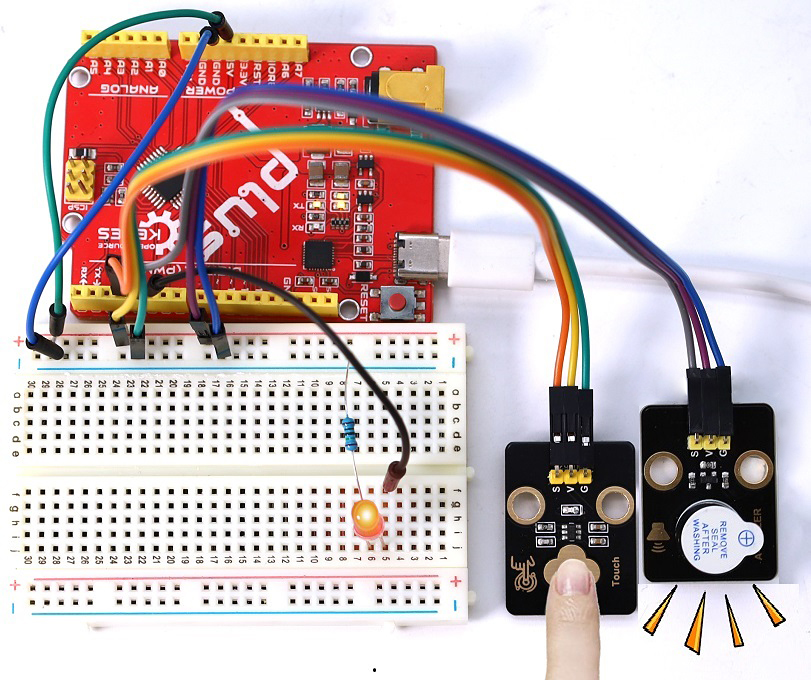

#### 6. 代码说明:

可以参照项目18的代码说明，这里就不多做介绍了。

---

### 项目21 火焰报警

#### 1. 项目介绍：

生活中，火灾的危害是相当大的。这一课我们来学习制作一个火灾报警系统，它虽然简单，但却是非常具有意义的。原理很简单，利用火焰传感器检测，检测的结果控制一个有源蜂鸣器响起，LED闪烁，实现火焰报警的效果。

#### 2. 项目元件：

||||||
| :--: | :--: | :--: |:--: |:--: |
|Plus主板*1|面包板*1|火焰传感器模块*1|有源蜂鸣器模块*1|红色LED*1|
|||| | |
|公对母杜邦线若干|MicroUSB线*1|220Ω电阻*1|面包板连接线若干| |

#### 3. 项目接线图：

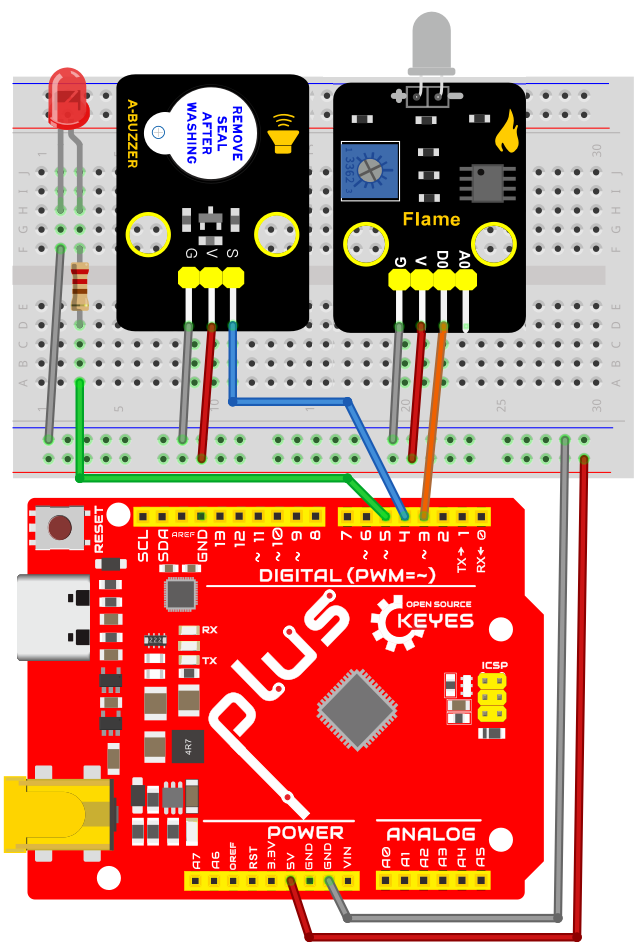

#### 4. 项目代码：

```C
//**********************************************************************************
/*  
 * 名称   : Flame_Alarm
 * 功能   : 火焰传感器控制LED和蜂鸣器
 * 作者   : http://www.keyes-robot.com/ 
*/
int item = 0;

void setup() {
  Serial.begin(9600); //设置串口波特率为9600
  pinMode(3, INPUT);  //火焰传感器连接D3上，并设置为输入模式
  pinMode(4, OUTPUT); //将有源蜂鸣器连接到D4上，并设置为输出模式
  pinMode(5, OUTPUT);  //将LED连接到D5上，并设置为输出模式
}

void loop() {
  item = digitalRead(3); //读取火焰传感器输出的数字信号
  Serial.println(item);  //串口打印火焰传感器输出的数字信号
  if (item == 0) {  //火焰传感器检测到火焰
    digitalWrite(4, HIGH); //打开蜂鸣器
    digitalWrite(5, HIGH);  //打开LED
    delay(500);  //延迟 500ms
    digitalWrite(4, LOW);  //关闭蜂鸣器
    digitalWrite(5, LOW);  //关闭LED
    delay(500);  //延迟 500ms
  } else {  //没有检测到任何火焰
    digitalWrite(4, LOW); //关闭蜂鸣器
    digitalWrite(5, LOW);  //关闭LED
  }
}
//**********************************************************************************
```

#### 5. 项目现象：

按照接线图正确接好模块和各元器件，选择正确的主板类型Arduino Uno和COM端口，点击Arduino IDE上的上传按钮上传代码。项目代码上传成功后，利用MicroUSB线连接到计算机上电，你会看到的现象是：当火焰传感器检测到火焰时，有源蜂鸣器发出警报，LED灯快速闪烁，实现火焰检测报警的效果。

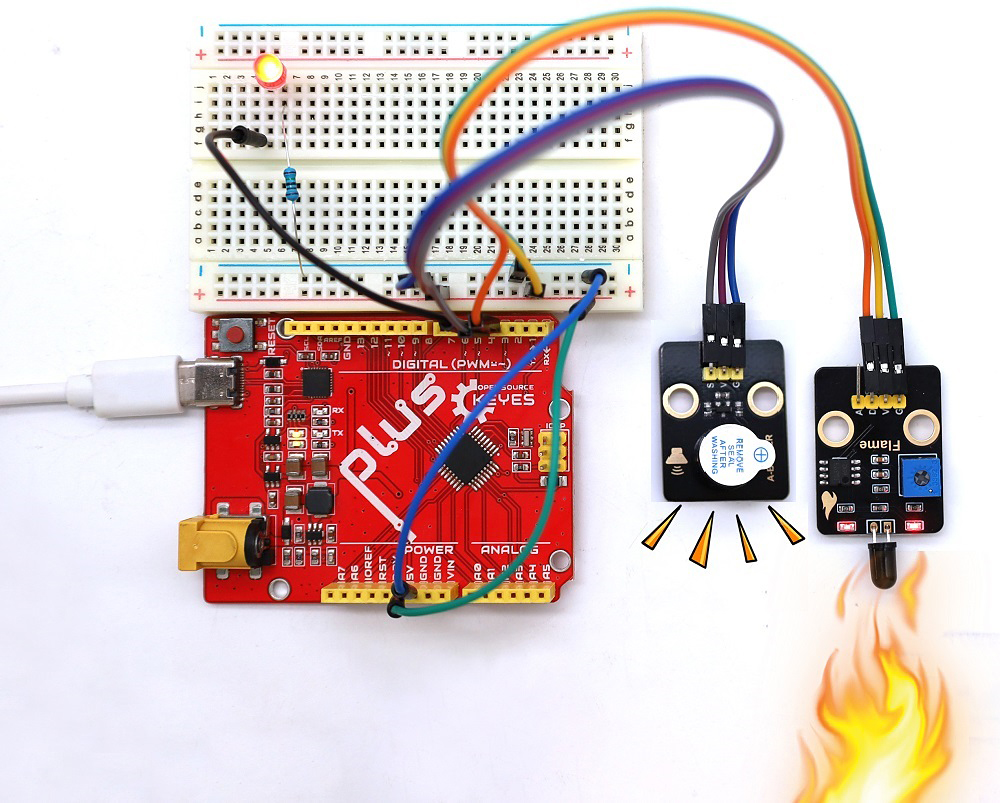

#### 6. 代码说明:

可以参照项目18的代码说明，这里就不多做介绍了。

---

### 项目22 夜光灯

#### 1. 项目介绍：

前面我们已经学习了光敏传感器的工作原理，在这一项目中，我们将光敏传感器和LED灯组合实验，实现光敏传感器检测到光照强度模拟值高于设定值时LED灯熄灭，低于设定值时LED灯点亮的效果。

#### 2. 项目元件：

|||||
| :--: | :--: | :--: |:--: |
|Plus主板*1|面包板*1|光敏传感器模块*1|红色LED*1|
|||| |
|公对母杜邦线若干|MicroUSB线*1|220Ω电阻*1|面包板连接线若干|

#### 3. 项目接线图：

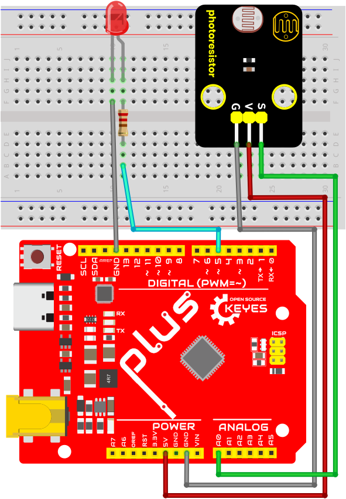

#### 4. 项目代码：

<span style="color: rgb(255, 76, 65);">注意：</span>代码中的阈值200可以根据环境中实际的光照强度更改。

```C
//**********************************************************************************
/*  
 * 名称   : Night_Lamp
 * 功能   : 光敏传感器控制LED
 * 作者   : http://www.keyes-robot.com/ 
*/
int item = 0;  //设置item为0
int PIN_ANALOG_IN = A0;   //光敏传感器的引脚定义为A0

void setup() {
  Serial.begin(9600); //设置串口波特率为9600
  pinMode(PIN_ANALOG_IN, INPUT);    //将传感器的引脚设置为输入模式
  pinMode(5, OUTPUT);  // 设置led引脚为输出模式.
}

void loop() {
  item = analogRead(PIN_ANALOG_IN);    //读取传感器的模拟信号
  Serial.println(item);  //串口打印光敏传感器输出的模拟信号
  if (item > 200) {  //光照强度的模拟值大于200
    digitalWrite(5, LOW);  //关闭LED
  } else {  //模拟值小于等于200
    digitalWrite(5, HIGH);  //打开LED
  }
}
//**********************************************************************************
```

#### 5. 项目现象：

按照接线图正确接好模块和各元器件，选择正确的主板类型Arduino Uno和COM端口，点击Arduino IDE上的上传按钮上传代码。项目代码上传成功后，利用MicroUSB线连接到计算机上电，你会看到的现象是：使用手机的照明灯对着光敏传感器模块上的光敏电阻照射，当光敏传感器检测到光照强度的模拟值大于200时，LED灯熄灭；否则，低于设定值时，LED灯点亮，实现了夜光灯的效果。

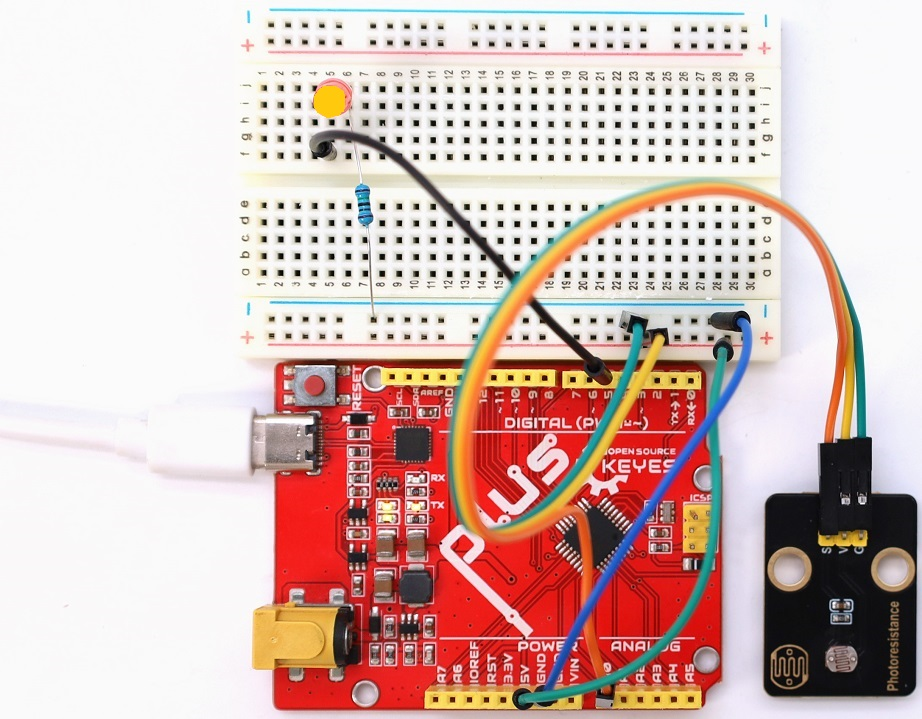

#### 6. 代码说明:

| 代码                   | 说明                                     |
| ---------------------- | ---------------------------------------- |
| item = analogRead(PIN_ANALOG_IN); | 读取光敏传感器检测到光照强度的模拟值。 |
| item > 200              | 光照强度检测，检测到光照强度的模拟值大于200。|
| if( ){ } else{ }       | 如果（ ）里的表达式为真，则执行 if { }块内的代码。如果（ ）里表达式为假 ，则执行 else { }块内的代码。 |
| digitalWrite(5, HIGH)  | LED灯点亮。                      |
| digitalWrite(5, LOW)  | LED灯熄灭。                      |

---

### 项目23 声控灯

#### 1. 项目介绍：

如今智能家居发展迅速，你使用过智能家居当中的智能声控灯吗？当我们跺跺脚或者拍拍手时，智能声控灯自动亮起；当没有声音时，智能声控灯处于熄灭状态。智能声控灯上安装有声音探测传感器，这些传感器将外界声音的大小，转换成对应数值。智能声控灯设置一个临界点，当声音转换后对应的数值超过该临界点时，灯光亮起一段时间。 

在这一实验课程中，我们将声音传感器和LED灯组合实验，学习制作一个最简单的智能声控灯。


#### 2. 项目元件：

|||||
| :--: | :--: | :--: |:--: |
|Plus主板*1|面包板*1|声音传感器模块*1|红色LED*1|
|||| |
|公对母杜邦线若干|MicroUSB线*1|220Ω电阻*1|面包板连接线若干|

#### 3. 项目接线图：

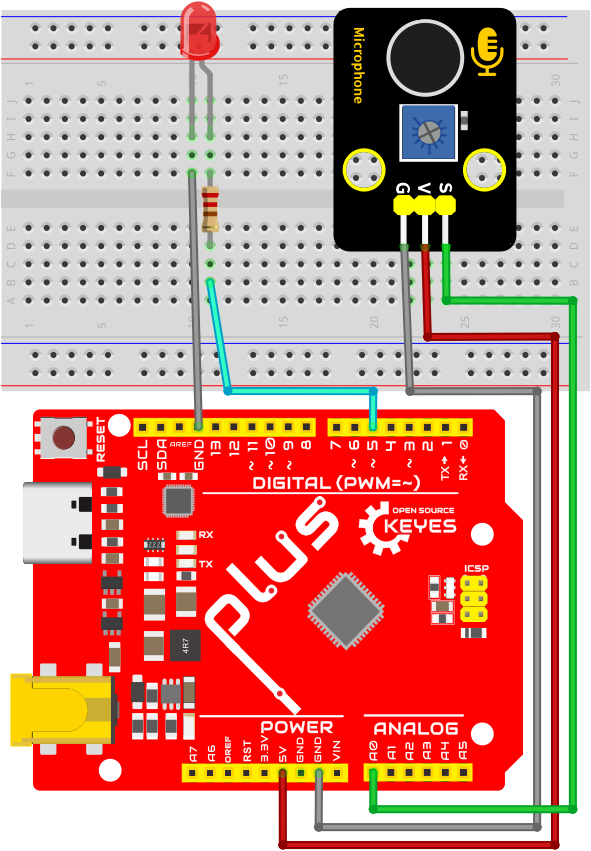

#### 4. 项目代码：

<span style="color: rgb(255, 76, 65);">注意：</span>代码中的阈值200可以根据实际情况更改的。

```C
//**********************************************************************************
/*  
 * 名称   : Sound Controlled Lamp
 * 功能   : 声音传感器控制LED
 * 作者   : http://www.keyes-robot.com/ 
*/
int item = 0;  //设置item为0
int PIN_ANALOG_IN = A0;   //声音传感器的引脚定义为A0

void setup() {
  Serial.begin(9600); //设置串口波特率为9600
  pinMode(PIN_ANALOG_IN, INPUT);    //将传感器的引脚设置为输入模式
  pinMode(5, OUTPUT);  // 设置led引脚为输出模式.
}

void loop() {
  item = analogRead(PIN_ANALOG_IN);    //读取传感器的模拟信号
  Serial.print(item);  //串口打印声音传感器输出的模拟信号
  if (item > 200) {  //模拟值大于200
    digitalWrite(5, HIGH);  //打开LED
    Serial.println("  led on");
    delay(5000);  //延迟 5s
  } else {  //模拟值小于等于200
    digitalWrite(5, LOW);  //关闭LED
    Serial.println("  led off");
  }
}
//**********************************************************************************
```

#### 5. 项目现象：

按照接线图正确接好模块和各元器件，选择正确的主板类型Arduino Uno和COM端口，点击Arduino IDE上的上传按钮上传代码。项目代码上传成功后，利用MicroUSB线连接到计算机上电，你会看到的现象是：对准模块上的MIC头大声说话（或大呼气），当声音传感器接收到的声音对应的模拟值大于200时，LED灯亮起5秒，然后熄灭。实现声控灯的效果。

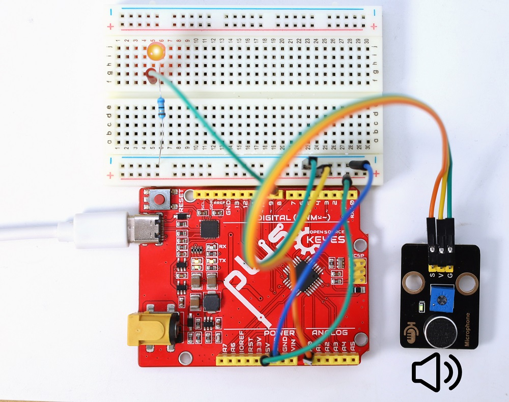

#### 6. 代码说明:

可以参照项目22的代码说明，这里就不多做介绍了。

---

### 项目24 雨水警报

#### 1. 项目介绍：

前面的项目中我们已经学习了水滴传感器的工作原理，那么，在本项目中，我们将结合水滴传感器、有源蜂鸣器和LED灯来模拟雨水警报。

#### 2. 项目元件：

||||||
| :--: | :--: | :--: |:--: |:--: |
|Plus主板*1|面包板*1|水滴传感器模块*1|有源蜂鸣器模块*1|红色LED*1|
|||| | |
|公对母杜邦线若干|MicroUSB线*1|220Ω电阻*1|面包板连接线若干| |

#### 3. 项目接线图：

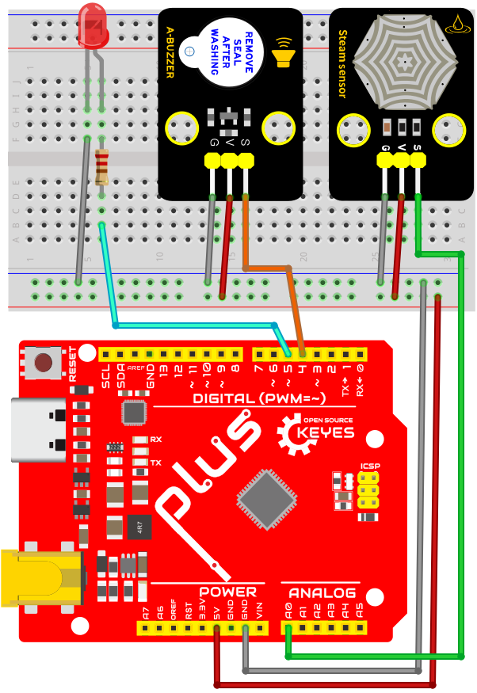

#### 4. 项目代码：

<span style="color: rgb(255, 76, 65);">注意：</span>代码中的阈值300可以根据实际情况更改的。

```C
//**********************************************************************************
/*  
 * 名称   : Water_Alarm
 * 功能   : 水滴传感器控制LED和蜂鸣器
 * 作者   : http://www.keyes-robot.com/ 
*/
int item = 0;  //设置item为0

void setup() {
  Serial.begin(9600); //设置串口波特率为9600
  pinMode(A0, INPUT);  //水滴传感器连接A0上，并设置为输入模式
  pinMode(4, OUTPUT); //将有源蜂鸣器连接到D4上，并设置为输出模式
  pinMode(5, OUTPUT);  //将LED连接到D5上，并设置为输出模式
}

void loop() {
  item = analogRead(A0);    //读取传感器的模拟信号
  Serial.println(item);  //串口打印传感器输出的水量模拟信号
  if (item > 300) {  //模拟值大于300
    digitalWrite(4, HIGH); //打开蜂鸣器
    digitalWrite(5, HIGH);  //打开LED
    delay(500);  //延迟 500ms
    digitalWrite(4, LOW);  //关闭蜂鸣器
    digitalWrite(5, LOW);  //关闭LED
    delay(500);  //延迟 500ms
  } else {  //模拟值小于等于300
    digitalWrite(4, LOW); //关闭蜂鸣器
    digitalWrite(5, LOW);  //关闭LED
  }
}
//**********************************************************************************
```

#### 5. 项目现象：

按照接线图正确接好模块和各元器件，选择正确的主板类型Arduino Uno和COM端口，点击Arduino IDE上的上传按钮上传代码。项目代码上传成功后，利用MicroUSB线连接到计算机上电，你会看到的现象是：在水滴传感器模块上的感应区滴一两滴水，当水滴传感器检测水量大小输出的模拟值大于300时，有源蜂鸣器发出警报，外接LED灯快速闪烁，实现雨水警报的效果。

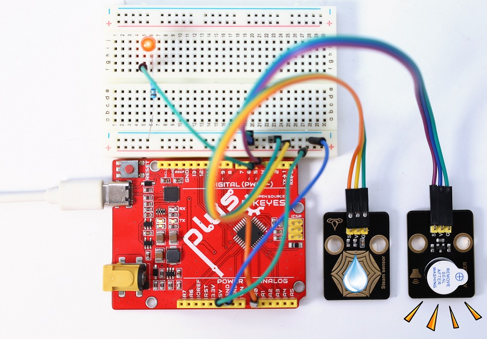

#### 6. 代码说明:

可以参照项目22的代码说明，这里就不多做介绍了。

---

### 项目25 烟雾报警器

#### 1. 项目介绍：

在前面课程中，我们学习了如何使用有源蜂鸣器模块、学习了如何使用MQ-2 烟雾传感器检测可燃气体、还学会了如何控制LCD 1602显示屏显示数字或字符。这一课程，我们尝试着将这三个实验结合在一起，制作一个烟雾报警器。制作思路是通过烟雾传感器测试出可燃气体的浓度，然后利用检测结果控制有源蜂鸣器报警、LCD 1602显示屏显示检测到的值。

#### 2. 项目元件：

||||||
| :--: | :--: | :--: |:--: |:--: |
|Plus主板*1|面包板*1|模拟气体(MQ-2)传感器模块*1|有源蜂鸣器模块*1|一字螺丝刀*1|
|||| | |
|LCD1602显示屏模块*1|公对母杜邦线若干|MicroUSB线*1|面包板连接线若干| |

#### 3. 项目接线图：

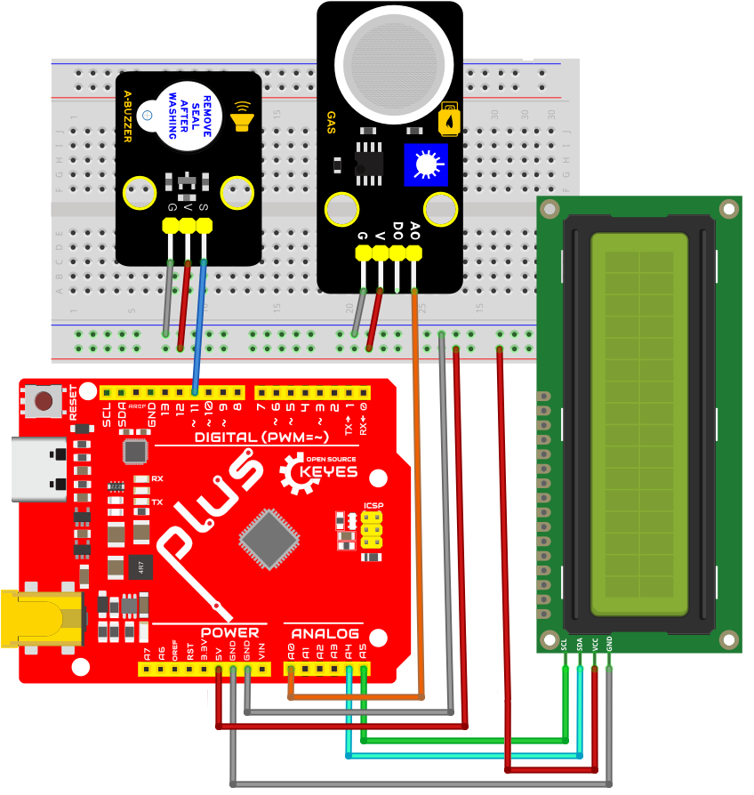

#### 4. 添加LiquidCrystal_I2C库文件：

添加LiquidCrystal_I2C库文件的方法请参照**项目17**，这里就不重复讲解。

#### 5. 项目代码：

<span style="color: rgb(255, 76, 65);">注意：</span>代码中的阈值500可以根据实际情况更改的。

```C
//**********************************************************************************
/*  
 * 名称   : Smoke_Alarm
 * 功能   : 烟雾或可燃性气体控制蜂鸣器和LCD
 * 作者   : http://www.keyes-robot.com/ 
*/
#include <Arduino.h>
#include <LiquidCrystal_I2C.h>

LiquidCrystal_I2C lcd(0x27,16,2); // 将显示16字符,2行的LCD设置地址为0x27
int item = 0;

void setup() {
  Serial.begin(9600);
  lcd.init(); // 初始化LCD
  lcd.backlight(); // 打开LCD背光
  lcd.clear();
  pinMode(A0, INPUT);  //模拟气体(MQ-2)传感器连接A0上，并设置为输入模式
  pinMode(11, OUTPUT); //将有源蜂鸣器连接到D11上，并设置为输出模式
}

void loop() {
  item = analogRead(A0); //读取模拟气体(MQ-2)传感器输出的模拟信号
  Serial.println(item);  //串口打印模拟气体(MQ-2)传感器输出的模拟信号
  lcd.setCursor(0, 0);
  lcd.print("val: ");
  lcd.setCursor(5, 0);
  lcd.print(item);
  delay(500);
  lcd.clear();
  if (item > 500) {  //检测到烟雾或可燃性气体，模拟值大于500
    lcd.setCursor(0, 1);
    lcd.print("Smoke or Gas!");
    digitalWrite(11, HIGH); //打开蜂鸣器
  } else {  //烟雾或可燃性气体模拟值小于500
    lcd.setCursor(0, 1);
    lcd.print("None!");
    digitalWrite(11, LOW); //关闭蜂鸣器
  }
}
//**********************************************************************************
```

#### 6. 项目现象：

按照接线图正确接好模块和各元器件，选择正确的主板类型Arduino Uno和COM端口，点击Arduino IDE上的上传按钮上传代码。项目代码上传成功后，利用MicroUSB线连接到计算机上电，你会看到的现象是：1602LCD显示屏显示烟雾或可燃性气体相应的模拟值，当模拟气体(MQ-2)传感器检测到烟雾或可燃性气体的模拟值大于500时，有源蜂鸣器发出警报。

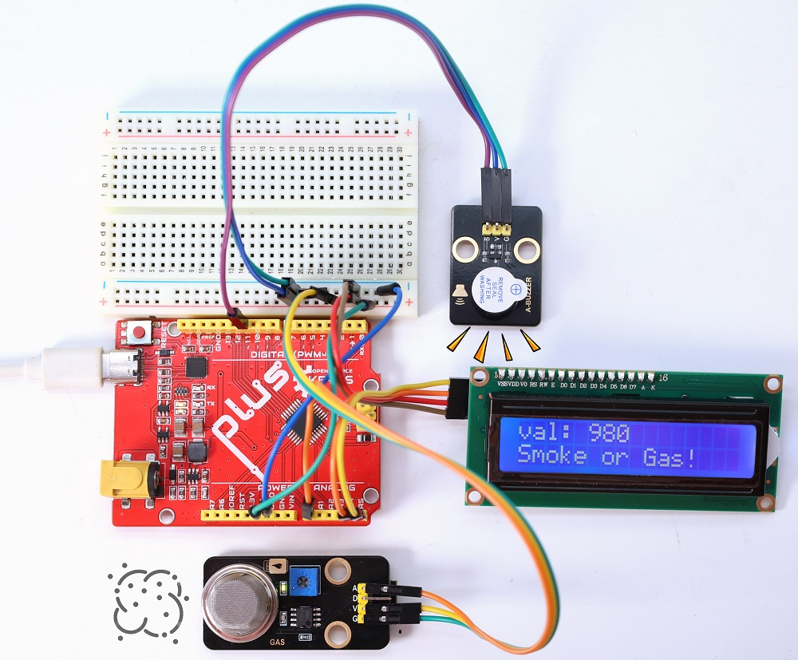

#### 6. 代码说明:

可以参照项目17和参照项目22的代码说明，这里就不多做介绍了。

---

### 项目26 模拟生活场景

#### 1. 项目介绍：

在前面我们做了很多项目实验，我们已经学习了所有的模块和传感器的使用方法，也学习了将它们搭配在一起组合实验。在这一项目实验中我们将搭配更多的模块和传感器组合在一起来模拟生活场景。

#### 2. 项目元件：

||||||
| :--: | :--: | :--: |:--: |:--: |
|Plus主板*1|面包板*1|模拟气体(MQ-2)传感器模块*1|有源蜂鸣器模块*1|红色LED*1|
||||||
|水滴传感器模块*1|声音传感器模块*1|电容触摸传感器模块*1|火焰传感器模块*1|220Ω电阻*1|
|||| | |
|LCD1602显示屏模块*1|公对母杜邦线若干|MicroUSB线*1|面包板连接线若干|一字螺丝刀*1 |

#### 3. 项目接线图：

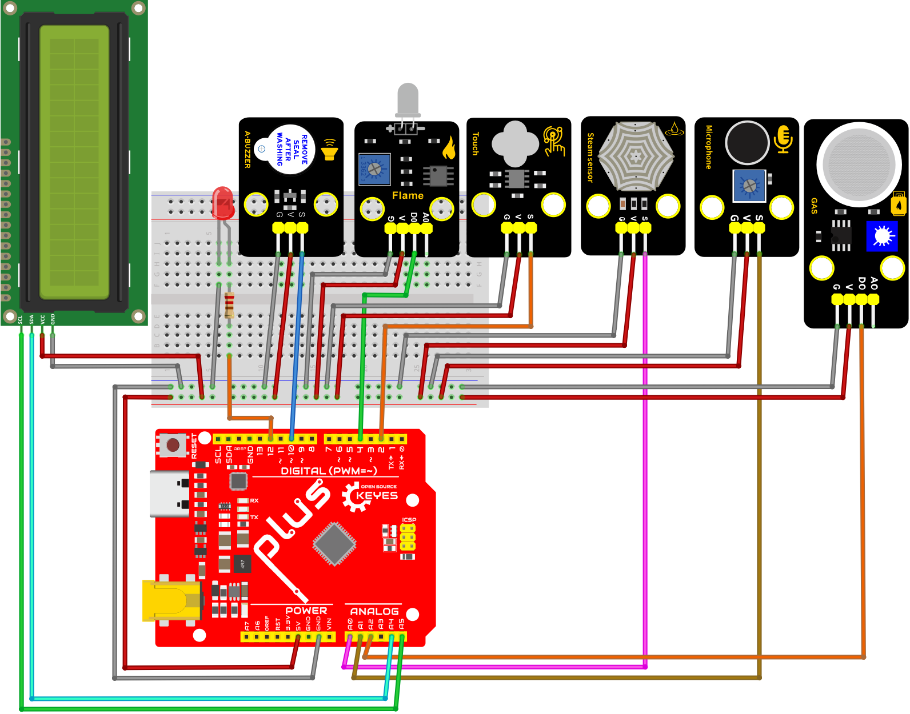

#### 4. 添加LiquidCrystal_I2C库文件：

添加LiquidCrystal_I2C库文件的方法请参照**项目17**，这里就不重复讲解。

#### 5. 项目代码：

<span style="color: rgb(255, 76, 65);">注意：</span>代码中的阈值可以根据实际情况更改的。

```C
//**********************************************************************************
/*  
 * 名称   : Simulate_smart_home
 * 功能   : 多种传感器和模块组合模拟生活场景
 * 作者   : http://www.keyes-robot.com/ 
*/
#include <Arduino.h>
#include <LiquidCrystal_I2C.h>

LiquidCrystal_I2C lcd(0x27, 16, 2);

int val1 = 0;
int val2 = 0;
int val3 = 0;
int val4 = 0;
int val5 = 0;

void setup() {
  Serial.begin(9600);
  pinMode(2, INPUT);
  pinMode(4, INPUT);
  pinMode(A0, INPUT);
  pinMode(A1, INPUT);
  pinMode(A2, INPUT);
  pinMode(10, OUTPUT);
  pinMode(12, OUTPUT);
  lcd.init();
  lcd.backlight();
  lcd.clear();
}

void loop() {
  val1=analogRead(A0);
  val2=analogRead(A1);
  val3=analogRead(A2);
  val4=digitalRead(2);
  val5=digitalRead(4);
  Serial.print("water_volume:  ");
  Serial.print(val1);
  Serial.print("   sound_volume:  ");
  Serial.println(val2);
  if (val1 > 250) {
    digitalWrite(10, HIGH);
    digitalWrite(12, HIGH);
    delay(200);
    digitalWrite(10, LOW);
    digitalWrite(12, LOW);
    delay(200);
  }
  else{
    digitalWrite(10, LOW);
    digitalWrite(12, LOW);
  }
  if (val2 > 250) {
    digitalWrite(12, HIGH);
    delay(5000);
  }
  else{
    digitalWrite(12, LOW);
  }
  if (val3 > 300) {
    lcd.clear();
    lcd.setCursor(0, 0);
    lcd.print("Val:");
    lcd.setCursor(5, 0);
    lcd.print(val3);
    lcd.setCursor(0, 1);
    lcd.print("Smoke or Gas!");
    digitalWrite(10, HIGH);
    delay(200);
    digitalWrite(10, LOW);
    delay(200);
  }
  else{
    lcd.clear();
    lcd.setCursor(0, 0);
    lcd.print("Val:");
    lcd.setCursor(5, 0);
    lcd.print(val3);
    lcd.setCursor(0, 1);
    lcd.print("None!");
    digitalWrite(10, LOW);
    delay(200);
  }
  if (val4 == 1) {
    digitalWrite(10, HIGH);
    delay(200);
    digitalWrite(10, LOW);
    delay(200);
  }
  else{
    digitalWrite(10, LOW);
  }
  if (val5 == 0) {
    digitalWrite(10, HIGH);
    digitalWrite(12, HIGH);
    delay(200);
    digitalWrite(10, LOW);
    digitalWrite(12, LOW);
    delay(200);
  }
  else{
    digitalWrite(10, LOW);
    digitalWrite(12, LOW);
  }
}
//**********************************************************************************
```

#### 6. 项目现象：

按照接线图正确接好模块和各元器件，选择正确的主板类型Arduino Uno和COM端口，点击Arduino IDE上的上传按钮上传代码。项目代码上传成功后，利用MicroUSB线连接到计算机上电，你会看到的现象及功能如下：

（1）下雨警报：当水滴滴传感器检测数据大于250时，蜂鸣器警报，LED灯闪烁，否则蜂鸣器不响，LED灯不亮。

（2）智能声控灯：我们跺跺脚或者拍拍手，当声音传感器检测到外界声音大小大于250时，智能声控灯自动亮起5秒钟；当没有声音时，智能声控灯处于熄灭状态。

（3）煤气警报：1602LCD显示屏显示烟雾或可燃性气体相应的模拟值，当模拟气体(MQ-2)传感器检测到烟雾或可燃性气体时（数值>300，这里可以用打火机气体测试），模块上的板载红色LED灯点亮，同时蜂鸣器发声警报，否则，蜂鸣器不响。

（4）触摸警报：当用手指触摸电容触摸传感器模块上的感应区时，模块上的板载红色LED灯点亮，有源蜂鸣器发出警报；否则有源蜂鸣器不响。

（5）火灾警报：当火焰传感器检测到火焰时，模块上的板载红色LED灯点亮，同时有源蜂鸣器发出警报，LED灯快速闪烁；否则蜂鸣器不响，LED灯不亮。

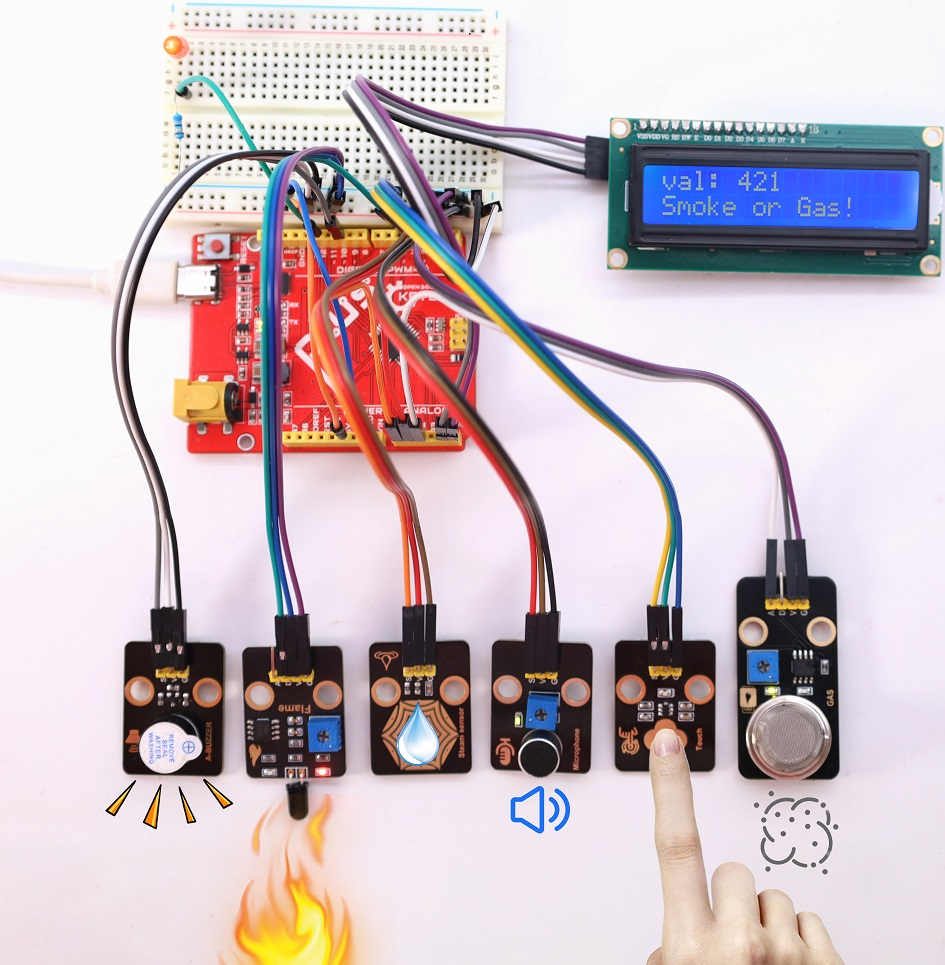

#### 7. 代码说明:

可以参照前面的项目实验的代码说明，这里就不多做介绍了。

---
