# Microbit主板_教程

## 1. 关于BBC Micro:bit

---

### （1）Micro:bit是什么?

在我们开始学习keyes 模拟智能家居综合套件之前，首先介绍Micro:bit主板，它是所有项目的核心。

Micro:bit是由ARM、巴克莱、element14、微软等机构与英国广播公司（BBC）合作推出的一款基于ARM架构的开源硬件平台，核心设备是32位Arm Cortex-M4带有FPU的微处理器，Micro:bit主板只有信用卡一半大小，但功能非常强大。Micro:bit V2.0主板拥有丰富的板资源，搭载了5×5可编程LED点阵、2颗可编程按键、加速度计、电子罗盘、温度计、可触摸感应的Logo、MEMS麦克风、低功耗蓝牙等电子模块，背面还有一个蜂鸣器，可以在没有外部设备的情况下也可以播放各种声音。此外，Micro:bit主板还支持休眠模式，用户可以长按Micro:bit主板后面的复位&电源按钮，使进入睡眠模式，降低电池功耗。

Micro:bit开发板的功能强大，具有易用性和扩展性，底部齿轮设计的金手指，它可以很好的通过固定鳄鱼夹与各种电子元件互动。支持读取传感器数据，控制舵机与RGB灯带等，也可以插入扩展板连接各种传感器。Micro:bit支持多种代码及图形化编程平台，支持几乎所有的PC和移动设备，具有免安装驱动，电子模块集成度高，且带有串口监控功能，方便调试！

Micro:bit应用非常广泛，可以用于编写电子游戏，声光互动，机器人控制，科学实验，可穿戴装置开发等，可以实现任何酷炫的小发明，无论是机器人还是乐器，没有做不到只有想不到。创造更多的创意作品。

---

### （2）Micro:bit正面和反面面板介绍：                               

#### Micro:bit正面面板介绍：

① 可编程按钮（自定义功能按钮）: 归根结底它就是一个按钮，对于按钮来说只有一个功能按下去，但是我们可以通过编程使得按钮按下去实现不同的功能。这些按钮组合起来可以实现三种操作，单独按下以及同时按下。

② LED 点阵：由一个一个的 LED 灯组成，灯从大的方向来说就只有两种状态：开和关，也就是我们平时说的亮和灭，但是从明和暗这个方向来说，它又可以分成不同的等级，也就是我们平时说的亮一点，就好比是成绩，分数可以从 0 到 100，划分不同的层次。这个点阵可以用来显示：图像,文字数字。同时这些 LED 灯还是一个光线传感器。

③ GPIO 引脚：增加开发板的功能，可以与其他的外置传感器进行交互。

④ 3V 电源引脚：可以为外接传感器进行供电。

⑤ GND 接地引脚。

⑥ 触摸感应 Logo，首先 Logo 没有什么好说的，就是一个图案， 但是同时它还是一个触摸感应器，触摸感应这里面可以有三种不同的操作：

- 点按：摸一下立刻松开
- 长按：按住超过一定的时间
- 松开：手指离开

⑦ 麦克风指示灯:当使用麦克风进行声音录制的时候会亮起。

#### Micro:bit反面面板介绍：

① 声音和蓝牙天线，通过这根天线，可以实现不同开发板之间通过声音进行通信，或者使用蓝牙与其他的设备进行通信。

② 处理器以及温度传感器：传感器是开发板的大脑，负责获取，解码以及指令的执行。同时温度传感器可以感知外界温度的变化

③ 指南针：测量磁场方向以及磁场强度，它可以测量三个维度的磁场。

④ 加速度计：测量三个维度的力（包括重力），因此可以用来监测开发板的振动或者移动。

⑤ 引脚：为外接的微型配件进行供电。

⑥ micro USB 接口: 用于充电以及将程序写入开发板。

⑦ 红色指示灯：当烧录程序或者接上电源的时候会亮起。

⑧ 重置按钮：使得烧录好的程序重新执行。

⑨ 电池盒接口：使用3.3V电池来对开发板进行供电。

⑩ USB 芯片接口：烧录代码，与电脑的 USB 接口进行串行数据的发送和接受。

⑪ 扬声器：也就是我们平时所说的喇叭，可以进行声音的播放。

⑫ 麦克风：也就是我们平时所说的话筒，话筒可以收到我们的声音，声音有大有小（在microbit中使用响度来标识），通过声音的大小，我们可以对板子实现控制。

⑬ 红色电源指示灯：当开发板接上电源后将会亮起。

⑭ 黄色指示灯：当将程序写入的时候会亮起。

⑮ 复位按键：恢复板子写入程序的最开始状态，也就是重新开始执行写入的程序。如果进行长按的话将会使得开发板进入休眠状态。

有关更多内容，请参阅：[https://tech.microbit.org/hardware/](https://tech.microbit.org/hardware/)

[https://microbit.org/new-microbit/](https://microbit.org/new-microbit/)

[https://www.microbit.org/get-started/user-guide/overview/](https://www.microbit.org/get-started/user-guide/overview/)

[https://microbit.org/get-started/user-guide/features-in-depth/](https://microbit.org/get-started/user-guide/features-in-depth/)

---

### （3）Micro:bit V2 引脚配置介绍，如下图所示：
 

Micro:bit V2 引出的引脚中，其引脚功能分类如下表所示：

| GPIO | P0，P1，P2，P3，P4，P5，P6，P7，P8，P9，P10，P11，P12，P13，P14，P15，P16，P19，P20 |
| :--: | :--: | 
| ADC/DAC | P0，P1，P2，P3，P4，P10 |
| IIC | P19（SCL），P20（SDA） |
| SPI | P13（SCK），P14（MISO），P15（MOSI） |
| PWM（常用） | P0，P1，P2，P3，P4，P10 |
| PWM（不常用） | P5、P6、P7、P8、P9、P11、P12、P13、P14、P15、P16、P19、P20 |
| 已占用 |P3(LED Col3)，P4(LED Col1)，P5(Button A)，P6(LED Col4)，P7(LED Col2)，P10(LED Col5)，P11(Button B) |

详细信息请参考官方网站：[https://tech.microbit.org/hardware/edgeconnector/](https://tech.microbit.org/hardware/edgeconnector/)

[https://microbit.org/guide/hardware/pins/](https://microbit.org/guide/hardware/pins/)
  
---

### （4）Micro:bit主板使用注意事项：

a. Micro:bit主板上有很多精密的电子元件，建议戴上硅胶保护套进行使用，防止短路。

b. Micro:bit主板的IO口驱动能力很弱，IO口电流不足300mA，请勿接大电流器件（例如大舵机MG995、直流电机），否则会烧坏Micro:bit主板，使用前必须完全了解清楚你所使用的器件电流情况，一般建议配搭Micro:bit扩展板进行使用。

c. 供电建议从Micro:bit主板的USB口进行供电，或者Micro:bit主板上的3V电池座接口。Micro:bit主板本身IO口是3V电平，所以是不支持5V传感器的，如需支持5V传感器需要使用 Micro:bit扩展板。

d. 使用与Micro:bit主板LED点阵的共用引脚（如P3、P4、P6、P7、P10），记得在代码中把LED点阵禁用掉，否则会有LED点阵乱亮的现象。

e. 不要使用IO 口P19、P20，P19和P20是不能当做IO口来使用的，虽然makecode软件上显示可以使用，实际是用不了的！只能用于I2C通讯。

f. 3V电池座接口上不能使用超过3.3V电池，插上去很容易会把Micro:bit主板烧坏。

g. 禁止放在金属制品上使用，以免发生短路。

总之：Micro:bit主板就像是一台微型计算机，它使编程变得有形，并促进数字创造力。关于编程环境，BBC提供了一个在线编程网站：[https://microbit.org/code/](https://microbit.org/code/) ，该网站有一个易于使用的图形化编程MakeCode编辑器。

---

## 2. 关于MakeCode编辑器

MakeCode编辑器网站：[https://microbit.org/code/](https://microbit.org/code/) 

MakeCode编辑器详细的使用说明方法请参考链接：[https://www.keyesrobot.cn/projects/MakeCode/en/latest/](https://www.keyesrobot.cn/projects/MakeCode/en/latest/)

---

## 3. 教程

 Micro:bit 基础课程是使用Micro:bit主板自带的传感器模块和LED点阵。

---

### 项目01 心跳

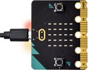

#### 1. 实验说明：

首先先来练习一个不需要其他辅助元件，只需要一块Micro:bit主板，一根Micro USB数据线与一台计算机的简单实验，让Micro:bit主板上的点阵显示“心跳”，这是一个让Micro:bit主板和计算机通信的实验，这也是一个入门实验，希望可以带领大家进入Micro:bit的魔幻世界。

#### 2. 准备：

（1）通过Micro USB线连接Micro:bit主板和电脑。

（2）打开离线版本或Web版本的MakeCode。 

如果是选择通过导入 **.Hex** 文件来加载项目，请单击“导入”。(方法请参照链接：[http://makecode-ide.readthedocs.io/](http://makecode-ide.readthedocs.io/)) 

如果要一一拖动代码块，请单击“**新建项目**”。

#### 3. 实验代码：                                                                                

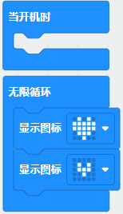

#### 4. 实验结果:  

按照之前的方式将代码下载到Micro:bit主板，Micro USB数据线不要拔下来，利用Micro USB数据线上电，Micro:bit主板上的LED点阵屏切换显示“❤”图案和“”图案，循环进行。

如果存在下载问题，请断开Micro USB线和Micro:bit主板，然后重新连接它们并重新打开MakeCode编辑器，以尝试再次下载。

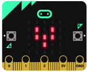

#### 5. 代码说明:

 

仅运行一次以启动程序。

程序循环运行。 

在Microbit主板上的LED点阵上绘制特定图案。

---

### 项目02 LED点阵中单个LED显示

#### 1. 实验说明：

Micro:bit主板的LED点阵共由25个发光二极管组成，5个一组，分别对应X和Y方向，形成一个5×5的矩阵，且每个发光二极管是放置在行线（X）和列线（Y）的交叉点上，我们可以通过设置坐标点来实现对25个LED中某一个LED的控制。例如，想要LED点阵中第1行第1个LED点亮，可以设置坐标点为（0，0）；第1行第3个LED点亮，可以设置坐标点为（2，0）；第1列第5个LED点亮，可以设置坐标点为（0，4）；第3列第2个LED点亮，可以设置坐标点为（2，1），依此类推。

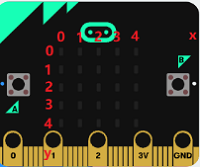

#### 2. 准备：

（1）通过Micro USB线连接Micro:bit主板和电脑。

（2）打开离线版本或Web版本的MakeCode。 

如果是选择通过导入 **.Hex** 文件来加载项目，请单击“导入”。(方法请参照链接：[http://makecode-ide.readthedocs.io/](http://makecode-ide.readthedocs.io/)) 

如果要一一拖动代码块，请单击“**新建项目**”。

#### 3. 实验代码：                                                                                

#### 4. 实验结果：

按照之前的方式将代码下载到Micro:bit主板，Micro USB数据线不要拔下来，利用Micro USB数据线上电，我们就可以看到切换坐标点(1,0)的LED的亮灭状态，持续0.5s，再次切换坐标点(1,0)的LED的亮灭状态，持续0.5s；点亮坐标点(3,4)的LED，持续0.5s，熄灭坐标点(3,4)的LED，持续0.5s。循环进行。

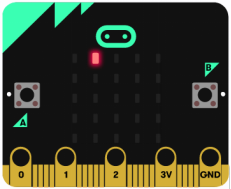

#### 5. 代码说明:

仅运行一次以启动程序。 

 

程序循环运行。 

数字打开或关闭Microbit主板上的LED点阵屏。

切换处于坐标x0 y0的LED亮度，数字0可以更改成其他数字。

点亮处于坐标x0，y0的LED，数字0可以更改成其他数字。

熄灭处于坐标x0 y0的LED，数字0可以更改成其他数字。

延时，单位为毫秒。

---

### 项目03 5 x 5 LED点阵图案显示

#### 1. 实验说明： 
                                                                               
点阵在我们生活中很常见，很多都有用到它，比如LED广告显示屏，电梯显示楼层，公交车报站等等。

Micro:bit主板的LED点阵共由25个发光二极管组成，上一课我们已经讲过通过设置坐标点来实现对LED点阵的25个LED中的某个LED的控制，这样可以通过设置多个坐标点控制多个LED的亮灭使得LED点阵能够显示图案、数字、字符串。我们也可以在特定代码中通过点击 LED点阵的灰白色小正方形点亮 LED点阵对应的LED来实现LED点阵显示图案、数字、字符串。除了上述方法还可以使用自定义图案使LED点阵显示图案。

#### 2. 准备：

（1）通过Micro USB线连接Micro:bit主板和电脑。

（2）打开离线版本或Web版本的MakeCode。 

如果是选择通过导入 **.Hex** 文件来加载项目，请单击“导入”。(方法请参照链接：[http://makecode-ide.readthedocs.io/](http://makecode-ide.readthedocs.io/)) 

如果要一一拖动代码块，请单击“**新建项目**”。

#### 3. 实验程序：

#### 4. 实验结果： 

用同样的方法将代码下载到Micro:bit主板，Micro USB数据线不要拔下来，利用Micro USB数据线上电，我们就可以看到Micro:bit主板的5×5 LED点阵开始显示数字1、2、3、4、5，然后循环显示“向下”图案、字符串“Hello!”、“心”图案、“东北”方向图案、“东南”方向图案、“西南”方向图案和“西北”方向图案。

#### 5. 代码说明:

在LED点阵显示数字。 

在Microbit主板上的LED点阵上绘制任意图案。

LED点阵滚动显示字符串。

LED点阵点亮对应的LED显示各个方向的箭头图案。

清空屏幕。

---

### 项目04 可编程按键

#### 1. 实验说明：

 

按键可以控制电路的通断，把按键接入电路中，不按下按键的时候电路是断开的，一按下按键电路就通啦，但是松开之后就又断了。可是为什么按下才通电呢？这得从按键的内部构造说起。没按下之前，电流从按键的一端过不去另一端，按键的两端就像两座山，中间隔着一条河，我们在这座山过不去另一座山；按下的时候，按键内部的金属片把两边连接起来让电流通过，就像搭了一座桥，把两座山连接起来。

按键内部结构如图：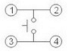，未按下按键之前，1、2就是导通的，3、4也是导通的，但是1、3或1、4或2、3或2、4是断开（不通）的；只有按下按键时，1、3或1、4或2、3或2、4才是导通的。

Micro:bit主板有三个按键，反面的是复位按钮，正面的是两个可编程按键，通过对两个可编程按键组合可以有三种组合，作为输入元件。我们结合上节课的LED点阵，一起来学习按键吧。按下Micro:bit主板上按键A，条形图高度值增加5，表现为LED点阵亮的行数增加；按下按键B，减少条形图高度，表现为LED点阵亮的行数减少。
                   
#### 2. 准备：

（1）通过Micro USB线连接Micro:bit主板和电脑。

（2）打开离线版本或Web版本的MakeCode。 

如果是选择通过导入 **.Hex** 文件来加载项目，请单击“导入”。(方法请参照链接：[http://makecode-ide.readthedocs.io/](http://makecode-ide.readthedocs.io/)) 

如果要一一拖动代码块，请单击“**新建项目**”。

#### 3. 实验程序：
                                                                              
**（3）完整的代码程序**

#### 4. 实验结果：

用同样的方式将程序下载到Micro:bit主板，Micro USB数据线不要拔下来，利用Micro USB数据线上电，按下Micro:bit主板上按键A，条形图高度值增加5，表现为LED点阵亮的行数增加；按下按键B，减少条形图高度，表现为LED点阵亮的行数减少。

#### 5. 代码说明:

设置变量“x”的初始值为0。

以1为幅度更改变量值x，数字1可以改成其他数字。

按下micro: bit主板上正面的按键。

点亮LED点阵中LED绘制条形图，最高点亮25个LED。

如果ture里的表达式为真，则执行“则”下面的代码。

获取变量x。

---

### 项目05 学习测温度

#### 1. 实验说明：

Micro:bit主板实际上并不带温度传感器，而是采用nRF52833芯片内置的温度传感器进行温度检测，所以检测的温度更接近芯片的温度，可能与周围环境温度存在一定的误差。在这一课程中，我们利用该传感器测试当前环境中的温度，并通过检测的温度范围来控制LED点阵显示不同的图案。

注意：Micro:bit主板的温度传感器在这里：

#### 2. 准备：

（1）通过Micro USB线连接Micro:bit主板和电脑。

（2）打开离线版本或Web版本的MakeCode。 

如果是选择通过导入 **.Hex** 文件来加载项目，请单击“导入”。(方法请参照链接：[http://makecode-ide.readthedocs.io/](http://makecode-ide.readthedocs.io/)) 

如果要一一拖动代码块，请单击“**新建项目**”。

#### 3. 实验程序：

通过温度控制Micro:bit主板上点阵显示不同图案（注意：程序中的温度值可以根据当地环境适当的调整）

#### 4. 实验结果：

按照之前的方式将程序下载到Micro:bit主板，Micro USB数据线不要拔下来，利用Micro USB数据线上电，外界环境中的温度小于35℃时，Micro:bit主板的5×5LED点阵中显示图案，用手按住Micro:bit主板的温度传感器，温度大于等于35℃时，5×5LED点阵中显示图案。

#### 5. 代码说明:

micro: bit主板上的温度传感器检测外界温度。

如果ture里的表达式为真，则执行“则”下面的代码；如果ture里的表达式为假，则执行“否则”下面的代码。

---

### 项目06 地磁传感器

#### 1. 实验说明：

本实验项目主要介绍Micro:bit地磁传感器的使用，地磁传感器除了检测地磁场强度外，还能当作指南针确定方向，同时也是航姿参考系统(AHRS)的重要组成部分。Micro:bit V2主板采用的是LSM303AGR 地磁传感器，磁场动态范围为±50 gauss。在micro:bit V2主板中，磁力检测、指南针积木块均用到了磁力计栏，本实验中，将先介绍指南针，然后查看磁力计原始数据。常见的指南针主要部件是一根磁针，在地磁场的作用下可以转动并指向地磁北极（地磁北极是在地理南极附近），用来辨别方向。

micro:bit内部的一个地磁传感器（磁力计、指南针），我们可以读取这个磁力计的读数来判断方位，得到相对于北磁极的数值。返回值是0到360之间的数值，在磁力计首次开始工作（带到新位置后）时系统会自动要求我们对micro:bit主板校准，正确的校准方式是旋转micro:bit主板。需要注意的是，附近要是有金属物件可能会影响读数和校准准确性。

#### 2. 准备：

（1）通过Micro USB线连接Micro:bit主板和电脑。

（2）打开离线版本或Web版本的MakeCode。 

如果是选择通过导入 **.Hex** 文件来加载项目，请单击“导入”。(方法请参照链接：[http://makecode-ide.readthedocs.io/](http://makecode-ide.readthedocs.io/))

如果要一一拖动代码块，请单击“**新建项目**”。

#### 3. 实验程序1：

按下按键A的时候，可以在屏幕上显示磁力计的读数。

程序说明：首先必须对Micro:bit进行校准，因为每个地方地磁场不同，对结果有比较大的的影响，如果是第一次使用指南针，Micro:bit会自动提示需要校准。

#### 4. 实验结果1:  

按照之前的方式将程序1下载至Micro: bit主板，micro USB数据线不要拔下来，利用Micro USB数据线上电，按下Micro:bit主板上正面按键A时，Micro:bit主板首先提示校准，屏幕(LED点阵)提示:“TILT TO FILL SCREEN”,然后进入校准界面，校准方式为：旋转Micro:bit主板，使得屏幕(LED点阵)画一个封闭的正方形（25个LED都点亮），如下图所示：

当封闭的正方形画好后，会显示一个“笑脸”图案，表示校准完成。

校准完成后，当每次按下按键A的时候，直接在屏幕上显示磁力计读数，北、东、南、西对应0°、90°、180°、270°。

#### 5. 实验程序2：

朝不同的方向旋转磁力计，LED点阵显示对应的方向图案。

该代码块是可以持续磁力计的读数来确定方向，并让箭头指向当前的磁北极。

如上图所示，如果读数在292.5和337.5之间，就让显示屏显示一个指向右上方的箭头，由于程序里不能输入0.5，所以取的判断数值是293和338。之后再加入其它逻辑判断条件，就得到了完整的程序。

#### 6. 实验结果2：

按照之前的方式将程序2下载到Micro:bit主板，Micro USB数据线不要拔下来，利用Micro USB数据线上电，提示校准（校准方法请参考:上面实验程序1部分），校准完成后，旋转移动Micro:bit主板，可以看到Micro:bit主板上LED点阵显示各方向图案。

#### 7. 代码说明:

校准指南针。

指南针朝向角度。

LED点阵显示指南针朝向角度。

---

### 项目07 加速度传感器

#### 1. 实验说明：

Micro:bit V2主板内置有LSM303AGR 重力加速度传感器（加速度计），其具有8/10/12 bits的分辨率，程序可设置量程为1g、2g、4g、8g，我们常使用加速度计来检测机器的姿态。在本实验项目中，将介绍加速度传感器（加速度计）对几个特殊姿态的检测。

#### 2. 准备：

（1）通过Micro USB线连接Micro:bit主板和电脑。

（2）打开离线版本或Web版本的MakeCode。 

如果是选择通过导入 **.Hex** 文件来加载项目，请单击“导入”。(方法请参照链接：[http://makecode-ide.readthedocs.io/](http://makecode-ide.readthedocs.io/)) 

如果要一一拖动代码块，请单击“**新建项目**”。

#### 3. 实验程序：

对Micro:bit不同的操作，LED点阵显示对应的数字。

#### 4. 实验结果: 

按照之前的方式将程序下载到Micro:bit主板，利用Micro USB数据线上电，将Micro:bit主板晃动，则可见Micro:bit显示数字1（表明只要有晃动，无论朝哪个方向晃动，该条件都将满足）。

当Micro:bit主板的Logo朝上时，LED点阵显示数字2，Logo朝上示意图如下所示：

同理，Micro:bit主板的Logo朝上时，LED点阵显示数字3(倒立的3)，Logo朝下示意图如下所示：

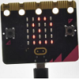

当屏幕朝上（指的是LED点阵朝上）时，LED点阵显示数字4。如下图所示：

同理，当屏幕朝下（指的是LED点阵朝下）时，LED点阵显示数字5。

当Micro:bit 主板向左倾斜（是指LED点阵先朝上，然后再往左边倾斜）时，LED点阵显示数字6。如下图所示：

同理，当Micro:bit主板向右倾斜（是指LED点阵先朝上，然后再往右边倾斜）时，LED点阵显示数字7。如下图所示：

当不小心碰到Micro:bit主板使其从桌面掉落，则为做自由落体运动，此时，Micro:bit主板满足自由落体的条件，则LED点阵显示数字8。（注意：此方法操作时，很容易把micro:bit主板摔坏，不建议操作）
注意：（3g、6g、8g， 如果需要满足此条件，则需要达到3倍，6倍，8倍重力加速度甩动Micro:bit主板。如果你们有兴趣的话，这部分程序可以自己添加）

#### 5. 代码说明:

完成一个特定的动作(如晃动microbit主板等）时执行操作。

---

### 项目08 光照强度检测

#### 1. 实验说明：

本实验将介绍Micro:bit对外界光照强度的检测，由于Micro:bit并不自带光敏传感器，对外界光照强度的检测是通过LED矩阵进行的，LED矩阵被用来感知周围的光，并反复地将LED转换成输入，并采样电压衰减时间。这样检测出来的光照强度大于100时，LED矩阵显示“太阳”标志；否则，LED矩阵上LED灯全部点亮。

#### 2. 准备：

（1）通过Micro USB线连接Micro:bit主板和电脑。

（2）打开离线版本或Web版本的MakeCode。 

如果是选择通过导入 **.Hex** 文件来加载项目，请单击“导入”。(方法请参照链接：[http://makecode-ide.readthedocs.io/](http://makecode-ide.readthedocs.io/)) 

如果要一一拖动代码块，请单击“**新建项目**”。

#### 3. 实验程序：

#### 4. 实验结果：

按照之前的方式将代码下载到Micro:bit主板，Micro USB数据线不要拔下来，利用Micro USB数据线上电。Micro:bit主板上的LED矩阵感知周围的光强，当光照强度大于100时，LED矩阵显示“太阳”标志；否则，LED矩阵上LED灯全部点亮

#### 5. 代码说明:

LED矩阵感知周围的光强，检测光照强度。

---

### 项目09 扬声器

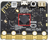

#### 1. 实验说明：

Micro:bit主板有内置扬声器，这使得在你的项目中添加声音变得非常容易。通过编程使扬声器发出各种各样的音调，让扬声器播放出来。

#### 2. 准备： 

（1）通过Micro USB线连接Micro:bit主板和电脑。

（2）打开离线版本或Web版本的MakeCode。 

如果是选择通过导入 **.Hex** 文件来加载项目，请单击“导入”。(方法请参照链接：[http://makecode-ide.readthedocs.io/](http://makecode-ide.readthedocs.io/)) 

如果要一一拖动代码块，请单击“**新建项目**”。

#### 3. 实验程序：

#### 4. 实验现象: 

按照之前的方式将实验程序下载到Micro:bit主板，利用Micro USB数据线上电，Micro:bit主板上的扬声器播放各种声音且LED点阵显示音乐标志图案。

#### 5. 代码说明:

蜂鸣器发出各种内置的声音。

---

### 项目10 触摸感应logo

#### 1. 实验说明：

如果你有了Micro:bit主板，你可以在你的项目中使用金色的触摸感应logo作为另一个输入，这就像多了一个按钮。触摸感应采用的是电容式触摸传感器，当你手指按下（或触摸）它时，它就能感应到电场的微小变化----就像你的手机或平板电脑屏幕一样。当你触摸它，能控制Micro:bit板实现某个功能。

#### 2. 准备：

（1）通过Micro USB线连接Micro:bit主板和电脑。

（2）打开离线版本或Web版本的MakeCode。 

如果是选择通过导入 **.Hex** 文件来加载项目，请单击“导入”。(方法请参照链接：[http://makecode-ide.readthedocs.io/](http://makecode-ide.readthedocs.io/)) 

如果要一一拖动代码块，请单击“**新建项目**”。

#### 3. 实验代码：

#### 4. 实验现象：  

按照之前的方式将实验代码下载到Micro:bit板，利用Micro USB数据线上电，手指按住Micro:bit主板上“Logo”标志处，Micro:bit主板上的LED点阵显示“❤”图案；手指松开Micro:bit主板上“Logo”标志处，会出现数字。

#### 5. 代码说明:

被触摸或被按下或被松开或被长按microbit主板上的logo标志。

将运行时间赋给于变量start，单位为毫秒。

将running time－变量start的值赋给于变量time，LED点阵屏显示变量time除于1000的整数。

---

### 项目11 麦克风

#### 1. 实验说明：

Micro:bit主板有一个内置麦克风，可以测量环境的声音程度。你可以使用它作为一个简单的输入---当你鼓掌时，Micro:bit主板上前面内置麦克风LED指示灯会被打开。它还可以测量声音的强度，所以你可以制作一个噪音等级表或与音乐合拍的迪斯科灯光。麦克风是在Micro:bit 主板的背面，而在前面，你会发现一个内置麦克风LED指示灯，还有紧挨着让声音进入麦克风的孔。当你Micro:bit主板在测量声音级别时，它就会亮起来。

#### 2. 准备：

（1）通过Micro USB线连接Micro:bit主板和电脑。

（2）打开离线版本或Web版本的MakeCode。 

如果是选择通过导入 **.Hex** 文件来加载项目，请单击“导入”。(方法请参照链接：[http://makecode-ide.readthedocs.io/](http://makecode-ide.readthedocs.io/)) 

如果要一一拖动代码块，请单击“**新建项目**”。

#### 3. 实验程序：                                                                                  

#### 4. 实验结果：

按照之前的方式将实验程序下载到Micro:bit主板，利用Micro USB数据线上电。
当你鼓掌时，Micro:bit 主板上的LED点阵显示显示了声音强度值，声音越大，LED点阵点亮的LED灯越多。

#### 5. 代码说明:

按键A被按下。

将声音级别值赋给于变量soundLevel。

---

### 项目12 Microbit 蓝牙无线通信

#### 1. 实验说明：

Micro:bit主板了处理器内置蓝牙5.1低功耗的BLE(蓝牙 Low Energy)设备）以及2.4GHz天线，可进行蓝牙无线通信和2.4GHz无线通信。使得Micro:bit主板可以与各种蓝牙设备进行通信，包括智能手机和平板电脑。

在本实验中，主要讲解新款的Micro:bit主板实现蓝牙无线通信功能，我们可以通过连接蓝牙，实现无线传输代码（信号）功能。我们利用一个苹果系统设备（手机/iPad）和Micro:bit 主板连接，实现无线传输功能。设置安卓系统手机实现无线传输方法和苹果系统设备（手机/iPad）类似，这里就不一一介绍了。

#### 2. 准备：

（1）通过Micro USB线连接Micro:bit主板和电脑。

（2）苹果系统设备（手机/iPad）或安卓系统手机。

#### 3. 实验步骤：

App下载链接：[https://microbit.org/get-started/user-guide/mobile/](https://microbit.org/get-started/user-guide/mobile/) （安卓系统下载参考链接，需要翻墙下载）

**我们以苹果系统设备为例：**

（1）如果你的智能手机/iPad是苹果系统的，需要先在电脑上进入网页：[https://www.microbit.org/get-started/user-guide/ble-ios/](https://www.microbit.org/get-started/user-guide/ble-ios/) ，往下翻点击“**Download pairing HEX file**”下载micro:bit的固件到创建的文件夹中或电脑桌面上，并将下载好的Micro:bit固件烧入Micro:bit主板中。（这一步只针对于苹果系统的智能手机/iPad，安卓系统智能手机/不需要这一步）

（2）在苹果系统设备（手机/iPad）上打开，在App Store的搜索框中输入“micro bit”，然后选中micro:bit 选项，会出现下载界面（如下图所示：），点击“”，就可以下载安装对应的APP。

（3）苹果系统设备（手机/iPad）和Micro:bit主板配对连接。

a.APP安装成功后，打开苹果系统设备（手机/iPad）上的蓝牙。

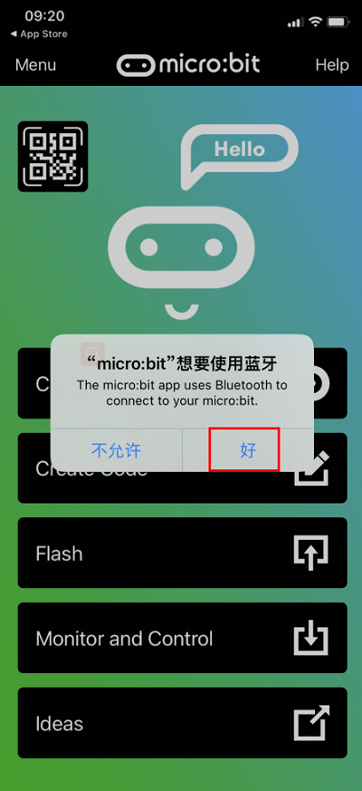

b.点击打开APP，先确定Micro USB数据线已经将Micro:bit主板和电脑连接上，再点击APP的第一项“**Choose micro:bit**”，开始配对蓝牙。

c.点击“**Pair a new micro:bit**”，开始配对。

d.根据提示，首先同时按住micro:bit主板上的按键A和B，然后按下micro:bit主板后面的复位&电源按钮几秒钟（按键A和B不能松开），再松开复位&电源按钮，micro:bit主板上LED点阵会显示一个密码图案。最后松开micro:bit主板上的按键A和B，接着点击“**Next**”。

e.在苹果系统手机/iPad上设置密码图案，使图案和micro:bit主板上显示的密码图案一样，点击“**Next**”。

f.点击“**Next**”，出现对话框，在对话框中点击“**Pair**”。几秒钟后，配对成功，同时Micro:bit主板上的LED点阵显示“√”图案。

（4）蓝牙配对成功后，开始利用APP编写代码，并上传代码。

a.点击第二项“Create Code”，进入编程界面，开始编写代码程序。

b. 将代码程序项目名称设置为“1”，点击保存图案“”，保存代码程序。

c.项目代码程序保存成功后，点击第三项“**Flash**”进入上传代码程序界面。默认选择代码程序是刚刚保存的项目名称为“**1**”的代码程序，然后点击“**Flash**”上传代码程序“**1**”。

d.几秒钟后，代码程序“**1**”上传成功，会显示如下图。然后micro:bit主板上的LED点阵显示跳跃的“**心**”对应图案。

---

### 项目13 Hello World

#### 1. 项目介绍：

对于Micro:bit初学者，我们将从一些简单的东西开始。在这个项目中，您只需要一个Micro:bit主板，Micro USB线和计算机来完成“Hello World!”项目。它不仅是Micro:bit主板和计算机的通信测试，也是Micro:bit世界的初级项目。

#### 2. 项目元件：

| |  |
| :--: | :--: |
|Micro:bit主板*1 | MicroUSB线*1 |

#### 3. 项目接线：

#### 4. 项目代码：

#### 5. 项目现象：

按照接线图正确接好线，将代码上传至Micro:bit主板。上传成功后，利用MicroUSB线连接到计算机上电，可以看到的现象是：Micro:bit主板上的LED点阵滚动显示“Hello World!”。

---

### 项目14 点亮LED

#### 1. 项目介绍：

在这个项目中，我们将向你展示点亮LED。我们是使用Micro:bit主板的数字引脚来打开LED，使LED被点亮。

#### 2. 项目元件：

|||| |
| :--: | :--: | :--: | :--: |
|Micro:bit主板*1|面包板*1|红色LED*1|Micro:bit扩展板*1|
|| || |
|220Ω电阻*1|面包板连接线*2|MicroUSB线*1| |

#### 3. 元件知识：

**（1）LED**

LED是一种被称为“发光二极管”的半导体，是一种由半导体材料(硅、硒、锗等)制成的电子器件。它有正极和负极。短腿为负极，接GND，长腿为正极，接3.3V或5V。

**（2）五色环电阻**

电阻是电路中限制或调节电流流动的电子元件。左边是电阻器的外观，右边是电阻在电路中表示的符号。电阻(R)的单位为欧姆(Ω)，1 mΩ= 1000 kΩ，1kΩ= 1000Ω。

我们可以使用电阻来保护敏感组件，如LED。电阻的强度（以Ω为单位）用小色环标记在电阻器的主体上。每种颜色代表一个数字，你可以用电阻对照卡查找。

在这个套件中，我们提供了2个具有不同电阻值的五色环电阻。这里以2个五色环电阻为例：

220Ω电阻×10

1KΩ电阻×10

在相同的电压下，会有更小的电流和更大的电阻。电流、电压、电阻之间的联系可以用公式表示：I=U/R。在下图中，目前通过R1的电流: I = U / R = 3 V / 10 KΩ= 0.0003A= 0.3mA。

不要把电阻值很低的电阻直接连接在电源两极，这样会使电流过高而损坏电子元件。电阻是没有正负极之分。

**（3）面包板**

面包板是实验室中用于搭接电路的重要工具。面包板上有许多孔，可以插入集成电路和电阻等电路元件。熟练掌握面包板的使用方法是提高实验效率，减少实验故障出现几率的重要基础之一。下面就面包板的结构和使用方法做简单介绍。一个典型的面包板如下所示：

面包板的外观和内部结构如上图所示，常见的最小单元面包板分上、中、下三部分，上面和下面部分一般是由一行或两行的插孔构成的窄条，中间部分是由中间一条隔离凹槽和上下各5 行的插孔构成的条。

在面包板的两个窄条分别有两行插孔，两行之间是不连通的，一般是作为电源引入的通路。上方第一行标有“+”的一行有10组插孔（内部都是连通），均为正极；上方第二行标有“-”的一行有10组插孔，（内部都是连通），均为接地。面包板下方的第一行与第二行结构同上。如需用到整个面包板，通常将“+”与“+”用导线连接起来，“-”与“-”用导线连接起来。0
中间部分宽条是由中间一条隔离凹槽和上下各5 行的插孔构成。在同一列中的5 个插孔是互相连通的，列和列之间以及凹槽上下部分则是不连通的。外观及结构如下图：

中间部分宽条的连接孔分为上下两部分，是面包板的主工作区，用来插接原件和面包板连接线。在同一列中的5个插孔（即a-b-c-d-e，f-g-h-i-j）是互相连通的；列和列之间以及凹槽上下部分是不连通的。在做实验的时候，通常是使用两窄一宽组成的小单元，在宽条部分搭接电路的主体部分，上面的窄条取一行做电源，下面的窄条取一行做接地。中间宽条用于连接电路，由于凹槽上下是不连通的，所以集成块一般跨插在凹槽上。

**(4) Micro:bit扩展板**

为了方便Micro:bit 开发板接线，特别设计了这款扩展板。扩展板自带AMS1117芯片，可以外接DC 4.75-12V 给Micro:bit扩展板供电。Micro:bit开发板全部引脚和电源均已引出到扩展板中间排母，我们可以直接在扩展板上焊接元件，也可以通过400孔面包板连接电路。面包板与扩展板之间通过双面胶连接，售出时面包板与扩展板是分离的。扩展区域使用双面PCB过孔连接，正反两面都可焊接元件背面IO有贴片焊盘，方面飞线连接；下面部分放置400孔面包板，方便实验扩展。

规格参数:

- 输入电压：DC 4.75-12V
- 排母间距：2.54mm

**(5) 电源**

Micro:bit主板需要3.3V电源，在本项目中，我们通过用MicroUSB线将Micro:bit主板和电脑连起来。

#### 4. 项目接线图：

#### 5. 项目代码：

#### 6. 项目现象：

按照接线图正确接好各元器件，将代码上传至Micro:bit主板。上传成功后，利用MicroUSB线连接到计算机上电，可以看到的现象是：LED被点亮。

#### 7. 代码说明:

  

向指定引脚设置“1”或“0”，选择“1”代表给该引脚设置高电平，有电压，有电流，则LED点亮；选择“0”代表给引脚设置低电平，没电压，没有电流，则LED不亮。 

---

### 项目15 LED闪烁

#### 1. 项目介绍：

在这个项目中，我们将向你展示LED闪烁效果。我们是使用Micro:bit主板的数字引脚来打开LED，让它闪烁。

#### 2. 项目元件：

|||| |
| :--: | :--: | :--: | :--: |
|Micro:bit主板*1|面包板*1|红色LED*1|Micro:bit扩展板*1|
|| || |
|220Ω电阻*1|面包板连接线*2|MicroUSB线*1| |

#### 3. 项目接线图：

#### 4. 项目代码：

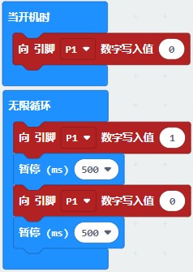

#### 5. 项目现象：

按照接线图正确接好各元器件，将代码上传至Micro:bit主板。上传成功后，利用MicroUSB线连接到计算机上电，可以看到的现象是：电路中的LED会反复闪烁。

#### 6. 代码说明:

  

向指定引脚设置“1”或“0”，选择“1”代表给该引脚设置高电平，有电压，有电流，则LED点亮；选择“0”代表给引脚设置低电平，没电压，没有电流，则LED不亮。 

延时，单位为毫秒。

---

### 项目16 交通灯

#### 1. 项目介绍：

交通灯在我们的日常生活中很普遍。根据一定的时间规律，交通灯是由红、黄、绿三种颜色组成的。每个人都应该遵守交通规则，这可以避免许多交通事故。在这个项目中，我们将使用Micro:bit主板和一些led(红，黄，绿)来模拟交通灯。

#### 2. 项目元件：

||| |
| :--: | :--: | :--: |
|Micro:bit主板*1|面包板*1|Micro:bit扩展板*1|
||||
|红色LED*1|黄色LED*1|绿色LED*1|
|| ||
|220Ω电阻*3|面包板连接线若干|MicroUSB线*1|

#### 3. 项目接线图： 

#### 4. 项目代码：

#### 5. 项目现象：

按照接线图正确接好各元器件，将代码上传至Micro:bit主板。上传成功后，利用MicroUSB线连接到计算机上电，可以看到的现象是：1.首先，绿灯会亮5秒，然后熄灭；2.其次，黄灯会闪烁3次，然后熄灭；3.然后，红灯会亮5秒，然后熄灭；4.继续运行上述1-3个步骤。

#### 6. 代码说明:

有条件的循环控制语句，当满足循环次数时就退出循环，比如：4表示循环执行4次，数字4是可以改成其他数字的。

---

### 项目17 呼吸灯

#### 1. 项目介绍：

在之前的研究中，我们知道LED有亮/灭状态，那么如何进入中间状态呢?如何输出一个中间状态让LED“半亮”?这就是我们将要学习的。呼吸灯，即LED由灭到亮，再由亮到灭，就像“呼吸”一样。那么，如何控制LED的亮度呢? 我们将使用Micro:bit主板的PWM来实现这个目标。

#### 2. 项目元件：

|||| |
| :--: | :--: | :--: | :--: |
|Micro:bit主板*1|面包板*1|红色LED*1|Micro:bit扩展板*1|
|| || |
|220Ω电阻*1|面包板连接线*2|MicroUSB线*1| |

#### 3. 元件知识：

**模拟信号 & 数字信号** 

模拟信号在时间和数值上都是连续的信号。相反，数字信号或离散时间信号是由一系列数字组成的时间序列。生活中的大多数信号都是模拟信号，一个熟悉的模拟信号的例子是：全天的温度是连续不断变化的，而不是突然从0到10的瞬间变化。然而，数字信号的值可以瞬间改变。这个变化用数字表示为1和0(二进制代码的基础)。如下图所示，我们可以更容易地看出它们的差异。

在实际应用中，我们经常使用二进制作为数字信号，即一系列的0和1。由于二进制信号只有两个值(0或1)，因此具有很大的稳定性和可靠性。最后，可以将模拟信号和数字信号相互转换。

**PWM：**

脉宽调制(PWM)是一种利用数字信号控制模拟电路的有效方法。普通处理器不能直接输出模拟信号。PWM技术使这种转换(将数字信号转换为模拟信号)非常方便。PWM技术利用数字引脚发送一定频率的方波，即高电平和低电平的输出，交替持续一段时间。每一组高电平和低电平的总时间一般是固定的，称为周期(注:周期的倒数是频率)。高电平输出的时间通常称为脉宽，占空比是脉宽(PW)与波形总周期(T)之比的百分比。高电平输出持续时间越长，占空比越长，模拟信号中相应的电压也就越高。下图显示了对应于脉冲宽度0%-100%的模拟信号电压在0V-3.3V(高电平为3.3V)之间的变化情况.

PWM占空比越长，输出功率越高。既然我们了解了这种关系，我们就可以用PWM来控制LED的亮度或直流电机的速度等等。从上面可以看出，PWM并不是真实的模拟信号，电压的有效值等于相应的模拟信号。因此，我们可以控制LED和其他输出模块的输出功率，以达到不同的效果。

#### 4. 项目接线图： 

#### 5. 项目代码：

#### 6. 项目现象：

按照接线图正确接好各元器件，将代码上传至Micro:bit主板。上传成功后，利用MicroUSB线连接到计算机上电，可以看到的现象是：电路中的LED从暗逐渐变亮，再从亮逐渐变暗，就像呼吸一样。

#### 7. 代码说明:

创建并设置变量“brightness”初始值为0。

 

获取变量brightness。

设置变量brightness每次以10毫秒频率加1，然后设置P1的模拟值为brightness。 

当满足false里语句，则运行“执行”处命令。

设置变量brightness每次以10毫秒频率减1，然后设置P1的模拟值为brightness。 

---

### 项目18 流水灯

#### 1. 项目介绍：

在日常生活中，我们可以看到许多由不同颜色的led组成的广告牌。他们不断地改变灯光(像流水一样)来吸引顾客的注意。在这个项目中，我们将使用Micro:bit主板控制3个LED灯实现流水的效果。

#### 2. 项目元件：

|||| |
| :--: | :--: | :--: | :--: |
|Micro:bit主板*1|面包板*1|红色LED*3|Micro:bit扩展板*1|
|| || |
|220Ω电阻*3|面包板连接线若干|MicroUSB线*1| |

#### 3. 项目接线图:

#### 4. 项目代码：

#### 5. 项目现象：

按照接线图正确接好各元器件，将代码上传至Micro:bit主板。上传成功后，利用MicroUSB线连接到计算机上电，可以看到的现象是：电路中的3个LED会逐渐亮起来，然后逐渐熄灭，就像电池充电一样。

#### 6. 代码说明:

可以参照项目03的代码说明，这里就不多做介绍了。

---

### 项目19 有源蜂鸣器

#### 1. 项目介绍：

有源蜂鸣器模块上有一个发声元件----有源蜂鸣器。它被广泛用作电脑、打印机、报警器、电子玩具、电话、计时器等的发声元件。它有一个内在的振动源，需连接3.3V~5V电源，即可持续发出嗡嗡声。在这个项目中，我们将使用Micro:bit主板控制有源蜂鸣器发出“滴滴”声。

#### 2. 项目元件：

||||
| :--: | :--: | :--: | 
|Micro:bit主板*1|Micro:bit扩展板*1| 有源蜂鸣器模块*1|
|||  |
|公对母杜邦线若干|MicroUSB线*1|  |
  
#### 3. 元件知识：

注意：本教程使用的是有源蜂鸣器。

有源蜂鸣器和无源蜂鸣器的“源”不是指电源，而是指震荡源。

**有源蜂鸣器**：内部自带震荡源，所以一触发就能发声，发声频率固定。有源蜂鸣器的优点是程序控制方便，声压高。有源自激型蜂鸣器工作发声原理如下：直流电源输入经过振荡系统的放大和取样电路在谐振装置作用下产生声音信号。

**模块参数：**

工作电压: DC 3.3 ~ 5V 

工作温度：-10°C ~ +50°C

控制信号：数字信号

尺寸：32 mm x 23.8 mm x 12.3 mm

定位孔大小：直径为 4.8 mm

**无源蜂鸣器**: 内部不带震荡源，如果直接通直流电信号无源蜂鸣器是没有声音的，因为磁路恒定，振动膜片一直处在吸附状态，不能振动发音。根据不同需求，一般我们通过方波去驱动，然后通过更换方波的频率来实现不同音效。

**总结：有源蜂鸣器内部带震荡源，发声频率固定。无源内部不带震荡源，通过方波去驱动，发音频率可改变。**

#### 4. 项目接线图：

#### 5. 项目代码：

#### 6. 项目现象：

按照接线图正确接好各元器件，将代码上传至Micro:bit主板。上传成功后，利用MicroUSB线连接到计算机上电，可以看到的现象是：有源蜂鸣器发出“滴滴”声。

#### 8. 代码说明:

可以参照项目03的代码说明，这里就不多做介绍了。

---

### 项目20 继电器控制LED

#### 1. 项目介绍：

在日常生活中，我们一般使用交流来驱动电气设备，有时我们会用开关来控制电器。如果将开关直接连接到交流电路上，一旦发生漏电，人就有危险。从安全的角度考虑，我们特别设计了这款具有NO(常开)端和NC(常闭)端的继电器模块。在这节课我们将学习一个比较特殊、好用的开关，就是继电器模块，使用继电器模块控制LED灯亮灭。

#### 2. 项目元件：

||| ||
| :--: | :--: | :--: | :--: |  
|Micro:bit主板*1|面包板*1| Micro:bit扩展板*1|继电器模块*1|
||| ||
|MicroUSB线*1|220Ω电阻*1|面包板连接线若干|红色LED*1|
|||||
|一字螺丝刀*1|公对母杜邦线若干|电源适配器*1|面包板专用电源模块*1|

#### 3. 元件知识：

**继电器：** 继电器能兼容多种单片机控制板，是用小电流去控制大电流运作的一种“自动开关”。它可以让单片机控制板驱动3A以下负载，如LED灯带、直流马达、微型水泵、电磁阀可插拔式接口设计，方便使用。继电器有3个接线柱用于外接电路，分别为NO、COM和NC端（背后丝印）。

**模块参数:**

工作电压: DC 5V 

工作电流: 50 mA

最大功率: 0.25 W

控制信号: 数字信号

触电电流: 小于 3 A

工作温度：-10°C ~ +50°C

尺寸：47.6mm x 23.8mm x 19mm

定位孔大小：直径为4.8mm

**模块原理图:**

一个继电器拥有一个动触点以及两个静触点A和B。

当开关K断开时，继电器线路无电流通过，此时动触点与静触点B相接触，上半部分的电路导通。静触点B被称为常闭触点（NC）。常闭——NC（normal close）通常情况下是关合状态，即线圈未得电的情况下闭合的。

当开关K闭合时，继电器电路通过电流产生磁力，此时动触点与静触点A相接触，下半部分电路导通。静触点A被称为常开触点（NO）。常开——NO（normal open）通常情况下是断开状态，即线圈未得电的情况下断开的。

而动触点也被称为公共触点（COM）。

继电器简单来说就是一个开关，VCC表示电源正极、GND表示电源负极、IN表示信号输入脚，COM表示公共端，NC（normal close）表示常闭端，NO(normal open)表示常开端。

**面包板专用电源模块**

**说明：**

这个是面包板专用电源模块，它兼容5V和3.3V， 适用于MB102面包板 。模块包含左右两路独立控制，一路通过USB供电 ，输出电压恒定为DC 5V；另一路供电DC 7-12V，输出电压由拨码开关控制，分别为DC 5V 和DC 3.3V。

如果在另一路供电DC 7-12V，当拨码开关拨到 +5V 端，模块左右两路输出电压都为DC 5V；当拨码开关拨到+3V端，模块的USB供电端输出电压为DC 5V，另一路供电DC 7-12V端输出电压为DC 3.3V。

**规格：**

适用：MB102面包板 

输入电压：DC7-12V或USB供电

输出电压：3.3V、5V可切换 

最大输出电流：<700mA

左右两路独立控制，其中一路可切换为3.3V、5V 

板载两组直流输出插针，方便外部引出使用

#### 4. 外接电源供电：

**特别注意：** 使用家庭用电。

#### 5. 项目接线图：

 
**特别注意：** 接线前，需要用一字螺丝刀将继电器模块的NO端口和COM端口处的螺丝扭松，将面包板连接线的一端插入NO端口和COM端口处；接好线后，再用一字螺丝刀将NO端口和COM端口处的螺丝扭紧。
 

#### 6. 项目代码：

#### 7. 项目现象：

按照接线图正确接好各元器件，将代码上传至Micro:bit主板。上传成功后，外接电源供电，可以看到的现象是：继电器将循环开与关，开启1秒LED点亮1秒，关闭1秒LED熄灭1秒。同时可以听到继电器开与关的声音，还可以看到继电器上的指示灯指示状态的变化。

#### 8. 代码说明:

可以参照项目03的代码说明，这里就不多做介绍了。

---

### 项目21 人体红外热释传感器

#### 1. 项目介绍：

在本项目中，通过读取人体红外热释传感器模块上S端高低电平，判断附近是否有人在运动；并且在Micro:bit主板上的LED点阵屏显示测试结果。

#### 2. 项目元件：

|||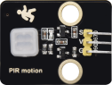|
| :--: | :--: | :--: | 
|Micro:bit主板*1|Micro:bit扩展板*1|人体红外热释传感器*1|
|||  |
|公对母杜邦线若干|MicroUSB线*1|  |

#### 3. 元件知识：

**人体红外热释传感器:** 它主要由一个RE200B-P传感器元件组成。它是一款基于热释电效应的人体热释运动传感器，能检测到人体或动物身上发出的红外线，配合菲涅尔透镜能使传感器探测范围更远更广。

**模块参数:**

工作电压: DC 3.3V ~ 5V 

工作电流: 3.6MA

最大功率: 0.018W

输出信号: 数字信号

触发方式: L 不可重复触发/H 重复触发

探测距离: ≤5m

视野角度: Y = 90°，X = 110°（视野角度为理论数值）

工作温度：-10°C ~ +50°C

尺寸：32mm x 23.8mm x 7.4mm

定位孔大小：直径为4.8mm

**模块原理图:**

这个模块的原理图可能较前面的模块稍复杂，我们一部分一部分来看。先看电压转换部分，作用是将5V输入电压转换为3.3V输入电压。因为我们模块上用到的热释电红外传感器的工作电压是3.3V，不能直接用5V电压供电使用。有了这个电压转换部分，3.3V输入电压和5V输入电压都适用于此热释电红外传感器。

当红外热释传感器没有检测到红外信号时，红外热释传感器的1脚输出低电平，此时模块上的LED两端有电压差，有电流流过，LED被点亮，MOS管Q1导通（Q1是NPN MOS管，型号为2N7002。由于红外热释传感器的1脚输出低电平，所以Q1的源极Vs=0，而Q1的栅极Vg=3.3V，于是Q1的栅极G和Q1的源极S之间的电压 Vgs = 3.3V 大于Q1的阈值电压 2.5V，Q1导通。），信号端S检测到低电平。

当红外热释传感器检测到红外信号时，红外热释传感器的1脚输出高电平，此时模块上的LED熄灭，MOS管Q1不导通，则信号端S检测到被10K上拉电阻R5拉高的高电平。

#### 4. 项目接线图：

#### 5. 项目代码：

#### 6. 项目现象：

按照接线图正确接好各元器件，将代码上传至Micro:bit主板。上传成功后，利用MicroUSB线连接到计算机上电，可以看到的现象是：当传感器检测到附近有人在运动时，Micro:bit主板上的LED点阵屏显示1；没有检测到附近有人在运动时，Micro:bit主板上的LED点阵屏显示0。

#### 7. 代码说明:

人体红外热释传感器读取数字电平信号输出，并在Microbit主板上的LED点阵显示电平信号。

---

### 项目22 避障传感器

#### 1. 项目介绍：

在本项目中，通过读取避障传感器模块上S端高低电平，判断是否存在障碍物，并且在Micro:bit主板上的LED点阵屏显示测试结果。

#### 2. 项目元件：

|||||
| :--: | :--: | :--: | :--: | 
|Micro:bit主板*1|Micro:bit扩展板*1|避障传感器模块*1|公对母杜邦线若干|
|||| |
|MicroUSB线*1|电源适配器*1|面包板专用电源模块*1| 面包板*1|
|||    |     |
|面包板连接线若干|一字螺丝刀*1 |    |     |

#### 3. 元件知识：

**避障传感器:** 它主要由一对红外线发射管与接收管元件组成。当传感器感应到物体时信号端S输出0，未感应到时信号端S输出1。它可通过调节电位器用来调节感应灵敏度，它感应速度快，适合智能小车避障、防跌落，产品计数器，流水线切割，液位检测等。

**模块参数:**

工作电压: DC 3.3 ~ 5V 

工作电流: 6.8MA

最大功率: 0.034W

静态电流: <50 uA

最大检测距离: 173mm

工作温度：-10°C ~ +50°C

输出信号: 数字信号

感应距离: 2 ~ 40 cm

尺寸：32mm x 23.8mm x 11mm

定位孔大小：直径为4.8mm

**模块原理图:**

NE555时基电路提供给发射管TX发射出一定频率的红外信号，红外信号会随着传送距离的加大逐渐衰减，如果遇到障碍物，就会形成红外反射。当检测方向RX遇到反射回来的信号比较弱时，接收检测引脚输出高电平，说明障碍物比较远；当反射回来的信号比较强，接收检测引脚输出低电平，说明障碍物比较近，此时指示灯亮起。传感器上有两个电位器，一个用于调节发送功率，一个用于调节接收频率，通过调节两个电位器，我们可以调节它的有效距离。

#### 4. 项目接线图：

#### 5. 项目代码：

#### 6. 项目现象：

按照接线图正确接好各元器件，将代码上传至Micro:bit主板。上传成功后，上传成功后，不要将MicroUSB线从Micro:bit主板上拔下，外接电源供电，将面包板专用电源模块上的拨码开关拨到+5V端。接着开始调节传感器模块上的两个电位器感应距离。避障传感器上有两个电位器，分别是接收频率调节电位器和发射功率调节电位器，如下图所示。

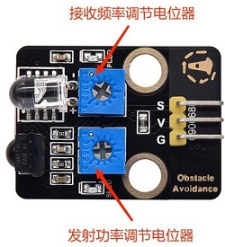

使用一字螺丝刀调节发射功率调节电位器，先将电位器顺时针拧到尽头，然后逆时针慢慢往回调，当调节到SLED灯很亮时，微调使传感器上SLED灯介于很亮与微亮之间的**微亮**状态。

接着设置接收频率调节电位器，同样将电位器顺时针拧到尽头，然后逆时针慢慢往回调，当SLED灯很亮时，微调使传感器上SLED灯介于很亮与微亮之间的**微亮**状态，此时能检测障碍物的距离最长。

可以看到的现象是：当传感器检测到障碍物时，Micro:bit主板上的LED点阵屏显示数字0；没有检测到障碍物时，Micro:bit主板上的LED点阵屏显示数字1。

#### 7. 代码说明:

可以参照项目21的代码说明，这里就不多做介绍了。

---

### 项目23 电容触摸传感器

#### 1. 项目介绍：

在本项目中，通过读取电容触摸传感器模块上S端高低电平，判断是否触摸传感器的感应区，并且在Micro:bit主板上的LED点阵屏显示测试结果。

#### 2. 项目元件：

||||
| :--: | :--: | :--: |
|Micro:bit主板*1|Micro:bit扩展板*1|电容触摸传感器*1|
||||
|公对母杜邦线若干|MicroUSB线*1|一字螺丝刀*1|

#### 3. 元件知识：

**电容触摸传感器:** 它主要由1个触摸检测芯片 TTP223-BA6 构成。模块上提供一个触摸按键，功能是用可变面积的按键取代传统按键。当我们上电之后，传感器需要约0.5秒的稳定时间，此时间段内不要触摸按键，此时所有功能都被禁止，始终进行自校准，校准周期约为4秒。

**模块参数:**

工作电压：DC 3.3 ~ 5V

工作电流：3MA

最大功率：0.015W

工作温度：-10°C ~ +50°C

输出信号：数字信号

尺寸：32 mm x 23.8 mm x 9 mm

定位孔大小：直径为 4.8 mm

**模块原理图:**

TTP223N-BA6 的输出通过 AHLB（4）引脚选择高电平或低电平有效。通过 TOG（6）引脚选择直接模式或触发模式。

| TOG  | AHLB | 引脚Q的功能           |
| ---- | ---- | --------------------- |
| 0    | 0    | 直接模式，高电平有效  |
| 0    | 1    | 直接模式，低电平有效  |
| 1    | 0    | 触发模式，上电状态为0 |
| 1    | 1    | 触发模式，上电状态为1 |

从原理图我们可以知道 TOG 脚和 AHLB 脚是悬空的，此时输出为直接模式，高电平有效。

当我们用手指触摸电容触摸传感器模块上的感应区时，信号端 S 输出高电平，板载红色LED点亮。我们通过读取模块上 S 端的高低电平，来判断电容触摸模块上的感应区是否感应到触摸。

#### 4. 项目接线图：

#### 5. 项目代码：

#### 6. 项目现象：

按照接线图正确接好各元器件，将代码上传至Micro:bit主板。上传成功后，利用MicroUSB线连接到计算机上电，可以看到的现象是：当电容触摸传感器模块上的感应区感应到触摸时，板载红色LED灯点亮，Micro:bit主板上的LED点阵屏显示数字1。否则，当没有感应到触摸时，板载红色LED灯熄灭，Micro:bit主板上的LED点阵屏显示数字0。

#### 8. 代码说明:

可以参照项目21的代码说明，这里就不多做介绍了。

---

### 项目24 光敏传感器

#### 1. 项目介绍：

光敏传感器模块有个信号输出端，可以输出光照强度的模拟信号。在本项目中，我们将读取传感器的模拟信号，并将测试结果在Micro:bit主板上的LED点阵屏显示出来。

#### 2. 项目元件：

||||
| :--: | :--: | :--: |
|Micro:bit主板*1|Micro:bit扩展板*1|光敏传感器模块*1
||||
|公对母杜邦线若干|MicroUSB线*1|一字螺丝刀*1|

#### 3. 元件知识：

**光敏传感器:** 是一个常用的光敏电阻传感器，它主要由一个光敏电阻元件组成。光敏电阻元件的阻值随着光照强度的变化而变化，此传感器就是利用光敏电阻元件这一特性，设计电路将阻值变化转换为电压变化。光敏电阻传感器可以模拟人对环境光线的强度的判断，方便做出与人友好互动的应用。

**模块参数:**

工作电压: DC 3.3 ~ 5V 

工作电流: 0.2MA

最大功率: 0.001W

光谱峰值: 540nm

亮电阻: 5~10千欧

暗电阻: 0.5兆欧

工作温度：-10°C ~ +50°C

输出信号: 模拟信号

尺寸：32 mm x 23.8 mm x 7.4 mm

定位孔大小：直径为 4.8 mm

**模块原理图:**

当没有光照射时，电阻大小为0.2 MΩ，光敏电阻的信号端（2脚）检测的电压接近0。随着光照强度增大，光敏传感器的电阻值越来越小，所以信号端能检测到的电压越来越大，模拟值也越来越大。

#### 4. 项目接线图：

#### 5. 项目代码：

#### 6. 项目现象：

按照接线图正确接好各元器件，将代码上传至Micro:bit主板。上传成功后，利用MicroUSB线连接到计算机上电，Micro:bit主板上的LED点阵屏显示光照强度模拟值。光线越强，可以看到模拟值越大。

#### 7. 代码说明:

可以参照项目21的代码说明，这里就不多做介绍了。

---

### 项目25 水滴传感器

#### 1. 项目介绍：

水滴传感器模块有个信号输出端，可以输出水量大小的模拟信号。在本项目中，我们将读取传感器的模拟信号，并将测试结果在Micro:bit主板上的LED点阵屏显示出来。

#### 2. 项目元件：

|||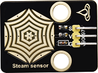|
| :--: | :--: | :--: |
|Micro:bit主板*1|Micro:bit扩展板*1|水滴传感器模块*1|
||||
|公对母杜邦线若干|MicroUSB线*1|一字螺丝刀*1|

#### 3. 元件知识：

**水滴传感器:** 是一个模拟（数字）输入模块，也叫雨水、雨量传感器。可用于各种天气状况的监测，检测是否下雨及雨量的大小，转成模拟信号（AO）输出，并广泛应用于各种天气状况的监测，也可用于汽车自动刮水系统、智能灯光系统和智能天窗系统等。

**模块参数:**

工作电压: DC 3.3 ~ 5V 

工作电流: 1.5MA

最大功率: 0.0075W

工作温度：-10°C ~ +50°C

输出信号: 模拟信号

尺寸：32 mm x 23.8 mm x 9.3 mm

定位孔大小：直径为 4.8 mm

**模块原理图:**

水滴传感器通过电路板上裸露的印刷平行线检测水量的大小。水量越多，就会有更多的导线被联通，随着导电的接触面积增大，雨滴感应区 2 脚输出的电压就会逐步上升。信号端 S 检测到的模拟值就越大。除了可以检测水量的大小，它还可以检测空气中的水蒸气。

#### 4. 项目接线图：

#### 5. 项目代码：

#### 6. 项目现象：

按照接线图正确接好各元器件，将代码上传至Micro:bit主板。上传成功后，利用MicroUSB线连接到计算机上电。

在水滴传感器的感应区滴一两滴水（**小心用水，注意不要滴到感应区以外的其他任何地方，包括Micro:bit主板和Micro:bit扩展板**），Micro:bit主板上的LED点阵屏显示此时水滴传感器的模拟值。水量变化，模拟值也会发生变化。水量越多，输出的模拟值越大。

#### 7. 代码说明:

可以参照项目21的代码说明，这里就不多做介绍了。

---

### 项目26 声音传感器

#### 1. 项目介绍：

声音传感器将外界声音的大小转换成对应的模拟信号，然后通过模块上的信号输出端输出。在本项目中，我们将读取传感器的模拟信号，并且在Micro:bit主板上的LED点阵屏显示测试结果。

#### 2. 项目元件：

||||
| :--: | :--: | :--: |
|Micro:bit主板*1|Micro:bit扩展板*1|声音传感器模块*1|
|||  |
|公对母杜邦线若干|MicroUSB线*1|一字螺丝刀*1|

#### 3. 元件知识：

**声音传感器:** 声音传感器通常用于检测周围环境中的声音响度。微型控制板可以通过模拟输入接口采集其输出信号。S引脚是模拟输出，是麦克风电压信号的实时输出。传感器附带一个电位器，这样你就可以调整信号强度。你可以使用它来制作一些交互式作品，如语音操作的开关等。

**模块参数:**

工作电压: DC 3.3 ~ 5V 

工作电流: 1.5MA

最大功率: 0.075W

工作温度：-10°C ~ +50°C

输出信号: 模拟信号

尺寸：32 mm x 23.8 mm x 10.3 mm

定位孔大小：直径为 4.8 mm

**模块原理图:**

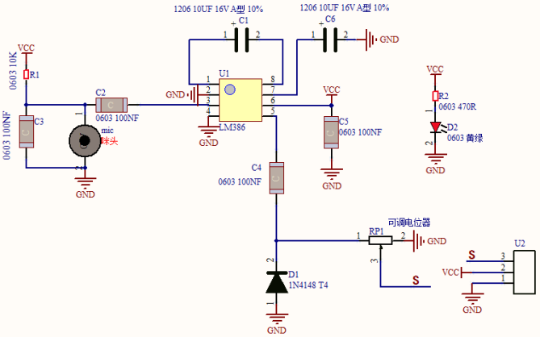

声音传感器主要由一个高感度麦克风元件和LM386音频功率放大器芯片组成。高感度麦克风元件用于检测外界的声音。利用LM386音频功率放大器芯片设计对高感度麦克风检测到的声音进行放大的电路，最大倍数为200倍。使用时我们可以通过旋转传感器上电位器，调节声音的放大倍数。顺时针调节电位器到尽头，放大倍数最大。

#### 4. 项目接线图：

#### 5. 项目代码：

#### 6. 项目现象：

按照接线图正确接好各元器件，将代码上传至Micro:bit主板。上传成功后，利用MicroUSB线连接到计算机上电，此时声音传感器上的电源指示灯点亮。

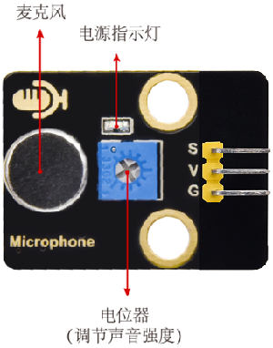

Micro:bit主板上的LED点阵屏显示声音传感器接收到的声音对应的模拟值，对准模块上的MIC头大声说话（或大呼气）时，可以看到接收到的声音对应的模拟值变大。（**注意：如果声音变化对应的模拟值没有变化并且一直都是数字0，需要用一字螺丝刀顺时针旋转电位器来调节。**）

#### 7. 代码说明:

可以参照项目21的代码说明，这里就不多做介绍了。

---

### 项目27 火焰传感器

#### 1. 项目介绍：

火焰传感器模块有两个信号输出端，分别可输出数字信号与模拟信号。在本项目中，我们分别读取传感器的数字信号与模拟信号，并且在Micro:bit主板上的LED点阵屏显示测试结果。

#### 2. 项目元件：

|||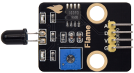|
| :--: | :--: | :--: |
|Micro:bit主板*1|Micro:bit扩展板*1|火焰传感器模块*1|
|||    |
|公对母杜邦线若干|MicroUSB线*1|一字螺丝刀*1    |

#### 3. 元件知识：

**火焰传感器:** 它对火焰光谱特别灵敏，且灵敏度可调。性能稳定，是救火机器人的必备部件。火焰传感器上有一个远红外火焰探头，起着非常重要的作用，它可以用作机器人的眼睛来寻找火源或足球。利用它可以制作灭火机器人、足球机器人等。

**模块参数:**

工作电压: DC 3.3 ~ 5V

工作电流: 1.2MA

最大功率: 0.006W

感应距离: 0~60mm

输出信号：模拟信号和数字信号

工作温度：-10°C ~ +50°C

尺寸：32 mm x 23.8 mm x 9.2 mm

定位孔大小：直径为 4.8 mm

**模块原理图:**

红外火焰传感器能够探测到波长在700纳米～1000纳米范围内的红外光，探测角度为60，其中红外光波长在880纳米附近时，其灵敏度达到最大。从电路原理图我们可以看到，上电后红色LED2先点亮，红色LED1处于熄灭状态，检测到火焰时，数字信号端D0输出低电平，红色LED1将点亮。红外火焰探头将外界红外光的强弱变化转化为电流的变化，通过A/D转换器反映为0～255范围内数值的变化。外界红外光越强，数值越小；红外光越弱，数值越大。

#### 4. 项目接线图：

#### 5. 项目代码：

#### 6. 项目现象：

按照接线图正确接好各元器件，将代码上传至Micro:bit主板。上传成功后，利用MicroUSB线连接到计算机上电，此时火焰传感器上的红色LED2点亮。使用一字螺丝刀旋转火焰传感器上的电位器，微调使传感器上红色LED1灯介于亮与不亮之间的**不亮**状态。如下图所示：

可以看到的现象是：当传感器检测到障碍物火焰时，Micro:bit主板上的LED点阵屏显示数字0和模拟信号值（远小于1023）；没有检测到火焰时，Micro:bit主板上的LED点阵屏显示数字1和模拟信号值（小于1023但非常接近1023）。

#### 7. 代码说明:

火焰传感器读取数字电平信号输出，并在Microbit主板上的LED点阵显示电平信号。

火焰传感器读取模拟信号输出，并在Microbit主板上的LED点阵显示模拟信号。

---

### 项目28 模拟气体(MQ-2)传感器

#### 1. 项目介绍：

模拟气体(MQ-2)传感器模块有两个信号输出端，分别可输出数字信号与模拟信号。在本项目中，我们分别读取传感器的数字信号与模拟信号，并且在Micro:bit主板上的LED点阵屏显示测试结果。

#### 2. 项目元件：

||||
| :--: | :--: | :--: |
|Micro:bit主板*1|Micro:bit扩展板*1|模拟气体(MQ-2)传感器模块*1|
|||    |
|公对母杜邦线若干|MicroUSB线*1| 一字螺丝刀*1   |

#### 3. 元件知识：

**模拟气体(MQ-2)传感器:** 它主要用到了MQ-2 可燃气体、烟雾传感器元件。该元件所使用的气敏材料是在清新空气中电导率较低的二氧化锡(SnO2)。当传感器所处环境中存在可燃气体时，传感器的电导率随空气中可燃气体浓度的增加而增大。该传感器对液化气、丙烷、氢气的灵敏度高，对天然气和其它可燃蒸汽的检测也很理想。它可检测多种可燃性气体，是一款适合多种应用的低成本传感器。

**模块参数:**

工作电压 : DC 3.3 ~ 5V

工作电流 : 100 mA

最大功率 : 0.5 W

输出信号 ：模拟信号和数字信号

工作温度 ：-10°C ~ +50°C

尺寸 ：47.6 mm x 23.8 mm x 17.9 mm

定位孔大小：直径为 4.8 mm

**模块原理图:**

模拟气体(MQ-2)传感器与烟雾接触时，晶粒间界处的势垒受到烟雾的浓度变化而变化，就会引起表面导电率的变化。利用这一点就可以获得这种烟雾存在的信息，烟雾的浓度越大，导电率越大，输出电阻越低，则输出的模拟信号就越大。

使用时，A 端读取对应气体的模拟值；D 端连接一个LM393芯片（电压比较器），我们可以通过电位器调节测量气体报警临界点，在 D 端输出数字值。当测量气体含量超过临界点时，D 端输出低电平；测量气体含量没超过临界点时，D 端输出高电平。

#### 4. 项目接线图：

#### 5. 项目代码：

#### 6. 项目现象：

按照接线图正确接好各元器件，将代码上传至Micro:bit主板。上传成功后，利用MicroUSB线连接到计算机上电，此时模拟气体(MQ-2)传感器上的电源指示灯点亮。使用一字螺丝刀旋转模拟气体(MQ-2)传感器上的电位器，微调使传感器上红色LED灯介于亮与不亮之间的**不亮**状态。如下图所示：

可以看到的现象是：当传感器检测到烟雾或可燃性气体时，红色LED点亮，Micro:bit主板上的LED点阵屏显示数字0和模拟信号值，同时传感器检测到的烟雾或可燃性气体浓度越大，模拟信号值也越大；没有检测到烟雾或可燃性气体时，Micro:bit主板上的LED点阵屏显示数字1和模拟信号值。

#### 7. 代码说明:

可以参照项目27的代码说明，这里就不多做介绍了。

---

### 项目29 LCD 1602 显示屏

#### 1. 项目介绍：

LCD1602液晶显示屏是广泛使用的一种字符型液晶显示模块。LCD1602液晶显示屏采用标准的14脚（无背光）或16脚（带背光）接口，通过显示屏驱动IC，实现I2C控制，节省了单片机引脚。这一项目中我们将使用LCD1602液晶显示屏显示字符串。

#### 2. 项目元件：

|||||
| :--: | :--: | :--: |:--: |
|Micro:bit主板*1|Micro:bit扩展板*1|LCD1602显示屏模块*1|公对母杜邦线若干|
|||||
|电源适配器*1|面包板专用电源模块*1| MicroUSB线*1| 面包板*1|
| ||   |   |
|一字螺丝刀*1 |面包板连接线若干|   |    |

#### 3. 元件知识：

**I2C串行通信：**

I2C通信协议是Inter-Integrated Circuit（IIC）的缩写，也叫作两线制或TWI（Two-Wire Interface），是一种通用的主从式的两线总线通信协议，它是由Philips Semiconductor公司开发的（现在被美国NXP半导体公司收购）。

其最大的优点是只需要两根线就可以完成数据的传输，对于系统线路的繁琐也减少了很多，这种总线可以并行联结127个节点，并且支持多主机，从机一般不需要外接电源，因为I2C总线可以把电源传输到从机。如下图。

I2C总线的数据传输采用8位数据传输的方式，通常一个字节的数据传输是由9个时钟信号组成，8个时钟信号传输数据，最后一个时钟信号用于传输结束的标志。同时，I2C总线也支持多字节的数据传输，不断重复上述过程，即可完成多字节的数据传输。

I2C协议的基本组成部分包括以下内容：

- 起始信号：在发送数据之前，发送方必须发送起始信号，以告知接收方，要发送数据了。

- 地址码：地址码用于告知接收方，要发送的数据是给谁的。

- 数据：数据按照位传输，每次传输一个字节的数据。 

- 停止信号：发送完数据后，发送方必须发送停止信号，以告知接收方，数据发送完毕。

**串口协议时序如下：**

具体通信协议请移步官网：[https://www.nxp.com/](https://www.nxp.com/)

Arduino提供了一个名为Wire.h的I2C协议集成库，可以通过调用其函数实现I2C通信，从而实现与I2C/TWI设备的通信。

具体库介绍参考官网链接：

[https://www.arduino.cc/reference/en/language/functions/communication/wire/](https://www.arduino.cc/reference/en/language/functions/communication/wire/)

**LCD 1602显示屏：**（1602 Liquid Crystal Display）是一种常见的字符液晶显示器，它是一种专门用来显示字母、数字、符号等的点阵型液晶模块。

字符型液晶，能够同时显示16x02即32个字符。它由若干个点阵字符位组成，每个点阵字符位都可以显示一个字符，每两个点阵字符位之间有一个点距的间隔，每行之间也有间隔，起到了字符间距和行间距的作用，正因为如此所以它不能很好地显示图形。

LCD1602显示屏模块，简化了LCD1602接线 ，使用IIC/I2C接口，不仅方便接线，还更加节省GPIO口。它能兼容Arduino的库文件，方便快速开发。

可以通过IIC扩展板上的电位器，调节对比度，使用一字螺丝刀旋转电位器。

**模块参数：**

工作电压 : DC 5V 

工作电流 :  < 130 mA

工作温度 : -10°C ~ +50°C

温度范围 : 0 ~ 50°C (± 2℃) 

IIC地址 : 0x27

尺寸 ：80 mm x 36 mm x 17.2 mm

定位孔大小：直径为 3 mm

**模块原理图：**

LCD1602 显示屏采用标准的16脚接口，其中：

| 引脚   | 符号     | 引脚说明                                                     |
| ------ | -------- | ------------------------------------------------------------ |
| 1      | VSS      | GND负电源。       |
| 2      | VDD      | 5V正电源。           |
| 3      | V0       | V0为液晶显示器对比度调整端，接正电源时对比度最弱，接地电源时对比度最高。 （对比度过高时会 产生“鬼影”，使用时可以通过一个10K的电位器调整对比度。） |
| 4      | RS       | RS为寄存器选择，高电平1时选择数据寄存器、低电平0时选择指令寄存器。 |
| 5      | RW       | RW为读写信号线，高电平(1)时进行读操作，低电平(0)时进行写操作。 |
| 6      | E        | E(或EN)端为使能(enable)端,高电平（1）时读取信息，负跳变时执行指令。 |
| 7 ~ 14 | D0 ~ D14 | D0～D7为8位双向数据端。第15～16脚：空脚或背灯电源。          |
| 15     | BLA      | 背光正极。                                                   |
| 16     | BLK      | 背光负极。                                                   |

LCD1602 显示屏使用时需要至少7个IO口才能驱动起来，占用的IO口太多了，其他传感器就不够用了。IIC LCD1602显示屏模块使用了I2C接口的转接板，使用IIC接口，简化了LCD1602接线 。不仅方便接线，还更加节省IO口。

#### 4. 项目接线图：

#### 5. 项目代码：

#### 6. 项目现象：

按照接线图正确接好各元器件，将代码上传至Micro:bit主板。上传成功后，不要将MicroUSB线从Micro:bit主板上拔下，外接电源供电，将面包板专用电源模块上的拨码开关拨到+5V端。可以看到的现象是：LCD1602显示屏第一行居中打印出“ **Hello World!** ” ，第二行居中打印出 “ **Hello Keyes!** ” 。

注意: 如果你看不见屏幕上的任何东西或显示不清楚，请尝试缓慢旋转LCD1602背面的白色旋钮，以调节对比度，直到屏幕可以清晰显示。

#### 7. 代码说明：

 

初始化对象名 lcd，地址是0x27，16列2行，LCD初始化管脚。

打开背光。

设置字符显示。

 

在显示屏上设置起始坐标，在第一行第三列开始打印 “Hello World!” 。

---

### 项目30 人体感应报警器

#### 1. 项目介绍：

前面的项目中我们已经学习了人体红外热释传感器的工作原理，那么，在本项目中，我们将结合人体红外热释传感器、有源蜂鸣器和LED灯来模拟入侵检测报警器。实现人体红外热释传感器检测到附近有人经过时有源蜂鸣器响起，LED灯快速闪烁的效果。

#### 2. 项目元件：

|||||
| :--: | :--: | :--: |:--: |
|Micro:bit主板*1|面包板*1|人体红外热释传感器模块*1|有源蜂鸣器模块*1|
|||| |
|公对母杜邦线若干|Micro USB线*1|Micro:bit扩展板*1|面包板连接线若干|
|| |    |    |
|红色LED*1|220Ω电阻*1 |    |     |

#### 3. 项目接线图：

#### 4. 项目代码：

#### 5. 项目现象：

按照接线图正确接好各元器件，将代码上传至Micro:bit主板。上传成功后，利用MicroUSB线连接到计算机上电，可以看到的现象是：当人体红外热释传感器检测到附近有人经过时，人体红外热释传感器模块上的红灯灭，Micro:bit主板上的LED点阵显示“”图案，有源蜂鸣器发出警报，LED灯快速闪烁。否则，人体红外热释传感器模块上的红灯亮，Micro:bit主板上的LED点阵显示“”图案，有源蜂鸣器不发声，LED灯熄灭。

#### 6. 代码说明:

 

设置引脚P2的输出电压为高\低电平，1为高电平，点亮LED；0为低电平，熄灭LED。 

如果ture里的表达式为真，则执行“则”下面的代码，如果ture里的表达式为假，则执行“否则”下面的代码。 

运动检测，检测到有人经过。

在Microbit主板上的LED点阵上绘制特定图案。

---

### 项目31 障碍物检测报警器

#### 1. 项目介绍：

上一项目中我们学习了使用人体红外热释传感器检测附近有人经过时进行报警提醒。在这一本项目中，我们将结合避障传感器、有源蜂鸣器和LED灯来模拟障碍物检测报警器。

#### 2. 项目元件：

|||||
| :--: | :--: | :--: |:--: |
|Micro:bit主板*1|面包板*1|避障传感器模块*1|有源蜂鸣器模块*1|
|||| |
|公对母杜邦线若干|Micro USB线*1|Micro:bit扩展板*1|面包板连接线若干|
|| |||
|红色LED*1|220Ω电阻*1 |电源适配器*1|面包板专用电源模块*1|

#### 3. 项目接线图：

#### 4. 项目代码：

#### 5. 项目现象：

按照接线图正确接好各元器件，将代码上传至Micro:bit主板。上传成功后，不要将MicroUSB线从Micro:bit主板上拔下，外接电源供电，将面包板专用电源模块上的拨码开关拨到+5V端。可以看到的现象是：当避障传感器检测到有障碍物时，避障传感器模块上的SLED灯亮，Micro:bit主板上的LED点阵显示“”图案，有源蜂鸣器发出警报，外接LED灯快速闪烁。否则，避障传感器模块上的SLED灯不亮，Micro:bit主板上的LED点阵显示“”图案，有源蜂鸣器不发声，外接LED灯熄灭。

#### 6. 代码说明:

可以参照项目30的代码说明，这里就不多做介绍了。

---

### 项目32 触摸报警

#### 1. 项目介绍：

前面的项目中我们已经学习了电容触摸传感器的工作原理。那么，在本项目中，我们将结合电容触摸传感器、有源蜂鸣器和LED灯来模拟触摸报警。

#### 2. 项目元件：

||||
| :--: | :--: | :--: |:--: |
|Micro:bit主板*1|面包板*1|电容触摸传感器模块*1|有源蜂鸣器模块*1|
|||| |
|公对母杜邦线若干|Micro USB线*1|Micro:bit扩展板*1|面包板连接线若干|
|| |    |    |
|红色LED*1|220Ω电阻*1 |    |    |

#### 3. 项目接线图：

#### 4. 项目代码：

#### 5. 项目现象：

按照接线图正确接好各元器件，将代码上传至Micro:bit主板。上传成功后，利用MicroUSB线连接到计算机上电，可以看到的现象是：用手指触摸电容触摸传感器模块上的感应区时，模块上的板载红色LED灯点亮，Micro:bit主板上的LED点阵显示“”图案，有源蜂鸣器发出警报，外接LED灯快速闪烁。否则，模块上的板载红色LED灯不亮，Micro:bit主板上的LED点阵显示“”图案，有源蜂鸣器不发声，外接LED灯熄灭。

#### 6. 代码说明:

可以参照项目30的代码说明，这里就不多做介绍了。

---

### 项目33 火焰报警

#### 1. 项目介绍：

生活中，火灾的危害是相当大的。这一课我们来学习制作一个火灾报警系统，它虽然简单，但却是非常具有意义的。原理很简单，利用火焰传感器检测，检测的结果控制一个有源蜂鸣器响起，LED闪烁，实现火焰报警的效果。

#### 2. 项目元件：

|||||
| :--: | :--: | :--: |:--: |
|Micro:bit主板*1|面包板*1|火焰传感器模块*1|有源蜂鸣器模块*1|
|||| |
|公对母杜邦线若干|Micro USB线*1|Micro:bit扩展板*1|面包板连接线若干|
|| |   |   |
|红色LED*1|220Ω电阻*1 |   |   |

#### 3. 项目接线图：

#### 4. 项目代码：

#### 5. 项目现象：

按照接线图正确接好各元器件，将代码上传至Micro:bit主板。上传成功后，利用MicroUSB线连接到计算机上电，可以看到的现象是：当火焰传感器检测到火焰时，Micro:bit主板上的LED点阵显示“”图案，有源蜂鸣器发出警报，LED灯快速闪烁。否则，Micro:bit主板上的LED点阵显示“”图案，有源蜂鸣器不发声，LED灯熄灭。

#### 6. 代码说明:

可以参照项目30的代码说明，这里就不多做介绍了。

---

### 项目34 夜光灯

#### 1. 项目介绍：

前面我们已经学习了光敏传感器的工作原理，在这一项目中，我们将光敏传感器和LED灯组合实验，实现光敏传感器检测到光照强度模拟值高于设定值时LED灯熄灭，低于设定值时LED灯点亮的效果。

#### 2. 项目元件：

||||
| :--: | :--: | :--: |
|Micro:bit主板*1|面包板*1|光敏传感器模块*1|
||||
|公对母杜邦线若干|Micro USB线*1|Micro:bit扩展板*1|
|| | |
|红色LED*1|面包板连接线若干|220Ω电阻*1 |

#### 3. 项目接线图：

#### 4. 项目代码：

注意：代码中的阈值200可以根据环境中实际的光照强度更改。

#### 5. 项目现象：

按照接线图正确接好各元器件，将代码上传至Micro:bit主板。上传成功后，利用MicroUSB线连接到计算机上电，可以看到的现象是：使用手机的照明灯对着光敏传感器模块上的光敏电阻照射，当光敏传感器检测到光照强度的模拟值大于200时，Micro:bit主板上的LED点阵显示“”图案，外接LED灯不亮。否则，Micro:bit主板上的LED点阵显示“”图案，外接LED灯点亮。

#### 6. 代码说明:

设置引脚P2的输出电压为高\低电平，1为高电平，点亮LED；0为低电平，熄灭LED。 

如果ture里的表达式为真，则执行“则”下面的代码，如果ture里的表达式为假，则执行“否则”下面的代码。

光照强度检测，检测到光照强度模拟值大于200。

在Microbit主板上的LED点阵上绘制特定图案。

---

### 项目35 声控灯

#### 1. 项目介绍：

如今智能家居发展迅速，你使用过智能家居当中的智能声控灯吗？当我们跺跺脚或者拍拍手时，智能声控灯自动亮起；当没有声音时，智能声控灯处于熄灭状态。智能声控灯上安装有声音探测传感器，这些传感器将外界声音的大小，转换成对应数值。智能声控灯设置一个临界点，当声音转换后对应的数值超过该临界点时，灯光亮起一段时间。 

在这一实验课程中，我们将声音传感器和LED灯组合实验，学习制作一个最简单的智能声控灯。

#### 2. 项目元件：

||| |
| :--: | :--: | :--: |
|Micro:bit主板*1|面包板*1|Micro:bit扩展板*1|
| || |
|声音传感器模块*1|220Ω电阻*1|面包板连接线若干|
|||| 
|MicroUSB线*1|公对母杜邦线若干|红色LED*1| 

#### 3. 项目接线图：

#### 4. 项目代码：

注意：代码中的阈值200可以根据实际情况更改的。

#### 5. 项目现象：

按照接线图正确接好各元器件，将代码上传至Micro:bit主板。上传成功后，利用MicroUSB线连接到计算机上电，可以看到的现象是：对准模块上的MIC头大声说话（或大呼气），当声音传感器接收到的声音对应的模拟值大于300时，Micro:bit主板上的LED点阵显示“”图案，外接LED灯快速闪烁；否则，Micro:bit主板上的LED点阵显示“”图案，外接LED灯熄灭。

#### 6. 代码说明:

可以参照项目34的代码说明，这里就不多做介绍了。

---

### 项目36 雨水警报

#### 1. 项目介绍：

前面的项目中我们已经学习了水滴传感器的工作原理，那么，在本项目中，我们将结合水滴传感器、有源蜂鸣器和LED灯来模拟雨水警报。

#### 2. 项目元件：

|||||
| :--: | :--: | :--: |:--: |
|Micro:bit主板*1|面包板*1|水滴传感器模块*1|有源蜂鸣器模块*1|
|||| |
|公对母杜邦线若干|Micro USB线*1|Micro:bit扩展板*1|面包板连接线若干|
|| |   |   |
|红色LED*1|220Ω电阻*1 |     |     |

#### 3. 项目接线图：

#### 4. 项目代码：

注意：代码中的阈值300可以根据实际情况更改的。

#### 5. 项目现象：

按照接线图正确接好各元器件，将代码上传至Micro:bit主板。上传成功后，利用MicroUSB线连接到计算机上电，可以看到的现象是：在水滴传感器模块上的感应区滴一两滴水，当水滴传感器检测水量大小输出的模拟值大于800时，Micro:bit主板上的LED点阵显示“”图案，有源蜂鸣器发出警报，外接LED灯快速闪烁。否则，Micro:bit主板上的LED点阵显示“”图案，有源蜂鸣器不发声，外接LED灯熄灭。

#### 6. 代码说明:

可以参照项目34的代码说明，这里就不多做介绍了。

---

### 项目37 烟雾报警器

#### 1. 项目介绍：

在前面课程中，我们学习了如何使用有源蜂鸣器模块、学习了如何使用MQ-2 烟雾传感器检测可燃气体、还学会了如何控制LCD 1602显示屏显示数字或字符。这一课程，我们尝试着将这三个实验结合在一起，制作一个烟雾报警器。制作思路是通过烟雾传感器测试出可燃气体的浓度，然后利用检测结果控制有源蜂鸣器报警、LCD 1602显示屏显示检测到的值。

#### 2. 项目元件：

|||||
| :--: | :--: | :--: |:--: |
|Micro:bit主板*1|面包板*1|模拟气体(MQ-2)传感器模块*1|有源蜂鸣器模块*1|
|||| |  
|公对母杜邦线若干|Micro USB线*1|Micro:bit扩展板*1|面包板连接线若干|
|||| |
|LCD1602显示屏模块*1|电源适配器*1|面包板专用电源模块*1| 一字螺丝刀*1 |
#### 3. 项目接线图：

#### 4. 项目代码：

注意：代码中的阈值300可以根据实际情况更改的。

#### 5. 项目现象：

按照接线图正确接好各元器件，将代码上传至Micro:bit主板。上传成功后，外接电源供电，将面包板专用电源模块上的拨码开关拨到+5V端。可以看到的现象是：当模拟气体(MQ-2)传感器检测到烟雾或可燃性气体时，你会看到的现象是：1602LCD显示屏显示烟雾或可燃性气体相应的模拟值，当模拟气体(MQ-2)传感器检测到烟雾或可燃性气体的模拟值大于300时，有源蜂鸣器发出警报。

#### 6. 代码说明:

可以参照项目29和项目34的代码说明，这里就不多做介绍了。

---

### 项目38 模拟生活场景

#### 1. 项目介绍：

在前面我们做了很多项目实验，我们已经学习了所有的模块和传感器的使用方法，也学习了将它们搭配在一起组合实验。在这一项目实验中我们将搭配更多的模块和传感器组合在一起来模拟生活场景。

#### 2. 项目元件：

|||||
| :--: | :--: | :--: |:--: |
|Micro:bit主板*1|面包板*1|模拟气体(MQ-2)传感器模块*1|有源蜂鸣器模块*1|
|||||
|水滴传感器模块*1|声音传感器模块*1|电容触摸传感器模块*1|火焰传感器模块*1|
|||| |
|LCD1602显示屏模块*1|公对母杜邦线若干|MicroUSB线*1|面包板连接线若干|
||| |
|Micro:bit扩展板*1|红色LED*1|220Ω电阻*1|一字螺丝刀*1 |
|||    |    |
|电源适配器*1|面包板专用电源模块*1|    |    |

#### 3. 项目接线图：

#### 4. 项目代码：

注意：代码中的阈值可以根据实际情况更改的。

#### 5. 项目现象：

按照接线图正确接好各元器件，将代码上传至Micro:bit主板。项目代码上传成功后，外接电源供电，将面包板专用电源模块上的拨码开关拨到+5V端。你会看到的现象及功能如下：

（1）下雨警报：当水滴滴传感器检测数据大于250时，蜂鸣器警报，LED灯闪烁，否则蜂鸣器不响，LED灯不亮。

（2）智能声控灯：我们跺跺脚或者拍拍手，当声音传感器检测到外界声音大小大于100时，智能声控灯自动亮起5秒钟；当没有声音时，智能声控灯处于熄灭状态。

（3）煤气警报：1602LCD显示屏显示烟雾或可燃性气体相应的模拟值，当模拟气体(MQ-2)传感器检测到烟雾或可燃性气体时（数值>200，这里可以用打火机气体测试），模块上的板载红色LED灯点亮，同时蜂鸣器发声警报，否则，蜂鸣器不响。

（4）触摸警报：当用手指触摸电容触摸传感器模块上的感应区时，模块上的板载红色LED灯点亮，有源蜂鸣器发出警报；否则有源蜂鸣器不响。

（5）火灾警报：当火焰传感器检测到火焰时，模块上的板载红色LED灯点亮，同时有源蜂鸣器发出警报，LED灯快速闪烁；否则蜂鸣器不响，LED灯不亮。

#### 6. 代码说明:

可以参照前面的项目实验的代码说明，这里就不多做介绍了。

---

